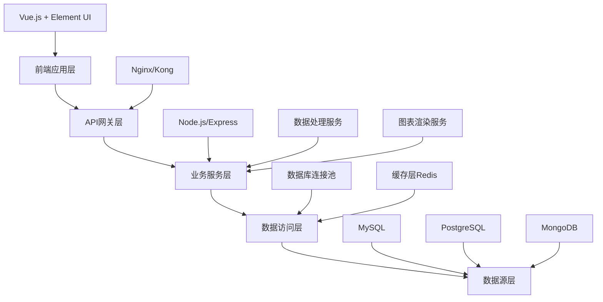

# 51Talk运营数据中台产品开发文档

## 目录
- [1. 产品概述](#1-产品概述)
- [2. 需求分析](#2-需求分析)
- [3. 系统设计](#3-系统设计)
- [4. 功能详细设计](#4-功能详细设计)
- [5. 技术实现](#5-技术实现)
- [6. 开发计划](#6-开发计划)
- [7. 测试方案](#7-测试方案)
- [8. 部署运维](#8-部署运维)

---

## 1. 产品概述

### 1.1 项目背景
51Talk运营部门包含转介绍运营、社群运营、新媒体运营等多个业务线，需要一个统一的数据中台来支撑日常的数据分析和决策需求。

### 1.2 产品定位
构建一个可视化的运营数据中台，支持多数据源接入、自定义仪表盘设计和实时数据展示，提升运营团队的数据分析效率。

### 1.3 产品价值
- **数据统一**：整合多个业务系统数据，形成统一视图
- **效率提升**：通过可视化降低数据分析门槛，提升决策效率
- **自助服务**：运营人员可自主配置所需的数据仪表盘
- **实时监控**：支持关键指标的实时监控和预警

### 1.4 目标用户
| 用户角色 | 使用场景 | 核心需求 |
|---------|---------|---------|
| 运营专员 | 日常数据查看 | 快速查看关键指标，生成报表 |
| 运营主管 | 团队管理决策 | 多维度数据分析，趋势监控 |
| 数据分析师 | 深度数据分析 | 自定义指标计算，复杂图表设计 |

---

## 2. 需求分析

### 2.1 功能需求

#### 2.1.1 核心功能
- **多数据源管理**：支持MySQL、PostgreSQL、MongoDB等数据库连接
- **仪表盘设计器**：拖拽式可视化设计工具
- **数据处理引擎**：字段选择、公式计算、数据转换
- **图表组件库**：柱状图、折线图、饼图、表格等多种展示形式
- **首页仪表盘**：个性化数据展示面板

#### 2.1.2 辅助功能
- **用户权限管理**：角色分配、数据权限控制
- **模板管理**：常用仪表盘模板库
- **数据导出**：支持Excel、PDF等格式导出
- **预警通知**：关键指标异常预警

### 2.2 非功能需求

#### 2.2.1 性能要求
- 页面响应时间 < 3秒
- 支持并发用户数 ≥ 50人
- 数据刷新频率可配置（最快1分钟）

#### 2.2.2 可用性要求
- 系统可用性 ≥ 99%
- 7×24小时运行
- 数据备份和恢复机制

#### 2.2.3 兼容性要求
- 支持Chrome、Firefox、Safari等主流浏览器
- 响应式设计，支持PC和平板设备

---

## 3. 系统设计

### 3.1 系统架构



### 3.2 技术栈选择

#### 3.2.1 前端技术栈
```json
{
  "框架": "Vue.js 3",
  "UI组件库": "Element Plus",
  "图表库": "ECharts / Chart.js",
  "拖拽库": "Vue Draggable",
  "状态管理": "Pinia",
  "构建工具": "Vite"
}
```

#### 3.2.2 后端技术栈
```json
{
  "运行环境": "Node.js",
  "Web框架": "Express.js",
  "数据库ORM": "Sequelize",
  "缓存": "Redis",
  "任务队列": "Bull Queue",
  "日志": "Winston"
}
```

### 3.3 数据库设计

#### 3.3.1 核心表结构

```sql
-- 用户表
CREATE TABLE users (
    id INT PRIMARY KEY AUTO_INCREMENT,
    username VARCHAR(50) UNIQUE NOT NULL,
    password VARCHAR(255) NOT NULL,
    email VARCHAR(100),
    role ENUM('admin', 'analyst', 'viewer') DEFAULT 'viewer',
    created_at TIMESTAMP DEFAULT CURRENT_TIMESTAMP,
    updated_at TIMESTAMP DEFAULT CURRENT_TIMESTAMP ON UPDATE CURRENT_TIMESTAMP
);

-- 数据源配置表
CREATE TABLE data_sources (
    id INT PRIMARY KEY AUTO_INCREMENT,
    name VARCHAR(100) NOT NULL,
    type ENUM('mysql', 'postgresql', 'mongodb') NOT NULL,
    host VARCHAR(255) NOT NULL,
    port INT NOT NULL,
    database_name VARCHAR(100) NOT NULL,
    username VARCHAR(100),
    password VARCHAR(255),
    config JSON,
    created_by INT,
    created_at TIMESTAMP DEFAULT CURRENT_TIMESTAMP,
    FOREIGN KEY (created_by) REFERENCES users(id)
);

-- 仪表盘配置表
CREATE TABLE dashboards (
    id INT PRIMARY KEY AUTO_INCREMENT,
    name VARCHAR(100) NOT NULL,
    description TEXT,
    config JSON NOT NULL,
    layout JSON NOT NULL,
    created_by INT,
    is_public BOOLEAN DEFAULT FALSE,
    created_at TIMESTAMP DEFAULT CURRENT_TIMESTAMP,
    updated_at TIMESTAMP DEFAULT CURRENT_TIMESTAMP ON UPDATE CURRENT_TIMESTAMP,
    FOREIGN KEY (created_by) REFERENCES users(id)
);

-- 图表配置表
CREATE TABLE charts (
    id INT PRIMARY KEY AUTO_INCREMENT,
    dashboard_id INT,
    name VARCHAR(100) NOT NULL,
    chart_type ENUM('bar', 'line', 'pie', 'table', 'gauge') NOT NULL,
    data_source_id INT,
    query_config JSON NOT NULL,
    chart_config JSON NOT NULL,
    position JSON,
    created_at TIMESTAMP DEFAULT CURRENT_TIMESTAMP,
    FOREIGN KEY (dashboard_id) REFERENCES dashboards(id) ON DELETE CASCADE,
    FOREIGN KEY (data_source_id) REFERENCES data_sources(id)
);
```

---

## 4. 功能详细设计

### 4.1 数据源管理模块

#### 4.1.1 功能描述
管理多个数据库连接，支持连接测试和数据源切换。

#### 4.1.2 页面设计
```
数据源管理页面
├── 数据源列表
│   ├── 新建数据源按钮
│   ├── 数据源卡片
│   │   ├── 数据源名称
│   │   ├── 数据库类型
│   │   ├── 连接状态
│   │   └── 操作按钮（编辑/删除/测试连接）
│   └── 分页组件
└── 数据源配置弹窗
    ├── 基本信息（名称、描述）
    ├── 连接配置（主机、端口、数据库、用户名、密码）
    ├── 高级配置（连接池、超时时间）
    └── 操作按钮（测试连接/保存/取消）
```

#### 4.1.3 接口设计
```javascript
// 获取数据源列表
GET /api/datasources
Response: {
  code: 200,
  data: [{
    id: 1,
    name: "用户数据库",
    type: "mysql",
    host: "localhost",
    status: "connected"
  }]
}

// 创建数据源
POST /api/datasources
Request: {
  name: "新数据源",
  type: "mysql",
  host: "localhost",
  port: 3306,
  database: "test_db",
  username: "root",
  password: "password"
}

// 测试连接
POST /api/datasources/test
Request: { /* 连接配置 */ }
Response: {
  code: 200,
  message: "连接成功",
  data: { 
    status: "success",
    tables: ["users", "orders", "products"]
  }
}
```

### 4.2 仪表盘设计器模块

#### 4.2.1 功能描述
拖拽式可视化设计工具，支持数据字段选择、公式计算和图表配置。

#### 4.2.2 页面布局
```
仪表盘设计器
├── 左侧配置面板 (30%)
│   ├── 数据源选择
│   ├── 表选择
│   ├── 字段列表
│   │   ├── 基础字段（可勾选）
│   │   ├── 计算字段
│   │   └── 公式编辑器
│   ├── 筛选条件
│   └── 数据预览
├── 右侧设计区域 (70%)
│   ├── 工具栏
│   │   ├── 图表类型选择
│   │   ├── 样式配置
│   │   └── 操作按钮
│   ├── 画布区域
│   │   └── 图表预览
│   └── 属性配置面板
└── 底部操作栏
    ├── 保存按钮
    ├── 预览按钮
    └── 返回按钮
```

#### 4.2.3 数据处理流程
```javascript
// 数据处理流程
const dataProcessFlow = {
  // 1. 选择数据源和表
  selectDataSource: (dataSourceId, tableName) => {
    return fetchTableSchema(dataSourceId, tableName);
  },

  // 2. 字段配置
  configFields: (selectedFields, calculations) => {
    return {
      baseFields: selectedFields,
      calculatedFields: calculations.map(calc => ({
        name: calc.name,
        formula: calc.formula,
        type: calc.returnType
      }))
    };
  },

  // 3. 数据查询
  buildQuery: (config) => {
    const { baseFields, calculatedFields, filters, groupBy } = config;
    return {
      select: [...baseFields, ...calculatedFields],
      where: filters,
      groupBy: groupBy,
      orderBy: config.orderBy
    };
  },

  // 4. 图表渲染
  renderChart: (data, chartConfig) => {
    return {
      type: chartConfig.type,
      data: processChartData(data, chartConfig),
      options: chartConfig.options
    };
  }
};
```

### 4.3 首页仪表盘模块

#### 4.3.1 功能描述
展示用户保存的仪表盘，支持拖拽调整布局和实时数据刷新。

#### 4.3.2 页面组件设计
```vue
<template>
  <div class="dashboard-home">
    <!-- 顶部导航 -->
    <header class="dashboard-header">
      <h1>运营数据中台</h1>
      <div class="header-actions">
        <el-button @click="createDashboard">新建仪表盘</el-button>
        <el-dropdown>
          <span class="user-info">{{ userInfo.name }}</span>
          <template #dropdown>
            <el-dropdown-menu>
              <el-dropdown-item>个人设置</el-dropdown-item>
              <el-dropdown-item @click="logout">退出登录</el-dropdown-item>
            </el-dropdown-menu>
          </template>
        </el-dropdown>
      </div>
    </header>
  
    <!-- 仪表盘网格 -->
    <main class="dashboard-grid">
      <grid-layout
        v-model:layout="layout"
        :col-num="12"
        :row-height="60"
        :is-draggable="true"
        :is-resizable="true"
      >
        <grid-item
          v-for="item in layout"
          :key="item.i"
          :x="item.x"
          :y="item.y"
          :w="item.w"
          :h="item.h"
          :i="item.i"
        >
          <chart-widget
            :chart-id="item.chartId"
            :config="item.config"
            @edit="editChart"
            @delete="deleteChart"
          />
        </grid-item>
      </grid-layout>
    </main>
  </div>
</template>
```

### 4.4 图表组件库

#### 4.4.1 支持的图表类型
```javascript
const chartTypes = {
  bar: {
    name: '柱状图',
    icon: 'bar-chart',
    dataRequirement: {
      dimensions: { min: 1, max: 2 },
      measures: { min: 1, max: 5 }
    },
    configOptions: ['color', 'legend', 'axis', 'dataLabel']
  },
  line: {
    name: '折线图',
    icon: 'line-chart',
    dataRequirement: {
      dimensions: { min: 1, max: 1 },
      measures: { min: 1, max: 5 }
    },
    configOptions: ['color', 'legend', 'axis', 'smooth']
  },
  pie: {
    name: '饼图',
    icon: 'pie-chart',
    dataRequirement: {
      dimensions: { min: 1, max: 1 },
      measures: { min: 1, max: 1 }
    },
    configOptions: ['color', 'legend', 'label', 'radius']
  },
  table: {
    name: '表格',
    icon: 'table',
    dataRequirement: {
      columns: { min: 1, max: 20 }
    },
    configOptions: ['pagination', 'sorting', 'columnWidth']
  },
  gauge: {
    name: '仪表盘',
    icon: 'gauge',
    dataRequirement: {
      measures: { min: 1, max: 1 }
    },
    configOptions: ['min', 'max', 'target', 'color']
  }
};
```

---

## 5. 技术实现

### 5.1 AI开发工具使用策略

#### 5.1.1 推荐工具组合
| 开发阶段 | 推荐工具 | 使用目的 |
|---------|---------|---------|
| 原型设计 | v0.dev | 快速生成UI组件和页面布局 |
| 代码生成 | Cursor/GitHub Copilot | 基础代码结构和业务逻辑实现 |
| 全栈开发 | Bolt.new | 整体项目框架搭建 |
| 代码优化 | Claude/ChatGPT | 代码review和性能优化建议 |

#### 5.1.2 开发提示词模板

**组件生成提示词**：
```
请帮我创建一个Vue3组件，用于{具体功能描述}。
要求：
1. 使用Element Plus UI组件库
2. 支持{具体交互需求}
3. 包含{必要的props和events}
4. 遵循组合式API编写风格
5. 添加适当的类型注解

请提供完整的.vue文件代码。
```

**API接口生成提示词**：
```
请帮我创建一个Express.js API接口，用于{具体业务场景}。
要求：
1. 使用RESTful规范
2. 包含参数验证
3. 错误处理和日志记录
4. 返回标准化的JSON格式
5. 添加适当的注释

请提供路由文件和控制器代码。
```

### 5.2 前端实现关键代码

#### 5.2.1 仪表盘设计器核心组件
```vue
<template>
  <div class="dashboard-designer">
    <!-- 左侧配置面板 -->
    <aside class="config-panel">
      <!-- 数据源选择 -->
      <data-source-selector 
        v-model="selectedDataSource"
        @change="onDataSourceChange"
      />
    
      <!-- 字段配置 -->
      <field-configurator
        :fields="availableFields"
        v-model:selected="selectedFields"
        v-model:calculated="calculatedFields"
      />
    
      <!-- 数据预览 -->
      <data-preview
        :data="previewData"
        :loading="isLoadingPreview"
      />
    </aside>
  
    <!-- 右侧设计区域 -->
    <main class="design-area">
      <!-- 图表配置工具栏 -->
      <chart-toolbar
        v-model:chart-type="chartConfig.type"
        :chart-config="chartConfig"
        @config-change="onChartConfigChange"
      />
    
      <!-- 图表画布 -->
      <chart-canvas
        :chart-type="chartConfig.type"
        :data="chartData"
        :config="chartConfig"
        @chart-ready="onChartReady"
      />
    </main>
  </div>
</template>

<script setup>
import { ref, computed, watch } from 'vue';
import { useDataQuery } from '@/composables/useDataQuery';
import { useChartRenderer } from '@/composables/useChartRenderer';

// 数据源管理
const selectedDataSource = ref(null);
const availableFields = ref([]);

// 字段配置
const selectedFields = ref([]);
const calculatedFields = ref([]);

// 图表配置
const chartConfig = ref({
  type: 'bar',
  title: '',
  xAxis: {},
  yAxis: {},
  series: []
});

// 数据查询
const { queryData, isLoading: isLoadingPreview } = useDataQuery();

// 预览数据
const previewData = computed(() => {
  if (!selectedFields.value.length) return [];
  return queryData({
    dataSource: selectedDataSource.value,
    fields: [...selectedFields.value, ...calculatedFields.value],
    limit: 100
  });
});

// 图表数据
const chartData = computed(() => {
  return processDataForChart(previewData.value, chartConfig.value);
});

// 事件处理
const onDataSourceChange = async (dataSource) => {
  availableFields.value = await fetchTableFields(dataSource);
};

const onChartConfigChange = (config) => {
  chartConfig.value = { ...chartConfig.value, ...config };
};

// 数据处理函数
const processDataForChart = (data, config) => {
  // 根据图表类型处理数据
  switch (config.type) {
    case 'bar':
    case 'line':
      return processSeriesData(data, config);
    case 'pie':
      return processPieData(data, config);
    case 'table':
      return processTableData(data, config);
    default:
      return data;
  }
};
</script>
```

#### 5.2.2 拖拽布局组件
```vue
<template>
  <div class="dashboard-layout">
    <vue-grid-layout
      v-model:layout="layout"
      :col-num="colNum"
      :row-height="rowHeight"
      :is-draggable="isDraggable"
      :is-resizable="isResizable"
      :vertical-compact="true"
      :use-css-transforms="true"
      @layout-updated="onLayoutUpdated"
    >
      <vue-grid-item
        v-for="item in layout"
        :key="item.i"
        :x="item.x"
        :y="item.y"
        :w="item.w"
        :h="item.h"
        :i="item.i"
        :min-w="2"
        :min-h="3"
      >
        <chart-widget
          :chart-id="item.chartId"
          :config="getChartConfig(item.chartId)"
          :data="getChartData(item.chartId)"
          @edit="editChart(item.chartId)"
          @delete="deleteChart(item.chartId)"
          @refresh="refreshChart(item.chartId)"
        />
      </vue-grid-item>
    </vue-grid-layout>
  
    <!-- 添加图表按钮 -->
    <div class="add-chart-btn" v-if="isEditMode">
      <el-button 
        type="primary" 
        icon="Plus" 
        circle 
        size="large"
        @click="showAddChartDialog = true"
      />
    </div>
  
    <!-- 添加图表对话框 -->
    <add-chart-dialog
      v-model="showAddChartDialog"
      @add="addChart"
    />
  </div>
</template>

<script setup>
import { ref, computed } from 'vue';
import { VueGridLayout, VueGridItem } from 'vue-grid-layout';
import ChartWidget from './ChartWidget.vue';
import AddChartDialog from './AddChartDialog.vue';

const props = defineProps({
  dashboardId: {
    type: Number,
    required: true
  },
  isEditMode: {
    type: Boolean,
    default: false
  }
});

// 布局配置
const colNum = ref(12);
const rowHeight = ref(60);
const isDraggable = computed(() => props.isEditMode);
const isResizable = computed(() => props.isEditMode);

// 布局数据
const layout = ref([]);
const chartConfigs = ref({});
const chartDataCache = ref({});

// 对话框状态
const showAddChartDialog = ref(false);

// 获取图表配置
const getChartConfig = (chartId) => {
  return chartConfigs.value[chartId] || {};
};

// 获取图表数据
const getChartData = (chartId) => {
  return chartDataCache.value[chartId] || [];
};

// 事件处理
const onLayoutUpdated = (newLayout) => {
  // 保存布局到后端
  saveDashboardLayout(props.dashboardId, newLayout);
};

const addChart = (chartConfig) => {
  const newItem = {
    i: `chart_${Date.now()}`,
    x: 0,
    y: 0,
    w: 4,
    h: 6,
    chartId: chartConfig.id
  };

  layout.value.push(newItem);
  chartConfigs.value[chartConfig.id] = chartConfig;
  showAddChartDialog.value = false;
};

const editChart = (chartId) => {
  // 跳转到图表编辑页面
  router.push(`/chart/edit/${chartId}`);
};

const deleteChart = (chartId) => {
  layout.value = layout.value.filter(item => item.chartId !== chartId);
  delete chartConfigs.value[chartId];
  delete chartDataCache.value[chartId];
};

const refreshChart = async (chartId) => {
  const config = chartConfigs.value[chartId];
  if (config) {
    chartDataCache.value[chartId] = await fetchChartData(config);
  }
};
</script>
```

### 5.3 后端实现关键代码

#### 5.3.1 数据查询服务
```javascript
// services/dataQueryService.js
const { Sequelize } = require('sequelize');
const connections = new Map();

class DataQueryService {
  // 创建数据库连接
  async createConnection(dataSource) {
    const { id, type, host, port, database, username, password } = dataSource;
  
    if (connections.has(id)) {
      return connections.get(id);
    }
  
    const sequelize = new Sequelize(database, username, password, {
      host,
      port,
      dialect: type,
      pool: {
        max: 5,
        min: 0,
        acquire: 30000,
        idle: 10000
      },
      logging: false
    });
  
    await sequelize.authenticate();
    connections.set(id, sequelize);
  
    return sequelize;
  }

  // 获取表结构
  async getTableSchema(dataSourceId, tableName) {
    const dataSource = await DataSource.findByPk(dataSourceId);
    const sequelize = await this.createConnection(dataSource);
  
    const [results] = await sequelize.query(`
      SELECT 
        COLUMN_NAME as name,
        DATA_TYPE as type,
        IS_NULLABLE as nullable,
        COLUMN_DEFAULT as defaultValue
      FROM INFORMATION_SCHEMA.COLUMNS 
      WHERE TABLE_NAME = '${tableName}'
      ORDER BY ORDINAL_POSITION
    `);
  
    return results;
  }

  // 执行数据查询
  async executeQuery(queryConfig) {
    const { dataSourceId, fields, filters, groupBy, orderBy, limit } = queryConfig;
  
    const dataSource = await DataSource.findByPk(dataSourceId);
    const sequelize = await this.createConnection(dataSource);
  
    // 构建查询SQL
    const sql = this.buildQuerySQL({
      fields,
      filters,
      groupBy,
      orderBy,
      limit
    });
  
    const [results] = await sequelize.query(sql);
    return results;
  }

  // 构建查询SQL
  buildQuerySQL({ fields, filters, groupBy, orderBy, limit }) {
    // 基础字段
    const selectFields = fields.base.map(field => field.name);
  
    // 计算字段
    const calculatedFields = fields.calculated.map(field => 
      `${field.formula} AS ${field.name}`
    );
  
    const allFields = [...selectFields, ...calculatedFields];
  
    let sql = `SELECT ${allFields.join(', ')} FROM ${fields.tableName}`;
  
    // WHERE条件
    if (filters && filters.length > 0) {
      const whereClause = filters.map(filter => 
        `${filter.field} ${filter.operator} ${this.formatValue(filter.value)}`
      ).join(' AND ');
      sql += ` WHERE ${whereClause}`;
    }
  
    // GROUP BY
    if (groupBy && groupBy.length > 0) {
      sql += ` GROUP BY ${groupBy.join(', ')}`;
    }
  
    // ORDER BY
    if (orderBy && orderBy.length > 0) {
      const orderClause = orderBy.map(order => 
        `${order.field} ${order.direction}`
      ).join(', ');
      sql += ` ORDER BY ${orderClause}`;
    }
  
    // LIMIT
    if (limit) {
      sql += ` LIMIT ${limit}`;
    }
  
    return sql;
  }

  // 格式化值
  formatValue(value) {
    if (typeof value === 'string') {
      return `'${value.replace(/'/g, "''")}'`;
    }
    return value;
  }
}

module.exports = new DataQueryService();
```

#### 5.3.2 仪表盘API控制器
```javascript
// controllers/dashboardController.js
const { Dashboard, Chart, DataSource } = require('../models');
const dataQueryService = require('../services/dataQueryService');

class DashboardController {
  // 获取仪表盘列表
  async getDashboards(req, res) {
    try {
      const { page = 1, pageSize = 10 } = req.query;
      const userId = req.user.id;
    
      const dashboards = await Dashboard.findAndCountAll({
        where: {
          [Op.or]: [
            { created_by: userId },
            { is_public: true }
          ]
        },
        include: [{
          model: Chart,
          as: 'charts'
        }],
        order: [['updated_at', 'DESC']],
        offset: (page - 1) * pageSize,
        limit: parseInt(pageSize)
      });
    
      res.json({
        code: 200,
        data: {
          items: dashboards.rows,
          total: dashboards.count,
          page: parseInt(page),
          pageSize: parseInt(pageSize)
        }
      });
    } catch (error) {
      res.status(500).json({
        code: 500,
        message: '获取仪表盘列表失败',
        error: error.message
      });
    }
  }

  // 创建仪表盘
  async createDashboard(req, res) {
    try {
      const { name, description, config = {}, layout = [] } = req.body;
      const userId = req.user.id;
    
      const dashboard = await Dashboard.create({
        name,
        description,
        config,
        layout,
        created_by: userId
      });
    
      res.json({
        code: 200,
        data: dashboard,
        message: '仪表盘创建成功'
      });
    } catch (error) {
      res.status(500).json({
        code: 500,
        message: '创建仪表盘失败',
        error: error.message
      });
    }
  }

  // 更新仪表盘布局
  async updateLayout(req, res) {
    try {
      const { id } = req.params;
      const { layout } = req.body;
    
      await Dashboard.update(
        { layout },
        { where: { id } }
      );
    
      res.json({
        code: 200,
        message: '布局更新成功'
      });
    } catch (error) {
      res.status(500).json({
        code: 500,
        message: '更新布局失败',
        error: error.message
      });
    }
  }

  // 获取图表数据
  async getChartData(req, res) {
    try {
      const { chartId } = req.params;
    
      const chart = await Chart.findByPk(chartId, {
        include: [{
          model: DataSource,
          as: 'dataSource'
        }]
      });
    
      if (!chart) {
        return res.status(404).json({
          code: 404,
          message: '图表不存在'
        });
      }
    
      const data = await dataQueryService.executeQuery(chart.query_config);
    
      res.json({
        code: 200,
        data: {
          chartData: data,
          config: chart.chart_config
        }
      });
    } catch (error) {
      res.status(500).json({
        code: 500,
        message: '获取图表数据失败',
        error: error.message
      });
    }
  }
}

module.exports = new DashboardController();
```

---

## 6. 开发计划

### 6.1 项目时间线

#### 第一阶段：基础架构（2-3周）
**目标**：搭建项目基础框架和核心页面

**任务清单**：
- [ ] **项目初始化**（2天）
  - 创建前后端项目结构
  - 配置开发环境和构建工具
  - 设置代码规范和Git工作流

- [ ] **用户认证系统**（3天）
  - 实现用户登录/注册功能
  - JWT token管理
  - 权限中间件开发

- [ ] **基础UI框架**（3天）
  - 主布局组件开发
  - 导航菜单实现
  - 响应式布局适配

- [ ] **数据库设计实现**（4天）
  - 数据库表结构创建
  - ORM模型定义
  - 数据库迁移脚本

- [ ] **基础API开发**（3天）
  - 用户管理API
  - 数据源管理API基础框架
  - 错误处理和日志系统

**输出物**：
- 可运行的项目框架
- 用户登录功能
- 基础页面布局

#### 第二阶段：核心功能开发（3-4周）
**目标**：实现数据源管理和基础数据查询功能

**任务清单**：
- [ ] **数据源管理模块**（5天）
  - 数据源配置页面
  - 多种数据库连接支持
  - 连接测试功能
  - 数据源列表管理

- [ ] **数据查询引擎**（7天）
  - 数据库连接池管理
  - SQL查询构建器
  - 字段类型识别和转换
  - 查询结果缓存机制

- [ ] **字段配置组件**（4天）
  - 表结构获取和展示
  - 字段选择器组件
  - 基础公式计算支持
  - 数据预览功能

- [ ] **基础图表组件**（6天）
  - ECharts集成
  - 柱状图、折线图、饼图组件
  - 表格组件
  - 图表配置面板

**输出物**：
- 完整的数据源管理功能
- 基础数据查询和展示能力
- 主要图表组件

#### 第三阶段：可视化设计器（2-3周）
**目标**：实现拖拽式仪表盘设计功能

**任务清单**：
- [ ] **仪表盘设计器页面**（5天）
  - 左右分栏布局实现
  - 数据配置面板开发
  - 图表预览区域
  - 工具栏和属性面板

- [ ] **拖拽布局系统**（4天）
  - Vue Grid Layout集成
  - 组件拖拽和调整大小
  - 布局保存和恢复
  - 响应式网格适配

- [ ] **高级数据处理**（4天）
  - 复杂公式计算支持
  - 数据过滤和排序
  - 分组聚合功能
  - 数据格式化

- [ ] **图表配置增强**（4天）
  - 图表样式自定义
  - 交互配置（钻取、联动）
  - 主题和色彩管理
  - 图表导出功能

**输出物**：
- 完整的仪表盘设计器
- 拖拽式布局功能
- 高级数据处理能力

#### 第四阶段：功能完善和优化（1-2周）
**目标**：系统优化和用户体验提升

**任务清单**：
- [ ] **权限管理完善**（2天）
  - 角色权限细化
  - 数据权限控制
  - 仪表盘共享机制

- [ ] **性能优化**（3天）
  - 查询性能优化
  - 前端渲染优化
  - 缓存策略实现
  - 懒加载和虚拟滚动

- [ ] **用户体验优化**（3天）
  - 加载状态和错误提示
  - 操作引导和帮助文档
  - 快捷操作和键盘支持
  - 移动端适配优化

- [ ] **测试和部署**（3天）
  - 单元测试编写
  - 集成测试
  - 生产环境部署
  - 监控和日志配置

**输出物**：
- 生产可用的完整系统
- 性能优化报告
- 部署和运维文档

### 6.2 人员分工建议

如果有团队协作，建议分工如下：

| 角色 | 主要职责 | 技能要求 |
|------|----------|----------|
| 前端开发 | UI组件开发、交互逻辑实现 | Vue.js、JavaScript、CSS |
| 后端开发 | API开发、数据库设计 | Node.js、数据库、系统设计 |
| 全栈开发 | 前后端连调、功能集成 | 全栈技能、项目管理 |

### 6.3 风险控制

**技术风险**：
- **数据库兼容性问题**：建议先支持1-2种主流数据库，逐步扩展
- **大数据量性能问题**：实现分页查询和数据采样机制
- **复杂SQL生成错误**：提供SQL预览和验证功能

**进度风险**：
- **功能范围过大**：采用MVP方式，先实现核心功能
- **技术学习成本**：充分利用AI工具，减少重复开发
- **需求变更频繁**：保持模块化设计，提高扩展性

---

## 7. 测试方案

### 7.1 测试策略

#### 7.1.1 测试分层
```
用户验收测试 (UAT)
    ↓
集成测试 (Integration Test)
    ↓
单元测试 (Unit Test)
```

#### 7.1.2 测试覆盖率目标
- **单元测试覆盖率**：≥ 80%
- **API接口测试覆盖率**：100%
- **核心功能集成测试覆盖率**：100%

### 7.2 测试用例设计

#### 7.2.1 功能测试用例

**数据源管理测试**：
```javascript
describe('数据源管理', () => {
  test('创建MySQL数据源', async () => {
    const dataSource = {
      name: '测试数据源',
      type: 'mysql',
      host: 'localhost',
      port: 3306,
      database: 'test_db',
      username: 'root',
      password: 'password'
    };
  
    const response = await createDataSource(dataSource);
    expect(response.code).toBe(200);
    expect(response.data.id).toBeDefined();
  });

  test('测试数据源连接', async () => {
    const connectionTest = await testConnection(dataSourceId);
    expect(connectionTest.status).toBe('success');
    expect(connectionTest.tables.length).toBeGreaterThan(0);
  });

  test('获取表字段信息', async () => {
    const fields = await getTableFields(dataSourceId, 'users');
    expect(fields.length).toBeGreaterThan(0);
    expect(fields[0]).toHaveProperty('name');
    expect(fields[0]).toHaveProperty('type');
  });
});
```

**仪表盘功能测试**：
```javascript
describe('仪表盘功能', () => {
  test('创建仪表盘', async () => {
    const dashboard = {
      name: '测试仪表盘',
      description: '测试描述',
      layout: []
    };
  
    const response = await createDashboard(dashboard);
    expect(response.code).toBe(200);
  });

  test('添加图表到仪表盘', async () => {
    const chartConfig = {
      type: 'bar',
      dataSource: dataSourceId,
      fields: ['date', 'count'],
      filters: []
    };
  
    const chart = await createChart(dashboardId, chartConfig);
    expect(chart.id).toBeDefined();
  });

  test('更新仪表盘布局', async () => {
    const newLayout = [
      { i: 'chart1', x: 0, y: 0, w: 6, h: 4 },
      { i: 'chart2', x: 6, y: 0, w: 6, h: 4 }
    ];
  
    const response = await updateDashboardLayout(dashboardId, newLayout);
    expect(response.code).toBe(200);
  });
});
```

#### 7.2.2 性能测试用例

**数据查询性能测试**：
```javascript
describe('性能测试', () => {
  test('大数据量查询性能', async () => {
    const startTime = Date.now();
  
    const result = await executeQuery({
      dataSourceId: 1,
      sql: 'SELECT * FROM large_table LIMIT 10000'
    });
  
    const endTime = Date.now();
    const executionTime = endTime - startTime;
  
    expect(executionTime).toBeLessThan(3000); // 3秒内完成
    expect(result.length).toBe(10000);
  });

  test('并发用户查询测试', async () => {
    const concurrentRequests = Array(10).fill().map(() => 
      executeQuery({ dataSourceId: 1, sql: 'SELECT COUNT(*) FROM users' })
    );
  
    const results = await Promise.all(concurrentRequests);
  
    results.forEach(result => {
      expect(result).toBeDefined();
      expect(result.length).toBeGreaterThan(0);
    });
  });
});
```

### 7.3 自动化测试实现

#### 7.3.1 前端组件测试
```javascript
// tests/components/ChartWidget.test.js
import { mount } from '@vue/test-utils';
import ChartWidget from '@/components/ChartWidget.vue';

describe('ChartWidget', () => {
  test('渲染柱状图', async () => {
    const wrapper = mount(ChartWidget, {
      props: {
        chartType: 'bar',
        data: [
          { name: 'A', value: 100 },
          { name: 'B', value: 200 }
        ],
        config: {
          title: '测试图表'
        }
      }
    });
  
    await wrapper.vm.$nextTick();
  
    expect(wrapper.find('.chart-container').exists()).toBe(true);
    expect(wrapper.find('.chart-title').text()).toBe('测试图表');
  });

  test('图表数据更新', async () => {
    const wrapper = mount(ChartWidget, {
      props: {
        chartType: 'line',
        data: [{ x: 1, y: 10 }]
      }
    });
  
    await wrapper.setProps({
      data: [{ x: 1, y: 10 }, { x: 2, y: 20 }]
    });
  
    // 验证图表更新
    expect(wrapper.vm.chartData.length).toBe(2);
  });
});
```

#### 7.3.2 API接口测试
```javascript
// tests/api/dashboard.test.js
const request = require('supertest');
const app = require('../../app');

describe('Dashboard API', () => {
  let authToken;
  let dashboardId;

  beforeAll(async () => {
    // 获取测试用户token
    const loginResponse = await request(app)
      .post('/api/auth/login')
      .send({
        username: 'testuser',
        password: 'testpass'
      });
  
    authToken = loginResponse.body.data.token;
  });

  test('POST /api/dashboards - 创建仪表盘', async () => {
    const response = await request(app)
      .post('/api/dashboards')
      .set('Authorization', `Bearer ${authToken}`)
      .send({
        name: '测试仪表盘',
        description: '测试描述'
      });
  
    expect(response.status).toBe(200);
    expect(response.body.code).toBe(200);
    expect(response.body.data.id).toBeDefined();
  
    dashboardId = response.body.data.id;
  });

  test('GET /api/dashboards - 获取仪表盘列表', async () => {
    const response = await request(app)
      .get('/api/dashboards')
      .set('Authorization', `Bearer ${authToken}`);
  
    expect(response.status).toBe(200);
    expect(response.body.data.items).toBeInstanceOf(Array);
  });
});
```

---

## 8. 部署运维

### 8.1 部署架构

#### 8.1.1 生产环境架构图
```
Internet
    ↓
Nginx (负载均衡 + 静态资源)
    ↓
Node.js应用服务器 (集群)
    ↓
Redis (缓存 + Session)
    ↓
MySQL/PostgreSQL (主从复制)
```

#### 8.1.2 Docker容器化部署

**前端Dockerfile**：
```dockerfile
# 前端构建镜像
FROM node:18-alpine as builder

WORKDIR /app
COPY package*.json ./
RUN npm ci --only=production

COPY . .
RUN npm run build

# 生产镜像
FROM nginx:alpine

COPY --from=builder /app/dist /usr/share/nginx/html
COPY nginx.conf /etc/nginx/conf.d/default.conf

EXPOSE 80
CMD ["nginx", "-g", "daemon off;"]
```

**后端Dockerfile**：
```dockerfile
FROM node:18-alpine

WORKDIR /app

# 安装依赖
COPY package*.json ./
RUN npm ci --only=production

# 复制代码
COPY . .

# 创建非root用户
RUN addgroup -g 1001 -S nodejs
RUN adduser -S nextjs -u 1001
USER nextjs

EXPOSE 3000

CMD ["node", "server.js"]
```

**Docker Compose配置**：
```yaml
version: '3.8'

services:
  # 前端服务
  frontend:
    build:
      context: ./frontend
      dockerfile: Dockerfile
    ports:
      - "80:80"
    depends_on:
      - backend
    networks:
      - app-network

  # 后端服务
  backend:
    build:
      context: ./backend
      dockerfile: Dockerfile
    ports:
      - "3000:3000"
    environment:
      - NODE_ENV=production
      - DB_HOST=mysql
      - DB_USER=root
      - DB_PASS=password
      - REDIS_HOST=redis
    depends_on:
      - mysql
      - redis
    networks:
      - app-network

  # 数据库
  mysql:
    image: mysql:8.0
    environment:
      MYSQL_ROOT_PASSWORD: password
      MYSQL_DATABASE: dashboard_db
    volumes:
      - mysql_data:/var/lib/mysql
      - ./init.sql:/docker-entrypoint-initdb.d/init.sql
    networks:
      - app-network

  # 缓存
  redis:
    image: redis:7-alpine
    volumes:
      - redis_data:/data
    networks:
      - app-network

volumes:
  mysql_data:
  redis_data:

networks:
  app-network:
    driver: bridge
```

### 8.2 监控和日志

#### 8.2.1 应用监控配置

**健康检查端点**：
```javascript
// routes/health.js
const express = require('express');
const router = express.Router();
const { sequelize } = require('../models');
const redis = require('../utils/redis');

router.get('/health', async (req, res) => {
  const health = {
    status: 'ok',
    timestamp: new Date().toISOString(),
    services: {}
  };

  try {
    // 数据库健康检查
    await sequelize.authenticate();
    health.services.database = 'ok';
  } catch (error) {
    health.services.database = 'error';
    health.status = 'error';
  }

  try {
    // Redis健康检查
    await redis.ping();
    health.services.redis = 'ok';
  } catch (error) {
    health.services.redis = 'error';
    health.status = 'error';
  }

  const statusCode = health.status === 'ok' ? 200 : 503;
  res.status(statusCode).json(health);
});

module.exports = router;
```

**性能监控**：
```javascript
// middleware/monitoring.js
const prometheus = require('prom-client');

// 创建指标
const httpRequestDuration = new prometheus.Histogram({
  name: 'http_request_duration_seconds',
  help: 'HTTP请求响应时间',
  labelNames: ['method', 'route', 'status_code']
});

const httpRequestTotal = new prometheus.Counter({
  name: 'http_requests_total',
  help: 'HTTP请求总数',
  labelNames: ['method', 'route', 'status_code']
});

const activeConnections = new prometheus.Gauge({
  name: 'active_connections',
  help: '当前活跃连接数'
});

// 监控中间件
const monitoringMiddleware = (req, res, next) => {
  const startTime = Date.now();

  res.on('finish', () => {
    const duration = (Date.now() - startTime) / 1000;
    const labels = {
      method: req.method,
      route: req.route?.path || req.path,
      status_code: res.statusCode
    };
  
    httpRequestDuration.observe(labels, duration);
    httpRequestTotal.inc(labels);
  });

  next();
};

module.exports = {
  monitoringMiddleware,
  register: prometheus.register
};
```

#### 8.2.2 日志配置

**Winston日志配置**：
```javascript
// utils/logger.js
const winston = require('winston');
const path = require('path');

const logger = winston.createLogger({
  level: process.env.LOG_LEVEL || 'info',
  format: winston.format.combine(
    winston.format.timestamp(),
    winston.format.errors({ stack: true }),
    winston.format.json()
  ),
  defaultMeta: { service: 'dashboard-api' },
  transports: [
    // 错误日志文件
    new winston.transports.File({
      filename: path.join(__dirname, '../logs/error.log'),
      level: 'error',
      maxsize: 5242880, // 5MB
      maxFiles: 5
    }),
  
    // 所有日志文件
    new winston.transports.File({
      filename: path.join(__dirname, '../logs/combined.log'),
      maxsize: 5242880,
      maxFiles: 5
    })
  ]
});

// 开发环境控制台输出
if (process.env.NODE_ENV !== 'production') {
  logger.add(new winston.transports.Console({
    format: winston.format.simple()
  }));
}

module.exports = logger;
```

### 8.3 备份和恢复

#### 8.3.1 数据库备份脚本
```bash
#!/bin/bash
# backup_database.sh

# 配置参数
DB_HOST="localhost"
DB_USER="root"
DB_PASSWORD="password"
DB_NAME="dashboard_db"
BACKUP_DIR="/backup/mysql"
DATE=$(date +%Y%m%d_%H%M%S)

# 创建备份目录
mkdir -p $BACKUP_DIR

# 执行备份
mysqldump -h$DB_HOST -u$DB_USER -p$DB_PASSWORD \
  --single-transaction \
  --routines \
  --triggers \
  $DB_NAME > $BACKUP_DIR/dashboard_backup_$DATE.sql

# 压缩备份文件
gzip $BACKUP_DIR/dashboard_backup_$DATE.sql

# 删除7天前的备份
find $BACKUP_DIR -name "*.sql.gz" -mtime +7 -delete

echo "数据库备份完成: dashboard_backup_$DATE.sql.gz"
```

#### 8.3.2 自动化备份配置
```bash
# 添加到crontab
# 每天凌晨2点执行备份
0 2 * * * /scripts/backup_database.sh >> /var/log/backup.log 2>&1

# 每周日执行完整备份
0 1 * * 0 /scripts/full_backup.sh >> /var/log/backup.log 2>&1
```

### 8.4 安全配置

#### 8.4.1 Nginx安全配置
```nginx
server {
    listen 80;
    server_name dashboard.51talk.com;
  
    # 重定向到HTTPS
    return 301 https://$server_name$request_uri;
}

server {
    listen 443 ssl http2;
    server_name dashboard.51talk.com;
  
    # SSL配置
    ssl_certificate /etc/ssl/certs/dashboard.crt;
    ssl_certificate_key /etc/ssl/private/dashboard.key;
    ssl_protocols TLSv1.2 TLSv1.3;
    ssl_ciphers ECDHE-RSA-AES256-GCM-SHA512:DHE-RSA-AES256-GCM-SHA512;
  
    # 安全头
    add_header X-Frame-Options DENY;
    add_header X-Content-Type-Options nosniff;
    add_header X-XSS-Protection "1; mode=block";
    add_header Strict-Transport-Security "max-age=63072000; includeSubDomains";
  
    # 限制文件上传大小
    client_max_body_size 10M;
  
    # 静态资源
    location / {
        root /usr/share/nginx/html;
        try_files $uri $uri/ /index.html;
      
        # 静态资源缓存
        location ~* \.(js|css|png|jpg|jpeg|gif|ico|svg)$ {
            expires 1y;
            add_header Cache-Control "public, immutable";
        }
    }
  
    # API代理
    location /api/ {
        proxy_pass http://backend:3000;
        proxy_set_header Host $host;
        proxy_set_header X-Real-IP $remote_addr;
        proxy_set_header X-Forwarded-For $proxy_add_x_forwarded_for;
        proxy_set_header X-Forwarded-Proto $scheme;
      
        # 超时配置
        proxy_connect_timeout 30s;
        proxy_send_timeout 30s;
        proxy_read_timeout 30s;
    }
}
```

#### 8.4.2 应用安全中间件
```javascript
// middleware/security.js
const helmet = require('helmet');
const rateLimit = require('express-rate-limit');
const cors = require('cors');

// 安全头配置
const securityMiddleware = [
  helmet({
    contentSecurityPolicy: {
      directives: {
        defaultSrc: ["'self'"],
        styleSrc: ["'self'", "'unsafe-inline'"],
        scriptSrc: ["'self'"],
        imgSrc: ["'self'", "data:", "https:"]
      }
    }
  }),

  // CORS配置
  cors({
    origin: process.env.FRONTEND_URL || 'http://localhost:8080',
    credentials: true
  }),

  // 速率限制
  rateLimit({
    windowMs: 15 * 60 * 1000, // 15分钟
    max: 100, // 最多100个请求
    message: '请求过于频繁，请稍后再试'
  })
];

module.exports = securityMiddleware;
```

---

## 总结

这份完整的开发文档涵盖了51Talk运营数据中台从需求分析到部署运维的全过程。主要特点：

### 核心亮点
1. **完整的产品规划**：从需求分析到技术实现的完整链路
2. **AI友好的开发方式**：提供了具体的AI工具使用策略和提示词模板
3. **模块化设计**：支持分阶段开发和功能扩展
4. **生产就绪**：包含完整的测试、部署和运维方案

### 开发建议
1. **优先MVP**：先实现核心功能，再逐步完善
2. **充分利用AI**：使用推荐的AI工具加速开发
3. **注重用户体验**：在数据功能之外，关注操作便捷性
4. **预留扩展性**：为未来新增数据源和图表类型留出接口

按照这个文档的规划，您可以用AI工具逐步实现一个功能完整、可扩展的运营数据中台系统。