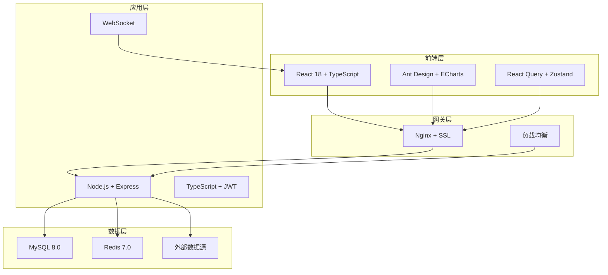

# 51Talk数据中台

<div align="center">
  
  
  
  
  
  
  
</div>

## 📖 项目简介

51Talk数据中台是一个现代化的数据可视化和分析平台，为51Talk在线教育提供全面的数据洞察和业务智能支持。平台采用前后端分离架构，支持多数据源接入、实时数据处理、交互式图表展示和灵活的仪表盘配置。

### ✨ 核心特性

- 🎯 **多数据源支持**: MySQL、PostgreSQL、MongoDB、Redis等主流数据库
- 📊 **丰富图表类型**: 折线图、柱状图、饼图、散点图、热力图等
- 🎨 **拖拽式设计**: 可视化仪表盘编辑器，支持拖拽布局
- ⚡ **实时数据**: WebSocket实时数据推送，毫秒级更新
- 🔐 **权限管理**: 基于RBAC的细粒度权限控制
- 📱 **响应式设计**: 完美适配桌面端、平板和移动设备
- 🚀 **高性能**: Redis缓存、数据库连接池、CDN加速
- 🔧 **易于扩展**: 插件化架构，支持自定义组件和数据源

### 🏗️ 技术架构



## 🚀 快速开始

### 环境要求

- **Node.js**: 18.0+ 
- **npm**: 8.0+ 或 **yarn**: 1.22+
- **MySQL**: 8.0+
- **Redis**: 7.0+
- **Git**: 2.30+

### 一键启动（推荐）

```bash
# 克隆项目
git clone https://github.com/51talk/data-platform.git
cd 51talk-data-platform

# Windows用户
.\scripts\start-dev.bat

# Linux/macOS用户
chmod +x scripts/start-dev.sh
./scripts/start-dev.sh
```

### 手动安装

#### 1. 安装依赖

```bash
# 安装根目录依赖
npm install

# 安装前端依赖
cd frontend
npm install
cd ..

# 安装后端依赖
cd backend
npm install
cd ..
```

#### 2. 配置环境变量

```bash
# 复制环境变量模板
cp backend/.env.example backend/.env
cp frontend/.env.example frontend/.env

# 编辑配置文件
# 配置数据库连接、Redis连接、JWT密钥等
```

#### 3. 初始化数据库

```bash
# 创建数据库
mysql -u root -p < database/schema.sql

# 初始化数据
mysql -u root -p 51talk_data_platform < database/init.sql

# 运行迁移（可选）
cd backend
npm run db:migrate
```

#### 4. 启动服务

```bash
# 启动开发环境（前端 + 后端）
npm run dev

# 或分别启动
npm run dev:frontend  # 前端开发服务器 (http://localhost:5173)
npm run dev:backend   # 后端API服务器 (http://localhost:3000)
```

### Docker部署

```bash
# 构建并启动所有服务
docker-compose up -d

# 查看服务状态
docker-compose ps

# 查看日志
docker-compose logs -f

# 停止服务
docker-compose down
```

## 📁 项目结构

```
51talk-data-platform/
├── 📁 frontend/                 # 前端应用
│   ├── 📁 src/
│   │   ├── 📁 components/       # 通用组件
│   │   ├── 📁 pages/           # 页面组件
│   │   ├── 📁 hooks/           # 自定义Hooks
│   │   ├── 📁 stores/          # 状态管理
│   │   ├── 📁 services/        # API服务
│   │   ├── 📁 utils/           # 工具函数
│   │   └── 📁 types/           # TypeScript类型
│   ├── 📄 package.json
│   ├── 📄 vite.config.ts
│   └── 📄 tsconfig.json
├── 📁 backend/                  # 后端应用
│   ├── 📁 src/
│   │   ├── 📁 controllers/     # 控制器
│   │   ├── 📁 services/        # 业务逻辑
│   │   ├── 📁 models/          # 数据模型
│   │   ├── 📁 middleware/      # 中间件
│   │   ├── 📁 routes/          # 路由定义
│   │   ├── 📁 utils/           # 工具函数
│   │   └── 📁 types/           # TypeScript类型
│   ├── 📄 package.json
│   └── 📄 tsconfig.json
├── 📁 database/                 # 数据库文件
│   ├── 📄 schema.sql           # 数据库结构
│   ├── 📄 init.sql             # 初始化数据
│   └── 📁 migrations/          # 数据库迁移
├── 📁 docs/                     # 项目文档
│   ├── 📄 API.md               # API文档
│   ├── 📄 DEVELOPMENT.md       # 开发指南
│   ├── 📄 DEPLOYMENT.md        # 部署指南
│   ├── 📄 CONTRIBUTING.md      # 贡献指南
│   └── 📄 SECURITY.md          # 安全指南
├── 📁 scripts/                  # 脚本文件
│   ├── 📄 start-dev.bat        # Windows启动脚本
│   └── 📄 start-dev.sh         # Linux/macOS启动脚本
├── 📄 docker-compose.yml       # Docker编排
├── 📄 package.json             # 根项目配置
├── 📄 .gitignore               # Git忽略文件
├── 📄 .editorconfig            # 编辑器配置
├── 📄 51talk-data-platform.code-workspace  # VSCode工作区
└── 📄 README.md                # 项目说明
```

## 🎯 功能模块

### 🔐 用户认证
- 用户注册、登录、登出
- JWT令牌认证
- 密码重置和修改
- 多因素认证（MFA）

### 👥 用户管理
- 用户信息管理
- 角色权限分配
- 用户组织架构
- 操作日志审计

### 🗄️ 数据源管理
- 多类型数据源连接
- 连接测试和验证
- 数据源权限控制
- 连接池管理

### 📊 图表组件
- 基础图表：折线图、柱状图、饼图
- 高级图表：散点图、热力图、雷达图
- 地理图表：地图、轨迹图
- 自定义图表组件

### 🎨 仪表盘
- 拖拽式布局编辑
- 组件库和模板
- 实时数据刷新
- 响应式设计

### ⚡ 实时数据
- WebSocket连接
- 数据流处理
- 实时告警
- 性能监控

## 📖 API文档

### 认证接口

- `POST /api/auth/register` - 用户注册
- `POST /api/auth/login` - 用户登录
- `GET /api/auth/me` - 获取当前用户信息
- `PUT /api/auth/password` - 修改密码
- `POST /api/auth/refresh` - 刷新令牌
- `POST /api/auth/logout` - 用户登出

### 数据源接口

- `GET /api/datasources` - 获取数据源列表
- `POST /api/datasources` - 创建数据源
- `GET /api/datasources/:id` - 获取数据源详情
- `PUT /api/datasources/:id` - 更新数据源
- `DELETE /api/datasources/:id` - 删除数据源
- `POST /api/datasources/:id/test` - 测试数据源连接

### 仪表盘接口

- `GET /api/dashboards` - 获取仪表盘列表
- `POST /api/dashboards` - 创建仪表盘
- `GET /api/dashboards/:id` - 获取仪表盘详情
- `PUT /api/dashboards/:id` - 更新仪表盘
- `DELETE /api/dashboards/:id` - 删除仪表盘
- `POST /api/dashboards/:id/copy` - 复制仪表盘

### 图表接口

- `GET /api/charts` - 获取图表列表
- `POST /api/charts` - 创建图表
- `GET /api/charts/:id` - 获取图表详情
- `PUT /api/charts/:id` - 更新图表
- `DELETE /api/charts/:id` - 删除图表
- `GET /api/charts/:id/data` - 获取图表数据
- `POST /api/charts/:id/copy` - 复制图表

### 系统接口

- `GET /api/health` - 健康检查
- `GET /api/version` - 获取版本信息
- `GET /api/stats` - 获取系统统计

## 🔧 开发指南

### 代码规范

项目使用ESLint + Prettier进行代码格式化：

```bash
# 检查代码规范
npm run lint

# 自动修复
npm run lint:fix

# 格式化代码
npm run format
```

### 提交规范

使用Conventional Commits规范：

```bash
# 功能开发
git commit -m "feat: 添加用户管理模块"

# 问题修复
git commit -m "fix: 修复图表渲染问题"

# 文档更新
git commit -m "docs: 更新API文档"
```

### 分支管理

```bash
# 功能分支
git checkout -b feature/user-management

# 修复分支
git checkout -b fix/chart-rendering

# 发布分支
git checkout -b release/v1.0.0
```

### 数据库操作

```bash
# 查看数据库状态
npm run db:status

# 执行数据库迁移
npm run db:migrate

# 回滚数据库
npm run db:rollback

# 重置数据库
npm run db:reset
```

### 构建和部署

```bash
# 构建前端
cd frontend
npm run build

# 构建后端
cd backend
npm run build

# 构建整个项目
npm run build

# 启动生产环境
npm run start
```

### 测试

```bash
# 运行所有测试
npm test

# 运行前端测试
npm run test:frontend

# 运行后端测试
npm run test:backend

# 生成覆盖率报告
npm run test:coverage
```

## 📚 文档链接

- 📖 [开发指南](docs/DEVELOPMENT.md) - 详细的开发环境设置和开发流程
- 🚀 [部署指南](docs/DEPLOYMENT.md) - 生产环境部署和运维指南
- 🔌 [API文档](docs/API.md) - 完整的后端API接口文档
- 🤝 [贡献指南](docs/CONTRIBUTING.md) - 如何参与项目开发
- 🔒 [安全指南](docs/SECURITY.md) - 安全最佳实践和配置

## 📝 环境变量说明

### 后端环境变量 (.env)

```env
# 服务器配置
NODE_ENV=development
PORT=3000
FRONTEND_URL=http://localhost:5173

# 数据库配置
DB_HOST=localhost
DB_PORT=3306
DB_USER=root
DB_PASSWORD=your_password
DB_NAME=51talk_data_platform

# JWT配置
JWT_SECRET=your_jwt_secret_key_at_least_32_characters
JWT_REFRESH_SECRET=your_jwt_refresh_secret_key
JWT_EXPIRES_IN=15m
JWT_REFRESH_EXPIRES_IN=7d

# Redis配置
REDIS_HOST=localhost
REDIS_PORT=6379
REDIS_PASSWORD=
REDIS_DB=0

# 日志配置
LOG_LEVEL=info
LOG_FILE=logs/app.log
LOG_MAX_SIZE=10m
LOG_MAX_FILES=5

# 文件上传配置
UPLOAD_MAX_SIZE=10485760
UPLOAD_ALLOWED_TYPES=jpg,jpeg,png,gif,pdf,doc,docx,xls,xlsx
UPLOAD_PATH=uploads

# 邮件配置
MAIL_HOST=smtp.example.com
MAIL_PORT=587
MAIL_USER=your_email@example.com
MAIL_PASSWORD=your_email_password
MAIL_FROM=noreply@51talk.com

# 第三方API配置
API_RATE_LIMIT=100
API_TIMEOUT=30000
```

### 前端环境变量 (.env)

```env
# API配置
VITE_API_BASE_URL=http://localhost:3000/api
VITE_WS_URL=ws://localhost:3000

# 应用配置
VITE_APP_TITLE=51Talk数据中台
VITE_APP_VERSION=1.0.0

# 开发配置
VITE_DEV_PORT=5173
VITE_DEV_HOST=localhost

# 功能开关
VITE_ENABLE_MOCK=false
VITE_ENABLE_DEBUG=true

# 第三方服务
VITE_SENTRY_DSN=
VITE_GA_TRACKING_ID=

# 上传配置
VITE_UPLOAD_MAX_SIZE=10485760
VITE_UPLOAD_ALLOWED_TYPES=jpg,jpeg,png,gif

# 图表配置
VITE_CHART_THEME=default
VITE_CHART_AUTO_REFRESH=true
VITE_CHART_REFRESH_INTERVAL=30000
```

## 🚀 部署方案

### 开发环境
- 本地开发服务器
- 热重载和调试
- 模拟数据和API

### 测试环境
- Docker容器化部署
- 自动化测试集成
- 性能和安全测试

### 生产环境
- Kubernetes集群部署
- 负载均衡和高可用
- 监控和日志收集
- 自动扩缩容

## 📊 性能指标

- **首屏加载时间**: < 2秒
- **API响应时间**: < 500ms
- **图表渲染时间**: < 1秒
- **并发用户数**: 1000+
- **数据处理能力**: 10万条/秒

## 🔄 版本历史

### v1.0.0 (2024-01-15)
- ✨ 初始版本发布
- 🎯 基础功能完成
- 📊 支持基础图表类型
- 🔐 用户认证和权限管理

### v0.9.0 (2024-01-01)
- 🚧 Beta版本
- 🧪 功能测试和优化
- 📝 文档完善

## 🤝 贡献指南

1. Fork 项目
2. 创建特性分支 (`git checkout -b feature/AmazingFeature`)
3. 提交更改 (`git commit -m 'Add some AmazingFeature'`)
4. 推送到分支 (`git push origin feature/AmazingFeature`)
5. 打开 Pull Request

详细的贡献指南请参考 [CONTRIBUTING.md](docs/CONTRIBUTING.md)

## 🤝 贡献者

感谢所有为项目做出贡献的开发者：

<a href="https://github.com/51talk/data-platform/graphs/contributors">
  
</a>

## 📄 许可证

本项目采用 [MIT License](LICENSE) 许可证。

## 🆘 支持与反馈

如果您在使用过程中遇到问题或有改进建议，欢迎通过以下方式联系我们：

- 📧 **邮箱**: data-platform@51talk.com
- 🐛 **问题反馈**: [GitHub Issues](https://github.com/51talk/data-platform/issues)
- 💬 **讨论交流**: [GitHub Discussions](https://github.com/51talk/data-platform/discussions)
- 📱 **微信群**: 扫描二维码加入技术交流群

## ⭐ Star History

[](https://star-history.com/#51talk/data-platform&Date)

---

<div align="center">
  <p>Made with ❤️ by 51Talk Data Team</p>
  <p>© 2024 51Talk. All rights reserved.</p>
</div>