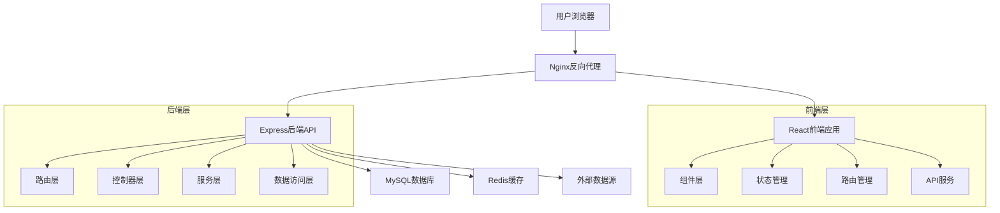

# 开发指南

本文档提供了51Talk数据中台项目的详细开发指南。

## 📋 目录

- [开发环境设置](#开发环境设置)
- [项目架构](#项目架构)
- [编码规范](#编码规范)
- [数据库设计](#数据库设计)
- [API设计](#api设计)
- [前端开发](#前端开发)
- [后端开发](#后端开发)
- [测试策略](#测试策略)
- [部署流程](#部署流程)
- [故障排除](#故障排除)

## 🛠️ 开发环境设置

### 必需软件

1. **Node.js** (>= 18.0.0)
   ```bash
   # 使用nvm安装
   nvm install 18
   nvm use 18
   ```

2. **MySQL** (>= 8.0)
   ```bash
   # Windows (使用Chocolatey)
   choco install mysql
   
   # macOS (使用Homebrew)
   brew install mysql
   
   # Ubuntu
   sudo apt-get install mysql-server
   ```

3. **Redis** (>= 6.0, 可选)
   ```bash
   # Windows (使用Chocolatey)
   choco install redis-64
   
   # macOS (使用Homebrew)
   brew install redis
   
   # Ubuntu
   sudo apt-get install redis-server
   ```

4. **Git**
   ```bash
   git --version
   ```

### IDE推荐配置

#### Visual Studio Code

推荐安装以下扩展：

```json
{
  "recommendations": [
    "ms-vscode.vscode-typescript-next",
    "bradlc.vscode-tailwindcss",
    "esbenp.prettier-vscode",
    "ms-vscode.vscode-eslint",
    "formulahendry.auto-rename-tag",
    "christian-kohler.path-intellisense",
    "ms-vscode.vscode-json",
    "redhat.vscode-yaml",
    "ms-vscode-remote.remote-containers"
  ]
}
```

#### 工作区设置

```json
{
  "editor.formatOnSave": true,
  "editor.codeActionsOnSave": {
    "source.fixAll.eslint": true
  },
  "typescript.preferences.importModuleSpecifier": "relative",
  "emmet.includeLanguages": {
    "typescript": "html",
    "typescriptreact": "html"
  }
}
```

## 🏗️ 项目架构

### 整体架构



### 前端架构

```
src/
├── components/          # 可复用组件
│   ├── common/         # 通用组件
│   ├── charts/         # 图表组件
│   └── forms/          # 表单组件
├── pages/              # 页面组件
│   ├── auth/          # 认证页面
│   ├── dashboard/     # 仪表盘页面
│   └── settings/      # 设置页面
├── hooks/              # 自定义Hook
├── services/           # API服务
├── utils/              # 工具函数
├── types/              # TypeScript类型
├── styles/             # 样式文件
└── constants/          # 常量定义
```

### 后端架构

```
src/
├── controllers/        # 控制器层
├── services/          # 业务逻辑层
├── models/            # 数据模型
├── routes/            # 路由定义
├── middleware/        # 中间件
├── config/            # 配置文件
├── utils/             # 工具函数
└── types/             # TypeScript类型
```

## 📝 编码规范

### TypeScript规范

1. **类型定义**
   ```typescript
   // ✅ 好的做法
   interface User {
     id: number;
     name: string;
     email: string;
     createdAt: Date;
   }
   
   // ❌ 避免使用any
   const userData: any = {};
   
   // ✅ 使用具体类型
   const userData: User = {
     id: 1,
     name: 'John',
     email: 'john@example.com',
     createdAt: new Date()
   };
   ```

2. **函数定义**
   ```typescript
   // ✅ 明确的参数和返回类型
   async function fetchUser(id: number): Promise<User | null> {
     // 实现
   }
   
   // ✅ 使用泛型
   function createApiResponse<T>(data: T): ApiResponse<T> {
     return { success: true, data };
   }
   ```

### React组件规范

1. **函数组件**
   ```typescript
   // ✅ 使用函数组件和TypeScript
   interface Props {
     title: string;
     onSubmit: (data: FormData) => void;
   }
   
   const MyComponent: React.FC<Props> = ({ title, onSubmit }) => {
     return (
       <div>
         <h1>{title}</h1>
         {/* 组件内容 */}
       </div>
     );
   };
   ```

2. **自定义Hook**
   ```typescript
   // ✅ 自定义Hook命名以use开头
   function useApi<T>(url: string) {
     const [data, setData] = useState<T | null>(null);
     const [loading, setLoading] = useState(false);
     const [error, setError] = useState<string | null>(null);
     
     // Hook逻辑
     
     return { data, loading, error };
   }
   ```

### 命名规范

1. **文件命名**
   - 组件文件：`PascalCase.tsx`
   - 工具文件：`camelCase.ts`
   - 常量文件：`UPPER_SNAKE_CASE.ts`

2. **变量命名**
   - 变量和函数：`camelCase`
   - 常量：`UPPER_SNAKE_CASE`
   - 组件：`PascalCase`
   - 接口：`PascalCase`（以I开头可选）

3. **数据库命名**
   - 表名：`snake_case`
   - 字段名：`snake_case`
   - 索引名：`idx_table_column`

## 🗄️ 数据库设计

### 核心表结构

1. **用户表 (users)**
   ```sql
   CREATE TABLE users (
     id INT PRIMARY KEY AUTO_INCREMENT,
     username VARCHAR(50) UNIQUE NOT NULL,
     email VARCHAR(100) UNIQUE NOT NULL,
     password_hash VARCHAR(255) NOT NULL,
     role ENUM('admin', 'user') DEFAULT 'user',
     avatar VARCHAR(255),
     created_at TIMESTAMP DEFAULT CURRENT_TIMESTAMP,
     updated_at TIMESTAMP DEFAULT CURRENT_TIMESTAMP ON UPDATE CURRENT_TIMESTAMP
   );
   ```

2. **数据源表 (data_sources)**
   ```sql
   CREATE TABLE data_sources (
     id INT PRIMARY KEY AUTO_INCREMENT,
     name VARCHAR(100) NOT NULL,
     type ENUM('mysql', 'postgresql', 'mongodb', 'redis', 'api') NOT NULL,
     config JSON NOT NULL,
     status ENUM('active', 'inactive', 'error') DEFAULT 'inactive',
     description TEXT,
     created_by INT NOT NULL,
     created_at TIMESTAMP DEFAULT CURRENT_TIMESTAMP,
     updated_at TIMESTAMP DEFAULT CURRENT_TIMESTAMP ON UPDATE CURRENT_TIMESTAMP,
     FOREIGN KEY (created_by) REFERENCES users(id)
   );
   ```

### 数据库最佳实践

1. **索引策略**
   ```sql
   -- 为经常查询的字段添加索引
   CREATE INDEX idx_users_email ON users(email);
   CREATE INDEX idx_dashboards_created_by ON dashboards(created_by);
   CREATE INDEX idx_charts_dashboard_id ON charts(dashboard_id);
   ```

2. **外键约束**
   ```sql
   -- 确保数据完整性
   ALTER TABLE charts 
   ADD CONSTRAINT fk_charts_data_source 
   FOREIGN KEY (data_source_id) REFERENCES data_sources(id);
   ```

## 🔌 API设计

### RESTful API规范

1. **URL设计**
   ```
   GET    /api/users          # 获取用户列表
   POST   /api/users          # 创建用户
   GET    /api/users/:id      # 获取特定用户
   PUT    /api/users/:id      # 更新用户
   DELETE /api/users/:id      # 删除用户
   ```

2. **响应格式**
   ```typescript
   // 成功响应
   {
     "success": true,
     "data": {
       "id": 1,
       "name": "John Doe"
     },
     "message": "操作成功"
   }
   
   // 错误响应
   {
     "success": false,
     "error": "用户不存在",
     "message": "请求失败"
   }
   
   // 分页响应
   {
     "success": true,
     "data": [...],
     "pagination": {
       "page": 1,
       "limit": 10,
       "total": 100,
       "totalPages": 10
     }
   }
   ```

3. **状态码使用**
   - `200` - 成功
   - `201` - 创建成功
   - `400` - 请求错误
   - `401` - 未认证
   - `403` - 无权限
   - `404` - 资源不存在
   - `500` - 服务器错误

### 认证和授权

1. **JWT令牌**
   ```typescript
   // 令牌结构
   {
     "userId": 1,
     "username": "john",
     "role": "admin",
     "iat": 1234567890,
     "exp": 1234567890
   }
   ```

2. **权限检查**
   ```typescript
   // 中间件示例
   const requireAuth = (req: Request, res: Response, next: NextFunction) => {
     const token = req.headers.authorization?.replace('Bearer ', '');
     
     if (!token) {
       return res.status(401).json({ success: false, error: '未提供认证令牌' });
     }
     
     try {
       const decoded = jwt.verify(token, JWT_SECRET) as JwtPayload;
       req.user = decoded;
       next();
     } catch (error) {
       return res.status(401).json({ success: false, error: '无效的认证令牌' });
     }
   };
   ```

## 🎨 前端开发

### 组件开发

1. **组件结构**
   ```typescript
   // components/common/Button/index.tsx
   import React from 'react';
   import { Button as AntButton } from 'antd';
   import './Button.scss';
   
   interface ButtonProps {
     type?: 'primary' | 'secondary' | 'danger';
     size?: 'small' | 'medium' | 'large';
     loading?: boolean;
     disabled?: boolean;
     onClick?: () => void;
     children: React.ReactNode;
   }
   
   const Button: React.FC<ButtonProps> = ({
     type = 'primary',
     size = 'medium',
     loading = false,
     disabled = false,
     onClick,
     children
   }) => {
     return (
       <AntButton
         type={type}
         size={size}
         loading={loading}
         disabled={disabled}
         onClick={onClick}
         className={`custom-button custom-button--${type} custom-button--${size}`}
       >
         {children}
       </AntButton>
     );
   };
   
   export default Button;
   ```

2. **状态管理**
   ```typescript
   // hooks/useAuth.ts
   import { useState, useEffect } from 'react';
   import { User } from '../types';
   import { authService } from '../services/auth';
   
   export const useAuth = () => {
     const [user, setUser] = useState<User | null>(null);
     const [loading, setLoading] = useState(true);
     
     useEffect(() => {
       const initAuth = async () => {
         try {
           const currentUser = await authService.getCurrentUser();
           setUser(currentUser);
         } catch (error) {
           console.error('认证初始化失败:', error);
         } finally {
           setLoading(false);
         }
       };
       
       initAuth();
     }, []);
     
     const login = async (credentials: LoginCredentials) => {
       const response = await authService.login(credentials);
       setUser(response.user);
       return response;
     };
     
     const logout = () => {
       authService.logout();
       setUser(null);
     };
     
     return { user, loading, login, logout };
   };
   ```

### 样式规范

1. **SCSS组织**
   ```scss
   // styles/variables.scss
   $primary-color: #1890ff;
   $success-color: #52c41a;
   $warning-color: #faad14;
   $error-color: #f5222d;
   
   $font-size-sm: 12px;
   $font-size-base: 14px;
   $font-size-lg: 16px;
   
   $border-radius-base: 6px;
   $box-shadow-base: 0 2px 8px rgba(0, 0, 0, 0.15);
   ```

2. **组件样式**
   ```scss
   // components/Button/Button.scss
   .custom-button {
     border-radius: $border-radius-base;
     transition: all 0.3s ease;
     
     &--primary {
       background-color: $primary-color;
       border-color: $primary-color;
       
       &:hover {
         background-color: lighten($primary-color, 10%);
       }
     }
     
     &--small {
       padding: 4px 8px;
       font-size: $font-size-sm;
     }
     
     &--medium {
       padding: 8px 16px;
       font-size: $font-size-base;
     }
   }
   ```

## ⚙️ 后端开发

### 控制器模式

```typescript
// controllers/userController.ts
import { Request, Response } from 'express';
import { UserService } from '../services/userService';
import { ResponseUtils } from '../utils';
import { asyncHandler } from '../middleware/errorHandler';

export class UserController {
  private userService = new UserService();

  // 获取用户列表
  getUsers = asyncHandler(async (req: Request, res: Response) => {
    const { page = 1, limit = 10, search } = req.query;
    
    const result = await this.userService.getUsers({
      page: Number(page),
      limit: Number(limit),
      search: search as string
    });
    
    res.json(ResponseUtils.paginated(
      result.users,
      Number(page),
      Number(limit),
      result.total
    ));
  });

  // 创建用户
  createUser = asyncHandler(async (req: Request, res: Response) => {
    const userData = req.body;
    const user = await this.userService.createUser(userData);
    
    res.status(201).json(ResponseUtils.success(user, '用户创建成功'));
  });
}
```

### 服务层模式

```typescript
// services/userService.ts
import { DatabaseManager } from '../config/database';
import { User, UserCreateRequest, PaginationQuery } from '../types';
import { PasswordUtils, QueryBuilder } from '../utils';
import { AppError } from '../middleware/errorHandler';

export class UserService {
  async getUsers(query: PaginationQuery) {
    const { limit, offset } = QueryBuilder.buildPagination(query.page, query.limit);
    const { condition, params } = QueryBuilder.buildSearchCondition(
      query.search || '',
      ['username', 'email']
    );
    
    let sql = 'SELECT id, username, email, role, avatar, created_at FROM users';
    let countSql = 'SELECT COUNT(*) as total FROM users';
    
    if (condition) {
      sql += ` WHERE ${condition}`;
      countSql += ` WHERE ${condition}`;
    }
    
    sql += ` ORDER BY created_at DESC LIMIT ${limit} OFFSET ${offset}`;
    
    const [users, [{ total }]] = await Promise.all([
      DatabaseManager.query(sql, params),
      DatabaseManager.query(countSql, params)
    ]);
    
    return { users, total };
  }

  async createUser(userData: UserCreateRequest): Promise<User> {
    // 验证用户名和邮箱唯一性
    const existingUser = await this.findByUsernameOrEmail(
      userData.username,
      userData.email
    );
    
    if (existingUser) {
      throw new AppError('用户名或邮箱已存在', 400);
    }
    
    // 加密密码
    const passwordHash = await PasswordUtils.hash(userData.password);
    
    // 插入用户
    const sql = `
      INSERT INTO users (username, email, password_hash, role)
      VALUES (?, ?, ?, ?)
    `;
    
    const result = await DatabaseManager.query(sql, [
      userData.username,
      userData.email,
      passwordHash,
      userData.role || 'user'
    ]);
    
    return this.findById(result.insertId);
  }
}
```

## 🧪 测试策略

### 单元测试

```typescript
// tests/utils/validation.test.ts
import { ValidationUtils } from '../../src/utils';

describe('ValidationUtils', () => {
  describe('isValidEmail', () => {
    it('should return true for valid email', () => {
      expect(ValidationUtils.isValidEmail('test@example.com')).toBe(true);
    });
    
    it('should return false for invalid email', () => {
      expect(ValidationUtils.isValidEmail('invalid-email')).toBe(false);
    });
  });
  
  describe('isValidPassword', () => {
    it('should return true for strong password', () => {
      expect(ValidationUtils.isValidPassword('Password123')).toBe(true);
    });
    
    it('should return false for weak password', () => {
      expect(ValidationUtils.isValidPassword('123')).toBe(false);
    });
  });
});
```

### 集成测试

```typescript
// tests/api/auth.test.ts
import request from 'supertest';
import app from '../../src/app';

describe('Auth API', () => {
  describe('POST /api/auth/login', () => {
    it('should login with valid credentials', async () => {
      const response = await request(app)
        .post('/api/auth/login')
        .send({
          username: 'testuser',
          password: 'password123'
        });
      
      expect(response.status).toBe(200);
      expect(response.body.success).toBe(true);
      expect(response.body.data.token).toBeDefined();
    });
    
    it('should reject invalid credentials', async () => {
      const response = await request(app)
        .post('/api/auth/login')
        .send({
          username: 'testuser',
          password: 'wrongpassword'
        });
      
      expect(response.status).toBe(401);
      expect(response.body.success).toBe(false);
    });
  });
});
```

## 🚀 部署流程

### 开发环境部署

```bash
# 1. 启动数据库服务
docker-compose up -d mysql redis

# 2. 运行数据库迁移
cd backend
npm run db:migrate

# 3. 启动后端服务
npm run dev

# 4. 启动前端服务
cd ../frontend
npm run dev
```

### 生产环境部署

```bash
# 1. 构建应用
npm run build

# 2. 使用Docker Compose部署
docker-compose -f docker-compose.prod.yml up -d

# 3. 检查服务状态
docker-compose ps

# 4. 查看日志
docker-compose logs -f
```

### CI/CD流程

```yaml
# .github/workflows/deploy.yml
name: Deploy to Production

on:
  push:
    branches: [main]

jobs:
  test:
    runs-on: ubuntu-latest
    steps:
      - uses: actions/checkout@v2
      - uses: actions/setup-node@v2
        with:
          node-version: '18'
      - run: npm ci
      - run: npm test
      
  build:
    needs: test
    runs-on: ubuntu-latest
    steps:
      - uses: actions/checkout@v2
      - run: docker build -t data-platform .
      - run: docker push ${{ secrets.DOCKER_REGISTRY }}/data-platform
      
  deploy:
    needs: build
    runs-on: ubuntu-latest
    steps:
      - run: |
          ssh ${{ secrets.SERVER_HOST }} \
          "docker pull ${{ secrets.DOCKER_REGISTRY }}/data-platform && \
           docker-compose up -d"
```

## 🔧 故障排除

### 常见问题

1. **数据库连接失败**
   ```bash
   # 检查MySQL服务状态
   systemctl status mysql
   
   # 检查端口是否开放
   netstat -tlnp | grep 3306
   
   # 测试连接
   mysql -h localhost -u root -p
   ```

2. **前端构建失败**
   ```bash
   # 清理缓存
   npm cache clean --force
   
   # 删除node_modules重新安装
   rm -rf node_modules package-lock.json
   npm install
   ```

3. **API请求跨域问题**
   ```typescript
   // 检查CORS配置
   app.use(cors({
     origin: process.env.FRONTEND_URL,
     credentials: true
   }));
   ```

### 性能优化

1. **数据库查询优化**
   ```sql
   -- 使用EXPLAIN分析查询
   EXPLAIN SELECT * FROM users WHERE email = 'test@example.com';
   
   -- 添加必要的索引
   CREATE INDEX idx_users_email ON users(email);
   ```

2. **前端性能优化**
   ```typescript
   // 使用React.memo优化组件渲染
   const ExpensiveComponent = React.memo(({ data }) => {
     return <div>{/* 复杂渲染逻辑 */}</div>;
   });
   
   // 使用useMemo缓存计算结果
   const expensiveValue = useMemo(() => {
     return heavyCalculation(data);
   }, [data]);
   ```

3. **API响应优化**
   ```typescript
   // 实现响应缓存
   const cache = new Map();
   
   app.get('/api/data', (req, res) => {
     const cacheKey = req.url;
     
     if (cache.has(cacheKey)) {
       return res.json(cache.get(cacheKey));
     }
     
     // 获取数据并缓存
     const data = fetchData();
     cache.set(cacheKey, data);
     res.json(data);
   });
   ```

## 📚 参考资源

- [React官方文档](https://reactjs.org/docs)
- [TypeScript官方文档](https://www.typescriptlang.org/docs)
- [Express.js官方文档](https://expressjs.com)
- [MySQL官方文档](https://dev.mysql.com/doc)
- [Ant Design组件库](https://ant.design/docs/react/introduce-cn)
- [ECharts图表库](https://echarts.apache.org/zh/index.html)

---

如有任何问题，请联系开发团队或查看项目的GitHub Issues。