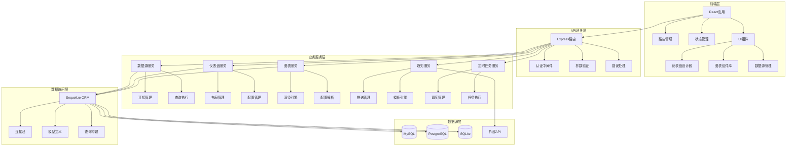
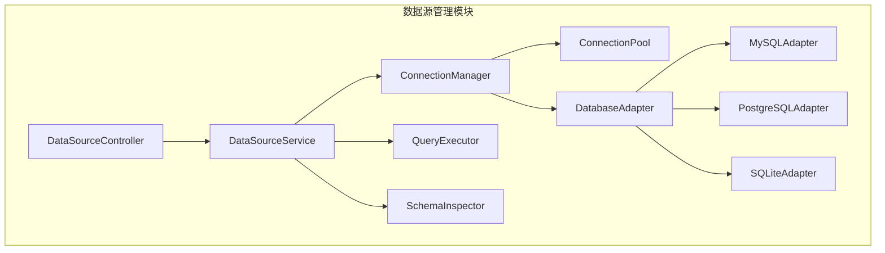
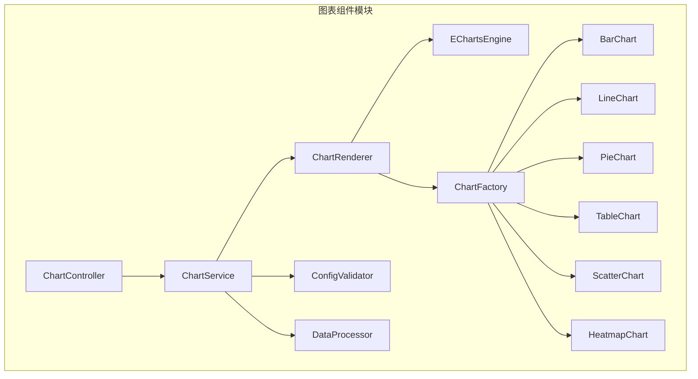
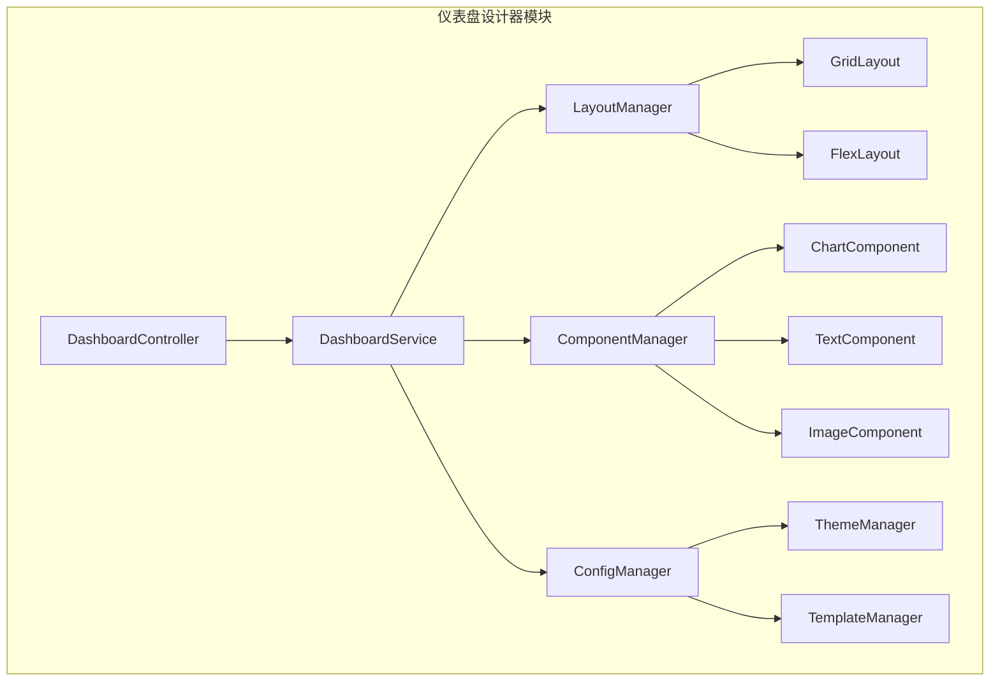
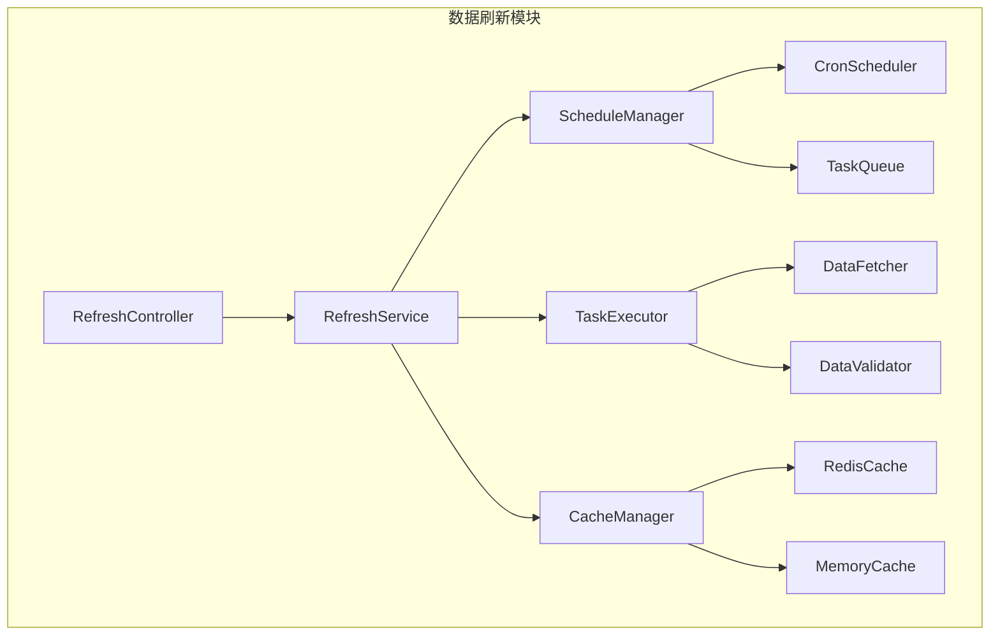
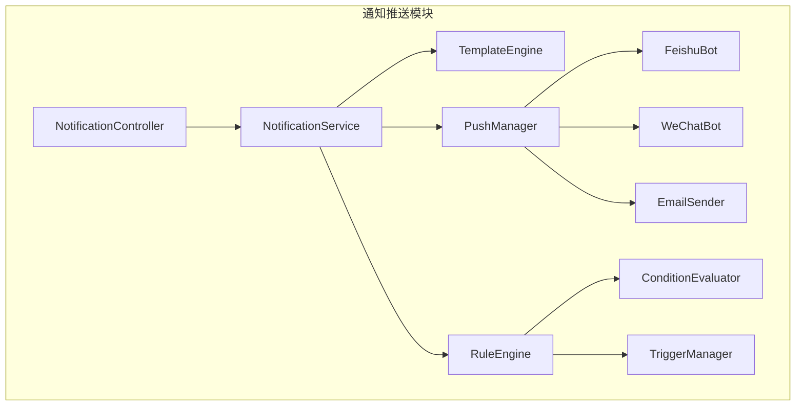
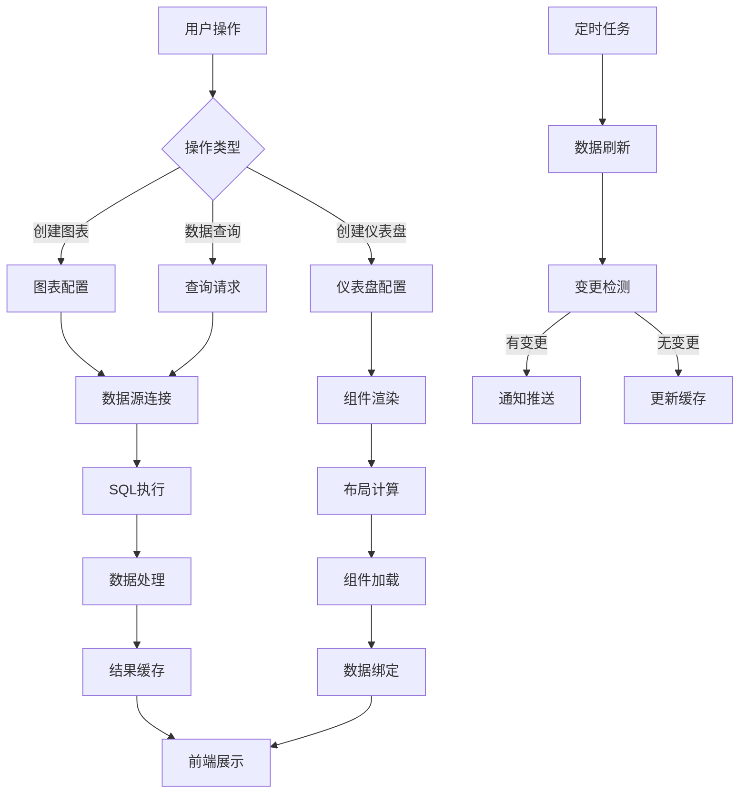

# 51Talk数据中台业务功能开发 - 系统设计文档

## 1. 整体架构设计

### 1.1 系统架构图



### 1.2 分层设计说明

#### 前端层 (Presentation Layer)
- **职责**: 用户界面展示和交互
- **技术**: React + TypeScript + Ant Design
- **核心组件**: 仪表盘设计器、图表组件库、数据源管理界面

#### API网关层 (API Gateway Layer)
- **职责**: 请求路由、认证授权、参数验证
- **技术**: Express.js + 中间件
- **功能**: 统一入口、安全控制、请求预处理

#### 业务服务层 (Business Service Layer)
- **职责**: 核心业务逻辑处理
- **模式**: 服务导向架构(SOA)
- **服务**: 数据源、仪表盘、图表、通知、定时任务服务

#### 数据访问层 (Data Access Layer)
- **职责**: 数据持久化和查询
- **技术**: Sequelize ORM
- **功能**: 多数据库支持、连接池管理、查询优化

#### 数据源层 (Data Source Layer)
- **职责**: 数据存储和外部数据接入
- **支持**: MySQL、PostgreSQL、SQLite、外部API

## 2. 核心模块设计

### 2.1 数据源管理模块

#### 2.1.1 模块架构



#### 2.1.2 接口定义

**DataSourceController**
```typescript
interface DataSourceController {
  // 创建数据源
  createDataSource(req: Request, res: Response): Promise<void>;
  
  // 获取数据源列表
  getDataSources(req: Request, res: Response): Promise<void>;
  
  // 更新数据源
  updateDataSource(req: Request, res: Response): Promise<void>;
  
  // 删除数据源
  deleteDataSource(req: Request, res: Response): Promise<void>;
  
  // 测试连接
  testConnection(req: Request, res: Response): Promise<void>;
  
  // 获取数据库结构
  getSchema(req: Request, res: Response): Promise<void>;
  
  // 执行查询
  executeQuery(req: Request, res: Response): Promise<void>;
}
```

**DataSourceService**
```typescript
interface DataSourceService {
  // 数据源CRUD操作
  create(config: DataSourceConfig): Promise<DataSource>;
  findAll(filters?: DataSourceFilters): Promise<DataSource[]>;
  findById(id: number): Promise<DataSource | null>;
  update(id: number, config: Partial<DataSourceConfig>): Promise<DataSource>;
  delete(id: number): Promise<boolean>;
  
  // 连接管理
  testConnection(config: DataSourceConfig): Promise<boolean>;
  getConnection(id: number): Promise<Connection>;
  
  // 查询执行
  executeQuery(id: number, query: string): Promise<QueryResult>;
  getSchema(id: number): Promise<DatabaseSchema>;
}
```

#### 2.1.3 数据模型

```typescript
interface DataSourceConfig {
  id?: number;
  name: string;
  type: 'mysql' | 'postgresql' | 'sqlite';
  host?: string;
  port?: number;
  database: string;
  username?: string;
  password?: string;
  options?: Record<string, any>;
  status: 'active' | 'inactive';
}

interface DatabaseSchema {
  tables: TableSchema[];
}

interface TableSchema {
  name: string;
  columns: ColumnSchema[];
  indexes: IndexSchema[];
}

interface ColumnSchema {
  name: string;
  type: string;
  nullable: boolean;
  defaultValue?: any;
  isPrimaryKey: boolean;
}
```

### 2.2 图表组件模块

#### 2.2.1 模块架构



#### 2.2.2 接口定义

**ChartService**
```typescript
interface ChartService {
  // 图表CRUD操作
  create(config: ChartConfig): Promise<Chart>;
  findAll(filters?: ChartFilters): Promise<Chart[]>;
  findById(id: number): Promise<Chart | null>;
  update(id: number, config: Partial<ChartConfig>): Promise<Chart>;
  delete(id: number): Promise<boolean>;
  
  // 图表渲染
  renderChart(id: number): Promise<ChartRenderResult>;
  previewChart(config: ChartConfig): Promise<ChartRenderResult>;
  
  // 数据处理
  processData(dataSourceId: number, query: string): Promise<ProcessedData>;
  validateConfig(config: ChartConfig): Promise<ValidationResult>;
}
```

**ChartRenderer**
```typescript
interface ChartRenderer {
  render(type: ChartType, data: any[], config: ChartConfig): ChartOption;
  getSupportedTypes(): ChartType[];
  getDefaultConfig(type: ChartType): ChartConfig;
  validateData(type: ChartType, data: any[]): boolean;
}
```

#### 2.2.3 图表配置模型

```typescript
interface ChartConfig {
  id?: number;
  name: string;
  type: ChartType;
  dataSourceId: number;
  queryConfig: QueryConfig;
  styleConfig: StyleConfig;
  interactionConfig: InteractionConfig;
  refreshInterval: number;
}

interface QueryConfig {
  sql: string;
  parameters?: Record<string, any>;
  dataMapping: DataMapping;
}

interface StyleConfig {
  title?: TitleConfig;
  legend?: LegendConfig;
  grid?: GridConfig;
  colors?: string[];
  theme?: string;
}

interface InteractionConfig {
  tooltip?: TooltipConfig;
  zoom?: ZoomConfig;
  brush?: BrushConfig;
  dataZoom?: DataZoomConfig;
}
```

### 2.3 仪表盘设计器模块

#### 2.3.1 模块架构



#### 2.3.2 接口定义

**DashboardService**
```typescript
interface DashboardService {
  // 仪表盘CRUD操作
  create(config: DashboardConfig): Promise<Dashboard>;
  findAll(filters?: DashboardFilters): Promise<Dashboard[]>;
  findById(id: number): Promise<Dashboard | null>;
  update(id: number, config: Partial<DashboardConfig>): Promise<Dashboard>;
  delete(id: number): Promise<boolean>;
  
  // 布局管理
  updateLayout(id: number, layout: LayoutConfig): Promise<Dashboard>;
  addComponent(id: number, component: ComponentConfig): Promise<Dashboard>;
  removeComponent(id: number, componentId: string): Promise<Dashboard>;
  
  // 数据刷新
  refreshData(id: number): Promise<DashboardData>;
  getDashboardData(id: number): Promise<DashboardData>;
}
```

**LayoutManager**
```typescript
interface LayoutManager {
  createLayout(type: LayoutType, config: LayoutConfig): Layout;
  updateLayout(layout: Layout, changes: LayoutChange[]): Layout;
  validateLayout(layout: Layout): ValidationResult;
  optimizeLayout(layout: Layout): Layout;
}
```

#### 2.3.3 仪表盘配置模型

```typescript
interface DashboardConfig {
  id?: number;
  name: string;
  description?: string;
  layout: LayoutConfig;
  components: ComponentConfig[];
  theme?: ThemeConfig;
  refreshInterval?: number;
  permissions?: PermissionConfig[];
}

interface LayoutConfig {
  type: 'grid' | 'flex';
  columns: number;
  rowHeight: number;
  margin: [number, number];
  padding: [number, number];
  responsive: boolean;
}

interface ComponentConfig {
  id: string;
  type: 'chart' | 'text' | 'image' | 'iframe';
  position: Position;
  size: Size;
  config: any;
  dataSource?: DataSourceRef;
}
```

### 2.4 数据刷新模块

#### 2.4.1 模块架构



#### 2.4.2 接口定义

**RefreshService**
```typescript
interface RefreshService {
  // 刷新任务管理
  createRefreshTask(config: RefreshTaskConfig): Promise<RefreshTask>;
  updateRefreshTask(id: number, config: Partial<RefreshTaskConfig>): Promise<RefreshTask>;
  deleteRefreshTask(id: number): Promise<boolean>;
  
  // 手动刷新
  refreshNow(targetType: 'chart' | 'dashboard', targetId: number): Promise<RefreshResult>;
  
  // 调度管理
  startSchedule(taskId: number): Promise<boolean>;
  stopSchedule(taskId: number): Promise<boolean>;
  getScheduleStatus(taskId: number): Promise<ScheduleStatus>;
  
  // 缓存管理
  clearCache(key: string): Promise<boolean>;
  getCacheInfo(key: string): Promise<CacheInfo>;
}
```

### 2.5 通知推送模块

#### 2.5.1 模块架构



#### 2.5.2 接口定义

**NotificationService**
```typescript
interface NotificationService {
  // 通知配置管理
  createNotification(config: NotificationConfig): Promise<Notification>;
  updateNotification(id: number, config: Partial<NotificationConfig>): Promise<Notification>;
  deleteNotification(id: number): Promise<boolean>;
  
  // 推送管理
  sendNotification(id: number, data: any): Promise<SendResult>;
  testNotification(config: NotificationConfig, data: any): Promise<SendResult>;
  
  // 模板管理
  createTemplate(template: NotificationTemplate): Promise<NotificationTemplate>;
  renderTemplate(templateId: number, data: any): Promise<string>;
}
```

## 3. 数据流设计

### 3.1 数据流向图



### 3.2 关键数据流程

#### 3.2.1 图表渲染流程
1. 用户选择图表类型和数据源
2. 配置图表参数和样式
3. 系统验证配置有效性
4. 执行数据查询
5. 处理和转换数据
6. 生成ECharts配置
7. 渲染图表到前端

#### 3.2.2 仪表盘加载流程
1. 加载仪表盘配置
2. 解析布局信息
3. 并行加载所有组件
4. 获取组件数据
5. 渲染组件到指定位置
6. 应用主题和样式

#### 3.2.3 数据刷新流程
1. 定时任务触发
2. 检查刷新配置
3. 执行数据查询
4. 比较数据变更
5. 更新缓存
6. 推送变更通知
7. 更新前端显示

## 4. 接口契约定义

### 4.1 REST API 规范

#### 4.1.1 数据源管理API

```yaml
# 创建数据源
POST /api/datasources
Content-Type: application/json

{
  "name": "生产数据库",
  "type": "mysql",
  "host": "localhost",
  "port": 3306,
  "database": "production",
  "username": "user",
  "password": "password"
}

# 响应
{
  "code": 200,
  "message": "success",
  "data": {
    "id": 1,
    "name": "生产数据库",
    "type": "mysql",
    "status": "active",
    "createdAt": "2024-01-24T10:00:00Z"
  }
}
```

#### 4.1.2 图表管理API

```yaml
# 创建图表
POST /api/charts
Content-Type: application/json

{
  "name": "销售趋势图",
  "type": "line",
  "dataSourceId": 1,
  "queryConfig": {
    "sql": "SELECT date, sales FROM sales_data WHERE date >= ?",
    "parameters": ["2024-01-01"]
  },
  "styleConfig": {
    "title": { "text": "销售趋势" },
    "colors": ["#1890ff"]
  }
}
```

#### 4.1.3 仪表盘管理API

```yaml
# 创建仪表盘
POST /api/dashboards
Content-Type: application/json

{
  "name": "运营概览",
  "description": "运营数据总览仪表盘",
  "layout": {
    "type": "grid",
    "columns": 12,
    "rowHeight": 60
  },
  "components": [
    {
      "id": "chart-1",
      "type": "chart",
      "chartId": 1,
      "position": { "x": 0, "y": 0 },
      "size": { "w": 6, "h": 4 }
    }
  ]
}
```

### 4.2 WebSocket 接口

#### 4.2.1 实时数据推送

```typescript
// 客户端订阅
interface SubscribeMessage {
  type: 'subscribe';
  target: 'chart' | 'dashboard';
  id: number;
}

// 服务端推送
interface DataUpdateMessage {
  type: 'data_update';
  target: 'chart' | 'dashboard';
  id: number;
  data: any;
  timestamp: string;
}

// 错误消息
interface ErrorMessage {
  type: 'error';
  code: string;
  message: string;
}
```

## 5. 异常处理策略

### 5.1 异常分类

#### 5.1.1 系统异常
- 数据库连接失败
- 服务器内部错误
- 内存不足
- 网络超时

#### 5.1.2 业务异常
- 数据源配置错误
- SQL语法错误
- 权限不足
- 数据格式错误

#### 5.1.3 用户异常
- 参数验证失败
- 认证失败
- 操作频率限制
- 资源不存在

### 5.2 异常处理机制

#### 5.2.1 全局异常处理器

```typescript
class GlobalExceptionHandler {
  handle(error: Error, req: Request, res: Response, next: NextFunction) {
    const errorInfo = this.parseError(error);
    
    // 记录日志
    this.logError(errorInfo, req);
    
    // 返回错误响应
    res.status(errorInfo.status).json({
      code: errorInfo.code,
      message: errorInfo.message,
      timestamp: new Date().toISOString(),
      path: req.path
    });
  }
  
  private parseError(error: Error): ErrorInfo {
    if (error instanceof ValidationError) {
      return {
        status: 400,
        code: 'VALIDATION_ERROR',
        message: error.message
      };
    }
    
    if (error instanceof DatabaseError) {
      return {
        status: 500,
        code: 'DATABASE_ERROR',
        message: '数据库操作失败'
      };
    }
    
    return {
      status: 500,
      code: 'INTERNAL_ERROR',
      message: '服务器内部错误'
    };
  }
}
```

#### 5.2.2 重试机制

```typescript
class RetryManager {
  async executeWithRetry<T>(
    operation: () => Promise<T>,
    options: RetryOptions = {}
  ): Promise<T> {
    const { maxRetries = 3, delay = 1000, backoff = 2 } = options;
    
    for (let attempt = 1; attempt <= maxRetries; attempt++) {
      try {
        return await operation();
      } catch (error) {
        if (attempt === maxRetries || !this.isRetryableError(error)) {
          throw error;
        }
        
        await this.delay(delay * Math.pow(backoff, attempt - 1));
      }
    }
    
    throw new Error('Max retries exceeded');
  }
}
```

## 6. 性能优化策略

### 6.1 前端优化
- 组件懒加载
- 虚拟滚动
- 图表数据分页
- 缓存策略
- 防抖节流

### 6.2 后端优化
- 数据库连接池
- 查询结果缓存
- SQL查询优化
- 异步处理
- 负载均衡

### 6.3 数据库优化
- 索引优化
- 查询优化
- 分页查询
- 读写分离
- 数据归档

---

**文档版本**: v1.0  
**创建时间**: 2024-01-24  
**最后更新**: 2024-01-24  
**状态**: 设计完成