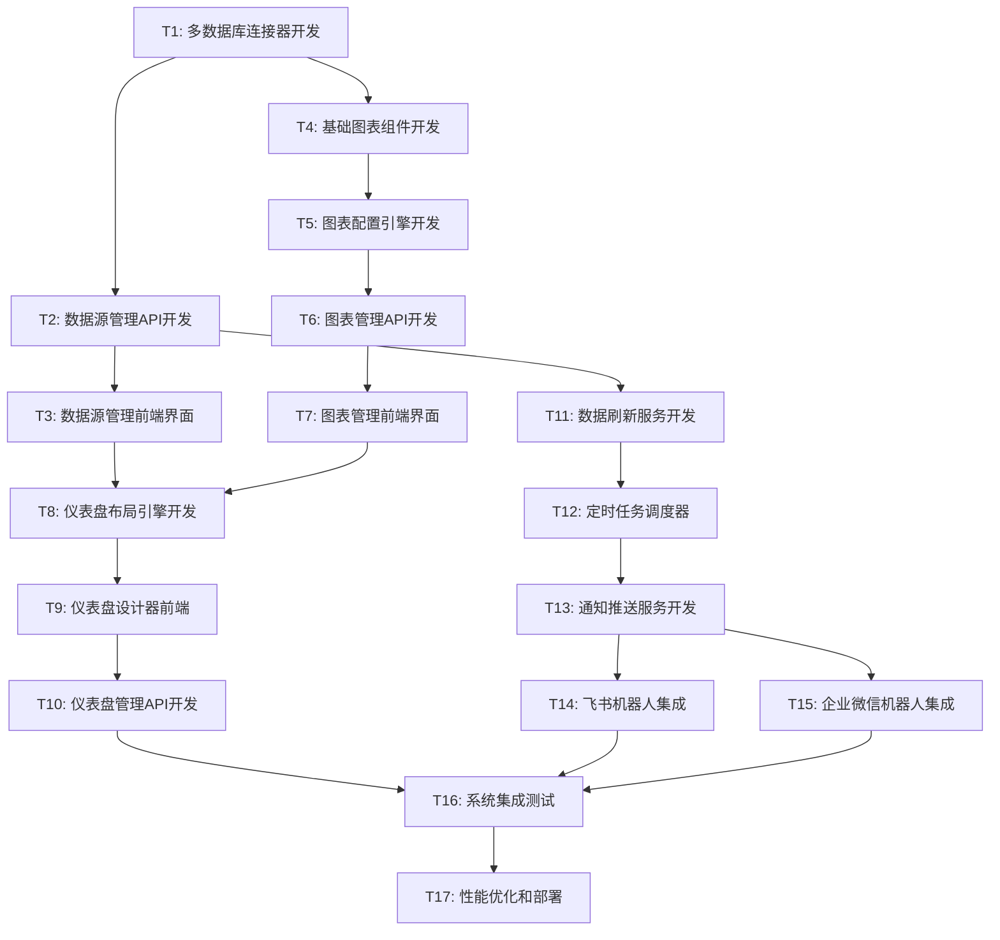

# 51Talk数据中台业务功能开发 - 任务拆分文档

## 1. 任务概述

基于系统设计文档，将业务功能开发拆分为可独立执行的原子任务。每个任务都有明确的输入输出契约、验收标准和依赖关系。

## 2. 任务依赖关系图

## 3. 任务详细定义

### T1: 多数据库连接器开发

**任务描述**: 开发支持MySQL、PostgreSQL、SQLite的统一数据库连接器

**输入契约**:
- 前置依赖: 无
- 输入数据: 数据库连接配置
- 环境依赖: Node.js 18+, Sequelize ORM

**输出契约**:
- 输出数据: 统一的数据库连接接口
- 交付物: 
  - `src/services/database/DatabaseConnector.ts`
  - `src/services/database/adapters/MySQLAdapter.ts`
  - `src/services/database/adapters/PostgreSQLAdapter.ts`
  - `src/services/database/adapters/SQLiteAdapter.ts`
  - `src/services/database/ConnectionPool.ts`
- 验收标准:
  - [ ] 支持三种数据库类型的连接
  - [ ] 连接池管理正常工作
  - [ ] 连接测试功能正常
  - [ ] 错误处理机制完善
  - [ ] 单元测试覆盖率 >= 90%

**实现约束**:
- 技术栈: TypeScript, Sequelize
- 接口规范: 统一的DatabaseAdapter接口
- 质量要求: 代码规范、错误处理、日志记录

**依赖关系**:
- 后置任务: T2, T4
- 并行任务: 无

---

### T2: 数据源管理API开发

**任务描述**: 开发数据源的CRUD操作API接口

**输入契约**:
- 前置依赖: T1 (多数据库连接器)
- 输入数据: 数据源配置信息
- 环境依赖: Express.js, 数据库连接器

**输出契约**:
- 输出数据: RESTful API接口
- 交付物:
  - `src/controllers/DataSourceController.ts`
  - `src/services/DataSourceService.ts`
  - `src/models/DataSource.ts`
  - `src/routes/datasource.ts`
  - API文档更新
- 验收标准:
  - [ ] 数据源CRUD操作正常
  - [ ] 连接测试API正常
  - [ ] 数据库结构查询API正常
  - [ ] SQL查询执行API正常
  - [ ] 参数验证和错误处理完善
  - [ ] API文档完整

**实现约束**:
- 技术栈: Express.js, TypeScript
- 接口规范: RESTful API设计规范
- 质量要求: 参数验证、错误处理、安全性

**依赖关系**:
- 前置任务: T1
- 后置任务: T3, T11
- 并行任务: T4

---

### T3: 数据源管理前端界面

**任务描述**: 开发数据源管理的前端界面

**输入契约**:
- 前置依赖: T2 (数据源管理API)
- 输入数据: API接口定义
- 环境依赖: React, Ant Design

**输出契约**:
- 输出数据: 数据源管理界面
- 交付物:
  - `src/pages/DataSource/DataSourceList.tsx`
  - `src/pages/DataSource/DataSourceForm.tsx`
  - `src/pages/DataSource/ConnectionTest.tsx`
  - `src/components/DataSource/`
  - `src/services/api/datasource.ts`
- 验收标准:
  - [ ] 数据源列表展示正常
  - [ ] 数据源创建/编辑表单正常
  - [ ] 连接测试功能正常
  - [ ] 数据源删除功能正常
  - [ ] 界面响应式适配
  - [ ] 错误提示友好

**实现约束**:
- 技术栈: React, TypeScript, Ant Design
- 接口规范: 组件化设计
- 质量要求: 用户体验、错误处理、响应式设计

**依赖关系**:
- 前置任务: T2
- 后置任务: T8
- 并行任务: T5, T6, T7

---

### T4: 基础图表组件开发

**任务描述**: 开发基于ECharts的可配置图表组件库

**输入契约**:
- 前置依赖: T1 (数据库连接器)
- 输入数据: 图表配置和数据
- 环境依赖: ECharts, React

**输出契约**:
- 输出数据: 图表组件库
- 交付物:
  - `src/components/Charts/BaseChart.tsx`
  - `src/components/Charts/BarChart.tsx`
  - `src/components/Charts/LineChart.tsx`
  - `src/components/Charts/PieChart.tsx`
  - `src/components/Charts/TableChart.tsx`
  - `src/components/Charts/ScatterChart.tsx`
  - `src/utils/chartConfig.ts`
- 验收标准:
  - [ ] 支持6种基础图表类型
  - [ ] 图表配置灵活可定制
  - [ ] 响应式设计适配
  - [ ] 数据更新实时渲染
  - [ ] 交互功能正常(缩放、提示等)
  - [ ] 组件文档完整

**实现约束**:
- 技术栈: React, TypeScript, ECharts
- 接口规范: 统一的图表组件接口
- 质量要求: 性能优化、内存管理、可复用性

**依赖关系**:
- 前置任务: T1
- 后置任务: T5
- 并行任务: T2

---

### T5: 图表配置引擎开发

**任务描述**: 开发图表配置的解析和验证引擎

**输入契约**:
- 前置依赖: T4 (基础图表组件)
- 输入数据: 图表配置JSON
- 环境依赖: 图表组件库

**输出契约**:
- 输出数据: 配置引擎服务
- 交付物:
  - `src/services/chart/ConfigEngine.ts`
  - `src/services/chart/ConfigValidator.ts`
  - `src/services/chart/DataProcessor.ts`
  - `src/types/chart.ts`
  - 配置Schema定义
- 验收标准:
  - [ ] 配置解析正确无误
  - [ ] 配置验证规则完善
  - [ ] 数据处理逻辑正确
  - [ ] 错误提示清晰明确
  - [ ] 性能满足要求
  - [ ] 扩展性良好

**实现约束**:
- 技术栈: TypeScript, JSON Schema
- 接口规范: 配置驱动设计
- 质量要求: 健壮性、扩展性、性能

**依赖关系**:
- 前置任务: T4
- 后置任务: T6
- 并行任务: T3

---

### T6: 图表管理API开发

**任务描述**: 开发图表的CRUD操作和渲染API

**输入契约**:
- 前置依赖: T5 (图表配置引擎)
- 输入数据: 图表配置和查询参数
- 环境依赖: Express.js, 配置引擎

**输出契约**:
- 输出数据: 图表管理API
- 交付物:
  - `src/controllers/ChartController.ts`
  - `src/services/ChartService.ts`
  - `src/models/Chart.ts`
  - `src/routes/chart.ts`
  - API文档更新
- 验收标准:
  - [ ] 图表CRUD操作正常
  - [ ] 图表渲染API正常
  - [ ] 图表预览功能正常
  - [ ] 数据查询和处理正常
  - [ ] 缓存机制工作正常
  - [ ] API性能满足要求

**实现约束**:
- 技术栈: Express.js, TypeScript
- 接口规范: RESTful API设计
- 质量要求: 性能优化、缓存策略、错误处理

**依赖关系**:
- 前置任务: T5
- 后置任务: T7
- 并行任务: T3

---

### T7: 图表管理前端界面

**任务描述**: 开发图表管理和配置的前端界面

**输入契约**:
- 前置依赖: T6 (图表管理API)
- 输入数据: API接口和图表组件
- 环境依赖: React, Ant Design, 图表组件

**输出契约**:
- 输出数据: 图表管理界面
- 交付物:
  - `src/pages/Chart/ChartList.tsx`
  - `src/pages/Chart/ChartEditor.tsx`
  - `src/pages/Chart/ChartPreview.tsx`
  - `src/components/Chart/ConfigPanel.tsx`
  - `src/services/api/chart.ts`
- 验收标准:
  - [ ] 图表列表展示正常
  - [ ] 图表编辑器功能完整
  - [ ] 实时预览功能正常
  - [ ] 配置面板交互友好
  - [ ] 图表保存和加载正常
  - [ ] 界面响应式适配

**实现约束**:
- 技术栈: React, TypeScript, Ant Design
- 接口规范: 组件化设计
- 质量要求: 用户体验、性能优化、可用性

**依赖关系**:
- 前置任务: T6
- 后置任务: T8
- 并行任务: T3

---

### T8: 仪表盘布局引擎开发

**任务描述**: 开发仪表盘的布局管理和组件管理引擎

**输入契约**:
- 前置依赖: T3 (数据源界面), T7 (图表界面)
- 输入数据: 布局配置和组件配置
- 环境依赖: React, 拖拽库

**输出契约**:
- 输出数据: 布局引擎服务
- 交付物:
  - `src/services/dashboard/LayoutEngine.ts`
  - `src/services/dashboard/ComponentManager.ts`
  - `src/components/Dashboard/GridLayout.tsx`
  - `src/components/Dashboard/DragDropProvider.tsx`
  - `src/types/dashboard.ts`
- 验收标准:
  - [ ] 网格布局功能正常
  - [ ] 拖拽操作流畅
  - [ ] 组件调整大小正常
  - [ ] 布局自适应功能正常
  - [ ] 组件管理功能完整
  - [ ] 性能满足要求

**实现约束**:
- 技术栈: React, TypeScript, react-grid-layout
- 接口规范: 布局引擎接口
- 质量要求: 性能优化、用户体验、稳定性

**依赖关系**:
- 前置任务: T3, T7
- 后置任务: T9
- 并行任务: 无

---

### T9: 仪表盘设计器前端

**任务描述**: 开发仪表盘设计器的前端界面

**输入契约**:
- 前置依赖: T8 (布局引擎)
- 输入数据: 布局引擎和组件库
- 环境依赖: React, 布局引擎

**输出契约**:
- 输出数据: 仪表盘设计器界面
- 交付物:
  - `src/pages/Dashboard/DashboardDesigner.tsx`
  - `src/pages/Dashboard/DashboardPreview.tsx`
  - `src/components/Dashboard/ComponentPalette.tsx`
  - `src/components/Dashboard/PropertyPanel.tsx`
  - `src/components/Dashboard/Toolbar.tsx`
- 验收标准:
  - [ ] 拖拽式设计器正常工作
  - [ ] 组件面板功能完整
  - [ ] 属性配置面板正常
  - [ ] 预览模式切换正常
  - [ ] 工具栏功能完整
  - [ ] 操作历史和撤销功能

**实现约束**:
- 技术栈: React, TypeScript, Ant Design
- 接口规范: 设计器组件接口
- 质量要求: 用户体验、操作流畅性、稳定性

**依赖关系**:
- 前置任务: T8
- 后置任务: T10
- 并行任务: 无

---

### T10: 仪表盘管理API开发

**任务描述**: 开发仪表盘的CRUD操作和数据获取API

**输入契约**:
- 前置依赖: T9 (仪表盘设计器)
- 输入数据: 仪表盘配置和布局信息
- 环境依赖: Express.js, 数据库

**输出契约**:
- 输出数据: 仪表盘管理API
- 交付物:
  - `src/controllers/DashboardController.ts`
  - `src/services/DashboardService.ts`
  - `src/models/Dashboard.ts`
  - `src/routes/dashboard.ts`
  - API文档更新
- 验收标准:
  - [ ] 仪表盘CRUD操作正常
  - [ ] 仪表盘数据获取正常
  - [ ] 布局保存和加载正常
  - [ ] 组件数据聚合正常
  - [ ] 权限控制正常
  - [ ] API性能满足要求

**实现约束**:
- 技术栈: Express.js, TypeScript
- 接口规范: RESTful API设计
- 质量要求: 数据一致性、性能优化、安全性

**依赖关系**:
- 前置任务: T9
- 后置任务: T16
- 并行任务: T11

---

### T11: 数据刷新服务开发

**任务描述**: 开发数据的自动刷新和缓存管理服务

**输入契约**:
- 前置依赖: T2 (数据源管理API)
- 输入数据: 刷新配置和数据源信息
- 环境依赖: Node.js, Redis(可选)

**输出契约**:
- 输出数据: 数据刷新服务
- 交付物:
  - `src/services/refresh/RefreshService.ts`
  - `src/services/refresh/CacheManager.ts`
  - `src/services/refresh/DataFetcher.ts`
  - `src/controllers/RefreshController.ts`
  - `src/routes/refresh.ts`
- 验收标准:
  - [ ] 手动刷新功能正常
  - [ ] 缓存机制工作正常
  - [ ] 数据更新检测正常
  - [ ] 错误处理和重试机制
  - [ ] 刷新状态监控正常
  - [ ] 性能满足要求

**实现约束**:
- 技术栈: Node.js, TypeScript, Redis
- 接口规范: 服务接口设计
- 质量要求: 可靠性、性能、监控

**依赖关系**:
- 前置任务: T2
- 后置任务: T12
- 并行任务: T10

---

### T12: 定时任务调度器

**任务描述**: 开发定时任务的调度和管理系统

**输入契约**:
- 前置依赖: T11 (数据刷新服务)
- 输入数据: 调度配置和任务定义
- 环境依赖: Node.js, node-cron

**输出契约**:
- 输出数据: 定时任务调度器
- 交付物:
  - `src/services/scheduler/TaskScheduler.ts`
  - `src/services/scheduler/JobManager.ts`
  - `src/services/scheduler/TaskQueue.ts`
  - `src/models/ScheduledTask.ts`
  - 调度器配置文件
- 验收标准:
  - [ ] 定时任务创建和管理正常
  - [ ] 任务调度准确可靠
  - [ ] 任务状态监控正常
  - [ ] 任务失败重试机制
  - [ ] 任务历史记录完整
  - [ ] 系统资源占用合理

**实现约束**:
- 技术栈: Node.js, TypeScript, node-cron
- 接口规范: 调度器接口设计
- 质量要求: 可靠性、准确性、监控

**依赖关系**:
- 前置任务: T11
- 后置任务: T13
- 并行任务: 无

---

### T13: 通知推送服务开发

**任务描述**: 开发通知推送的核心服务和模板引擎

**输入契约**:
- 前置依赖: T12 (定时任务调度器)
- 输入数据: 通知配置和数据变更信息
- 环境依赖: Node.js, HTTP客户端

**输出契约**:
- 输出数据: 通知推送服务
- 交付物:
  - `src/services/notification/NotificationService.ts`
  - `src/services/notification/TemplateEngine.ts`
  - `src/services/notification/RuleEngine.ts`
  - `src/controllers/NotificationController.ts`
  - `src/models/Notification.ts`
- 验收标准:
  - [ ] 通知配置管理正常
  - [ ] 模板引擎功能完整
  - [ ] 规则引擎逻辑正确
  - [ ] 推送失败重试机制
  - [ ] 通知历史记录完整
  - [ ] 性能满足要求

**实现约束**:
- 技术栈: Node.js, TypeScript, Handlebars
- 接口规范: 通知服务接口
- 质量要求: 可靠性、扩展性、监控

**依赖关系**:
- 前置任务: T12
- 后置任务: T14, T15
- 并行任务: 无

---

### T14: 飞书机器人集成

**任务描述**: 集成飞书机器人的webhook推送功能

**输入契约**:
- 前置依赖: T13 (通知推送服务)
- 输入数据: 飞书webhook配置和消息内容
- 环境依赖: 飞书机器人API, HTTP客户端

**输出契约**:
- 输出数据: 飞书机器人推送功能
- 交付物:
  - `src/services/notification/providers/FeishuBot.ts`
  - `src/templates/feishu/`
  - 飞书集成配置文件
  - 集成测试用例
- 验收标准:
  - [ ] 飞书机器人推送正常
  - [ ] 消息格式正确美观
  - [ ] 错误处理机制完善
  - [ ] 推送状态反馈正常
  - [ ] 配置管理简单易用
  - [ ] 集成测试通过

**实现约束**:
- 技术栈: Node.js, TypeScript, 飞书API
- 接口规范: 推送提供者接口
- 质量要求: 可靠性、用户体验、错误处理

**依赖关系**:
- 前置任务: T13
- 后置任务: T16
- 并行任务: T15

---

### T15: 企业微信机器人集成

**任务描述**: 集成企业微信应用机器人的webhook推送功能

**输入契约**:
- 前置依赖: T13 (通知推送服务)
- 输入数据: 企业微信webhook配置和消息内容
- 环境依赖: 企业微信机器人API, HTTP客户端

**输出契约**:
- 输出数据: 企业微信机器人推送功能
- 交付物:
  - `src/services/notification/providers/WeChatBot.ts`
  - `src/templates/wechat/`
  - 企业微信集成配置文件
  - 集成测试用例
- 验收标准:
  - [ ] 企业微信机器人推送正常
  - [ ] 消息格式正确美观
  - [ ] 错误处理机制完善
  - [ ] 推送状态反馈正常
  - [ ] 配置管理简单易用
  - [ ] 集成测试通过

**实现约束**:
- 技术栈: Node.js, TypeScript, 企业微信API
- 接口规范: 推送提供者接口
- 质量要求: 可靠性、用户体验、错误处理

**依赖关系**:
- 前置任务: T13
- 后置任务: T16
- 并行任务: T14

---

### T16: 系统集成测试

**任务描述**: 进行系统级集成测试和端到端测试

**输入契约**:
- 前置依赖: T10, T14, T15 (所有核心功能)
- 输入数据: 完整的系统功能
- 环境依赖: 测试环境, 测试数据

**输出契约**:
- 输出数据: 测试报告和问题修复
- 交付物:
  - 集成测试用例
  - 端到端测试脚本
  - 性能测试报告
  - 问题修复记录
  - 测试覆盖率报告
- 验收标准:
  - [ ] 所有核心功能正常工作
  - [ ] 系统集成无冲突
  - [ ] 性能指标满足要求
  - [ ] 错误处理机制完善
  - [ ] 用户体验良好
  - [ ] 安全性测试通过

**实现约束**:
- 技术栈: Jest, Cypress, 性能测试工具
- 接口规范: 测试规范和标准
- 质量要求: 全面性、准确性、可重复性

**依赖关系**:
- 前置任务: T10, T14, T15
- 后置任务: T17
- 并行任务: 无

---

### T17: 性能优化和部署

**任务描述**: 进行系统性能优化和生产环境部署

**输入契约**:
- 前置依赖: T16 (系统集成测试)
- 输入数据: 测试结果和性能数据
- 环境依赖: 生产环境, 监控工具

**输出契约**:
- 输出数据: 优化后的生产系统
- 交付物:
  - 性能优化代码
  - 部署脚本和配置
  - 监控配置
  - 运维文档
  - 用户手册
- 验收标准:
  - [ ] 系统性能满足要求
  - [ ] 部署流程自动化
  - [ ] 监控告警正常
  - [ ] 文档完整准确
  - [ ] 用户培训完成
  - [ ] 生产环境稳定运行

**实现约束**:
- 技术栈: Docker, CI/CD, 监控工具
- 接口规范: 部署和运维规范
- 质量要求: 稳定性、可维护性、可监控性

**依赖关系**:
- 前置任务: T16
- 后置任务: 无
- 并行任务: 无

## 4. 任务执行计划

### 4.1 第一阶段 (Week 1-2): 基础设施
- T1: 多数据库连接器开发 (3天)
- T2: 数据源管理API开发 (2天)
- T4: 基础图表组件开发 (3天)

### 4.2 第二阶段 (Week 3-4): 核心功能
- T3: 数据源管理前端界面 (2天)
- T5: 图表配置引擎开发 (3天)
- T6: 图表管理API开发 (2天)
- T7: 图表管理前端界面 (3天)

### 4.3 第三阶段 (Week 5-6): 仪表盘功能
- T8: 仪表盘布局引擎开发 (3天)
- T9: 仪表盘设计器前端 (4天)
- T10: 仪表盘管理API开发 (2天)
- T11: 数据刷新服务开发 (1天)

### 4.4 第四阶段 (Week 7-8): 高级功能
- T12: 定时任务调度器 (2天)
- T13: 通知推送服务开发 (2天)
- T14: 飞书机器人集成 (1天)
- T15: 企业微信机器人集成 (1天)
- T16: 系统集成测试 (2天)

### 4.5 第五阶段 (Week 9): 优化部署
- T17: 性能优化和部署 (5天)

## 5. 风险评估和缓解策略

### 5.1 技术风险
- **风险**: 多数据库兼容性问题
- **缓解**: 充分测试各数据库版本，建立兼容性矩阵

- **风险**: 图表性能问题
- **缓解**: 数据分页、虚拟滚动、懒加载

- **风险**: 实时数据同步复杂度
- **缓解**: 采用WebSocket + 缓存策略

### 5.2 进度风险
- **风险**: 任务依赖导致阻塞
- **缓解**: 并行开发、模拟接口、增量集成

- **风险**: 第三方API变更
- **缓解**: 版本锁定、适配器模式、降级方案

### 5.3 质量风险
- **风险**: 测试覆盖不足
- **缓解**: TDD开发、自动化测试、代码审查

- **风险**: 用户体验不佳
- **缓解**: 原型验证、用户反馈、迭代优化

---

**文档版本**: v1.0  
**创建时间**: 2024-01-24  
**最后更新**: 2024-01-24  
**状态**: 任务拆分完成