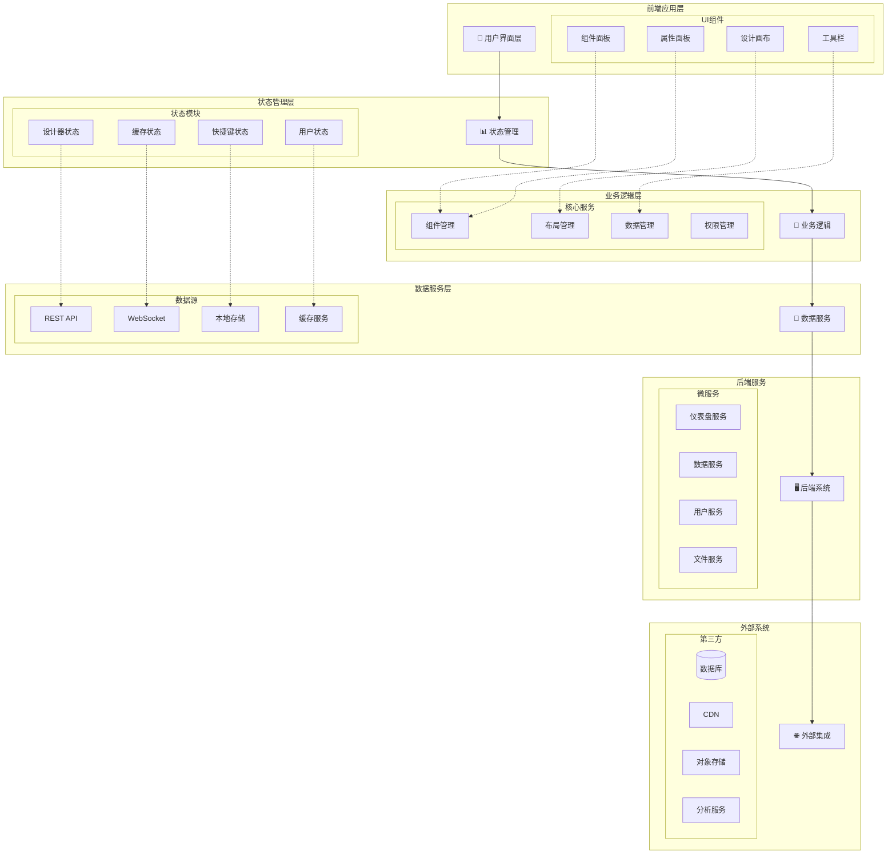
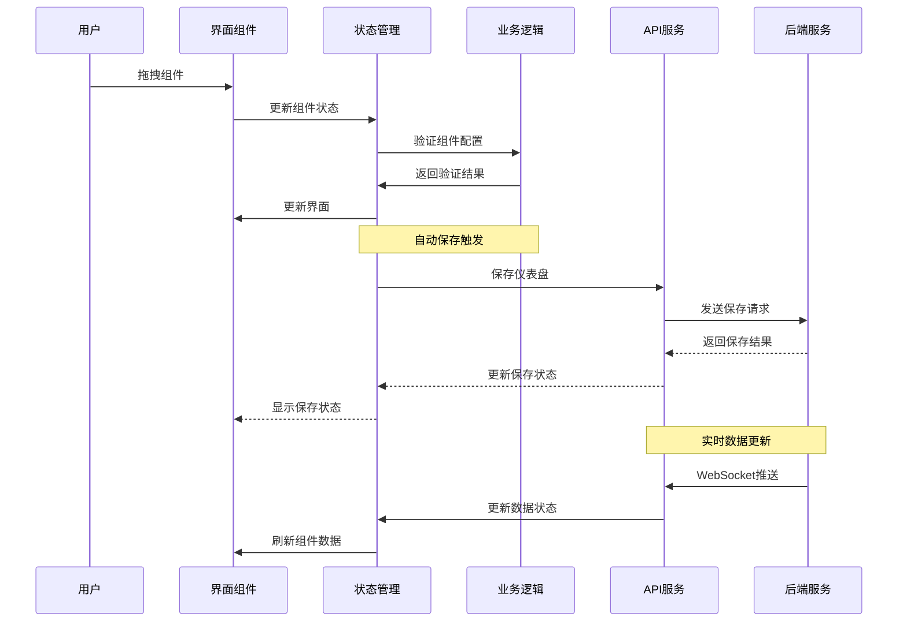
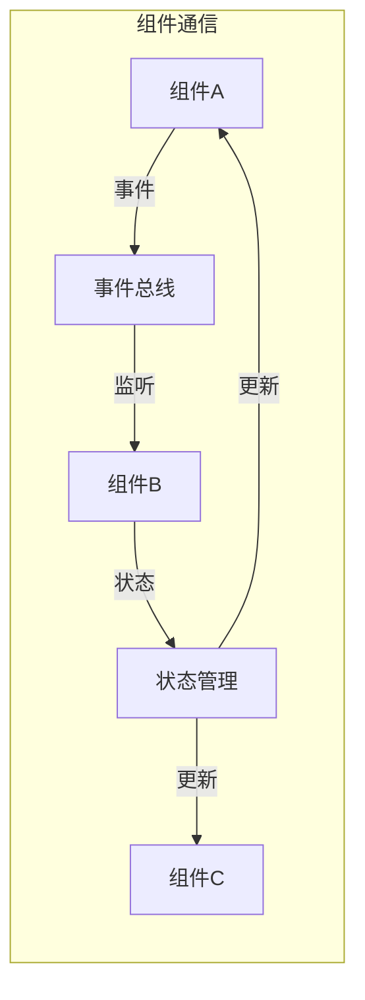
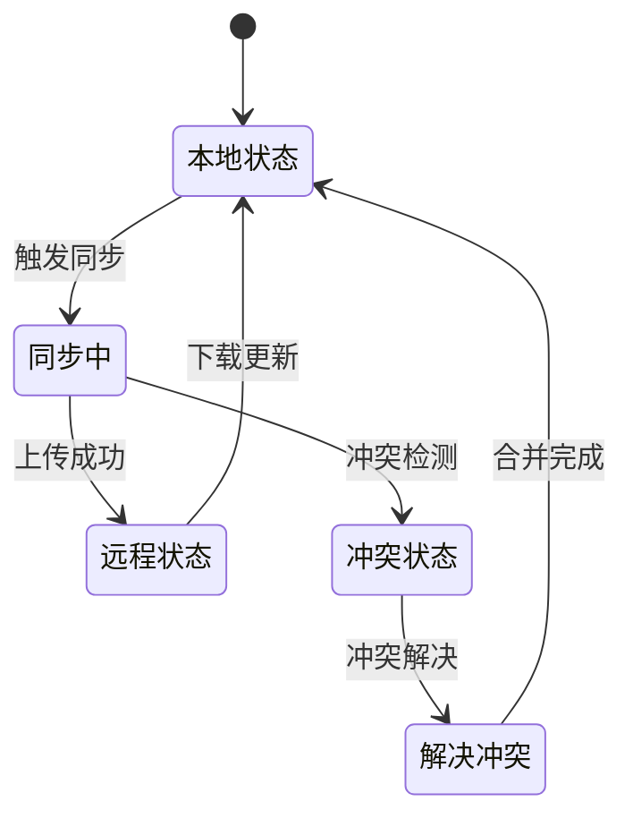
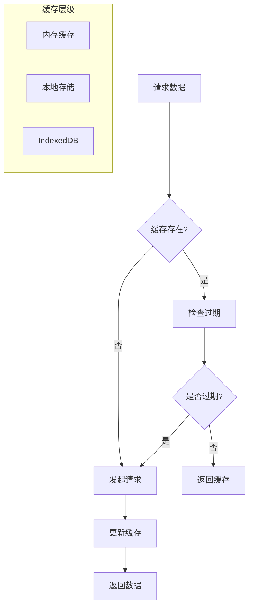
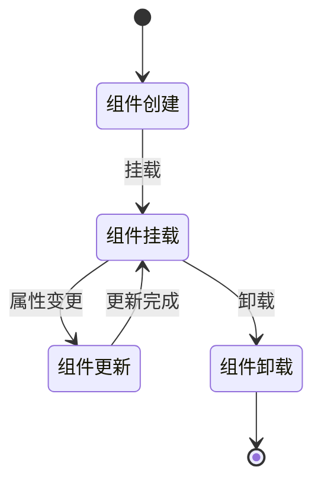
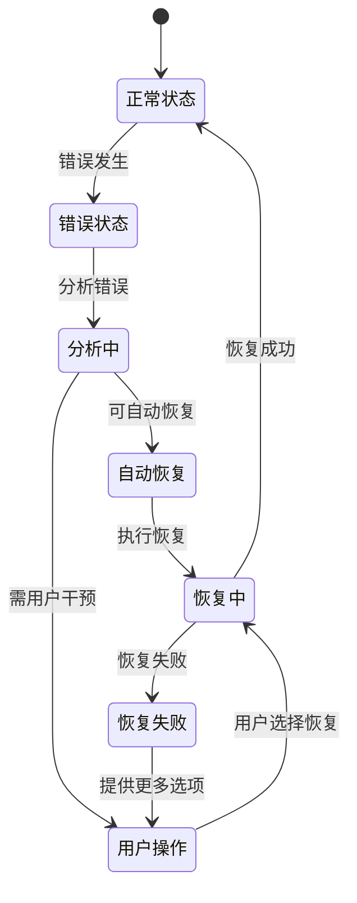

# 仪表盘设计器系统设计文档

## 设计概述

基于架构评估结果，本文档详细设计仪表盘设计器的系统架构，包括整体架构图、分层设计、核心组件、接口契约、数据流向和异常处理策略。

## 整体架构设计

### 🏗️ 系统架构图



### 🔄 数据流向图



## 分层架构设计

### 1️⃣ 用户界面层 (UI Layer)

#### 设计原则
- **组件化**: 每个UI元素都是独立的React组件
- **响应式**: 支持多种屏幕尺寸和设备
- **可访问性**: 遵循WCAG 2.1标准
- **主题化**: 支持多主题切换

#### 核心组件架构

```typescript
// 组件基础接口
interface BaseComponent {
  id: string;
  type: ComponentType;
  props: ComponentProps;
  style: ComponentStyle;
  events: ComponentEvents;
}

// 组件渲染器
interface ComponentRenderer {
  render(component: BaseComponent): React.ReactElement;
  validate(component: BaseComponent): ValidationResult;
  getDefaultProps(type: ComponentType): ComponentProps;
}

// 布局管理器
interface LayoutManager {
  addComponent(component: BaseComponent, position: Position): void;
  removeComponent(id: string): void;
  updateLayout(layout: Layout): void;
  getOptimalLayout(components: BaseComponent[]): Layout;
}
```

#### 组件通信机制



### 2️⃣ 状态管理层 (State Management Layer)

#### 状态架构设计

```typescript
// 全局状态结构
interface GlobalState {
  designer: DesignerState;
  user: UserState;
  data: DataState;
  ui: UIState;
  cache: CacheState;
}

// 设计器状态
interface DesignerState {
  dashboard: Dashboard;
  selectedComponents: string[];
  clipboard: Component[];
  history: HistoryState;
  layout: LayoutState;
  mode: DesignMode;
}

// 状态管理器
class StateManager {
  private state: GlobalState;
  private subscribers: Map<string, Subscriber[]>;
  private middleware: Middleware[];
  
  dispatch(action: Action): void;
  subscribe(path: string, callback: Subscriber): Unsubscribe;
  getState(path?: string): any;
  setState(path: string, value: any): void;
}
```

#### 状态同步策略



### 3️⃣ 业务逻辑层 (Business Logic Layer)

#### 核心服务设计

```typescript
// 组件管理服务
class ComponentService {
  async createComponent(type: ComponentType, config: ComponentConfig): Promise<Component>;
  async updateComponent(id: string, updates: Partial<Component>): Promise<Component>;
  async deleteComponent(id: string): Promise<void>;
  async duplicateComponent(id: string): Promise<Component>;
  validateComponent(component: Component): ValidationResult;
}

// 布局管理服务
class LayoutService {
  calculateLayout(components: Component[], constraints: LayoutConstraints): Layout;
  optimizeLayout(layout: Layout): Layout;
  validateLayout(layout: Layout): ValidationResult;
  getResponsiveLayout(layout: Layout, breakpoint: Breakpoint): Layout;
}

// 数据管理服务
class DataService {
  async connectDataSource(config: DataSourceConfig): Promise<DataConnection>;
  async executeQuery(query: DataQuery): Promise<DataResult>;
  async refreshData(componentId: string): Promise<void>;
  subscribeToRealTimeData(componentId: string, callback: DataCallback): Subscription;
}
```

#### 业务规则引擎

```typescript
// 规则引擎
interface BusinessRule {
  id: string;
  name: string;
  condition: (context: RuleContext) => boolean;
  action: (context: RuleContext) => void;
  priority: number;
}

class RuleEngine {
  private rules: BusinessRule[];
  
  addRule(rule: BusinessRule): void;
  removeRule(id: string): void;
  executeRules(context: RuleContext): void;
  validateRules(): ValidationResult[];
}

// 示例规则
const autoSaveRule: BusinessRule = {
  id: 'auto-save',
  name: '自动保存规则',
  condition: (ctx) => ctx.lastModified > ctx.lastSaved + 30000,
  action: (ctx) => ctx.saveManager.autoSave(),
  priority: 1
};
```

### 4️⃣ 数据服务层 (Data Service Layer)

#### API服务架构

```typescript
// API客户端
class APIClient {
  private baseURL: string;
  private interceptors: Interceptor[];
  private cache: Cache;
  
  async get<T>(url: string, config?: RequestConfig): Promise<T>;
  async post<T>(url: string, data: any, config?: RequestConfig): Promise<T>;
  async put<T>(url: string, data: any, config?: RequestConfig): Promise<T>;
  async delete<T>(url: string, config?: RequestConfig): Promise<T>;
  
  addInterceptor(interceptor: Interceptor): void;
  setCache(cache: Cache): void;
}

// WebSocket管理器
class WebSocketManager {
  private connections: Map<string, WebSocket>;
  private eventHandlers: Map<string, EventHandler[]>;
  
  connect(url: string, options?: WSOptions): Promise<WebSocket>;
  disconnect(url: string): void;
  send(url: string, message: any): void;
  subscribe(event: string, handler: EventHandler): Unsubscribe;
}
```

#### 缓存策略



## 核心模块设计

### 🎨 组件系统模块

#### 组件注册机制

```typescript
// 组件定义
interface ComponentDefinition {
  type: string;
  name: string;
  category: ComponentCategory;
  icon: string;
  defaultProps: ComponentProps;
  configSchema: JSONSchema;
  renderer: ComponentRenderer;
  validator: ComponentValidator;
}

// 组件注册表
class ComponentRegistry {
  private components = new Map<string, ComponentDefinition>();
  private plugins = new Map<string, ComponentPlugin>();
  
  register(definition: ComponentDefinition): void {
    this.validateDefinition(definition);
    this.components.set(definition.type, definition);
    this.notifyRegistration(definition);
  }
  
  unregister(type: string): void {
    this.components.delete(type);
    this.notifyUnregistration(type);
  }
  
  getComponent(type: string): ComponentDefinition | undefined {
    return this.components.get(type);
  }
  
  getAllComponents(): ComponentDefinition[] {
    return Array.from(this.components.values());
  }
  
  getComponentsByCategory(category: ComponentCategory): ComponentDefinition[] {
    return this.getAllComponents().filter(comp => comp.category === category);
  }
}
```

#### 组件生命周期



### 📐 布局引擎模块

#### 布局算法

```typescript
// 布局算法接口
interface LayoutAlgorithm {
  name: string;
  calculate(components: Component[], constraints: LayoutConstraints): Layout;
  optimize(layout: Layout): Layout;
  validate(layout: Layout): ValidationResult;
}

// 网格布局算法
class GridLayoutAlgorithm implements LayoutAlgorithm {
  name = 'grid';
  
  calculate(components: Component[], constraints: LayoutConstraints): Layout {
    const grid = this.createGrid(constraints);
    const positions = this.placeComponents(components, grid);
    return this.generateLayout(positions);
  }
  
  private createGrid(constraints: LayoutConstraints): Grid {
    return {
      cols: constraints.cols || 12,
      rowHeight: constraints.rowHeight || 100,
      margin: constraints.margin || [10, 10],
      containerPadding: constraints.containerPadding || [10, 10]
    };
  }
  
  private placeComponents(components: Component[], grid: Grid): Position[] {
    // 实现组件放置逻辑
    return components.map(comp => this.findOptimalPosition(comp, grid));
  }
}

// 自由布局算法
class FreeLayoutAlgorithm implements LayoutAlgorithm {
  name = 'free';
  
  calculate(components: Component[], constraints: LayoutConstraints): Layout {
    // 实现自由布局逻辑
    return components.map(comp => ({
      i: comp.id,
      x: comp.position?.x || 0,
      y: comp.position?.y || 0,
      w: comp.size?.width || 1,
      h: comp.size?.height || 1
    }));
  }
}
```

#### 响应式布局

```typescript
// 响应式布局管理器
class ResponsiveLayoutManager {
  private breakpoints: Breakpoint[] = [
    { name: 'lg', width: 1200 },
    { name: 'md', width: 996 },
    { name: 'sm', width: 768 },
    { name: 'xs', width: 480 }
  ];
  
  getBreakpoint(width: number): Breakpoint {
    return this.breakpoints.find(bp => width >= bp.width) || this.breakpoints[this.breakpoints.length - 1];
  }
  
  adaptLayout(layout: Layout, fromBreakpoint: string, toBreakpoint: string): Layout {
    const ratio = this.getBreakpointRatio(fromBreakpoint, toBreakpoint);
    return layout.map(item => ({
      ...item,
      w: Math.max(1, Math.round(item.w * ratio)),
      h: Math.max(1, Math.round(item.h * ratio))
    }));
  }
}
```

### 💾 数据绑定模块

#### 数据源管理

```typescript
// 数据源接口
interface DataSource {
  id: string;
  name: string;
  type: DataSourceType;
  config: DataSourceConfig;
  status: ConnectionStatus;
}

// 数据源管理器
class DataSourceManager {
  private dataSources = new Map<string, DataSource>();
  private connections = new Map<string, DataConnection>();
  
  async addDataSource(config: DataSourceConfig): Promise<DataSource> {
    const dataSource = await this.createDataSource(config);
    await this.testConnection(dataSource);
    this.dataSources.set(dataSource.id, dataSource);
    return dataSource;
  }
  
  async removeDataSource(id: string): Promise<void> {
    const connection = this.connections.get(id);
    if (connection) {
      await connection.close();
      this.connections.delete(id);
    }
    this.dataSources.delete(id);
  }
  
  async executeQuery(dataSourceId: string, query: DataQuery): Promise<DataResult> {
    const connection = await this.getConnection(dataSourceId);
    return connection.execute(query);
  }
}
```

#### 数据转换管道

```typescript
// 数据转换器
interface DataTransformer {
  name: string;
  transform(data: any, config: TransformConfig): any;
  validate(data: any): ValidationResult;
}

// 数据管道
class DataPipeline {
  private transformers: DataTransformer[] = [];
  
  addTransformer(transformer: DataTransformer): void {
    this.transformers.push(transformer);
  }
  
  async process(data: any, config: PipelineConfig): Promise<any> {
    let result = data;
    
    for (const transformer of this.transformers) {
      if (config.enabledTransformers.includes(transformer.name)) {
        result = await transformer.transform(result, config.transformerConfigs[transformer.name]);
      }
    }
    
    return result;
  }
}

// 内置转换器
const filterTransformer: DataTransformer = {
  name: 'filter',
  transform: (data, config) => {
    return data.filter(item => this.evaluateCondition(item, config.condition));
  },
  validate: (data) => Array.isArray(data)
};

const sortTransformer: DataTransformer = {
  name: 'sort',
  transform: (data, config) => {
    return data.sort((a, b) => this.compareValues(a[config.field], b[config.field], config.order));
  },
  validate: (data) => Array.isArray(data)
};
```

## 接口契约定义

### 🔌 组件接口

```typescript
// 组件基础接口
interface IComponent {
  // 基础属性
  readonly id: string;
  readonly type: ComponentType;
  
  // 生命周期方法
  onCreate?(context: ComponentContext): void;
  onMount?(context: ComponentContext): void;
  onUpdate?(prevProps: ComponentProps, context: ComponentContext): void;
  onUnmount?(context: ComponentContext): void;
  
  // 渲染方法
  render(props: ComponentProps, context: ComponentContext): React.ReactElement;
  
  // 配置方法
  getDefaultProps(): ComponentProps;
  getConfigSchema(): JSONSchema;
  validateProps(props: ComponentProps): ValidationResult;
  
  // 数据方法
  onDataChange?(data: any, context: ComponentContext): void;
  getDataRequirements?(): DataRequirement[];
}

// 组件上下文
interface ComponentContext {
  readonly designMode: boolean;
  readonly theme: Theme;
  readonly locale: string;
  readonly eventBus: EventBus;
  readonly dataManager: DataManager;
  readonly layoutManager: LayoutManager;
}
```

### 🔄 数据接口

```typescript
// 数据服务接口
interface IDataService {
  // 数据源管理
  addDataSource(config: DataSourceConfig): Promise<DataSource>;
  removeDataSource(id: string): Promise<void>;
  testConnection(id: string): Promise<ConnectionResult>;
  
  // 数据查询
  executeQuery(query: DataQuery): Promise<DataResult>;
  subscribeToData(subscription: DataSubscription): Promise<Subscription>;
  unsubscribeFromData(subscriptionId: string): Promise<void>;
  
  // 数据缓存
  getCachedData(key: string): Promise<any>;
  setCachedData(key: string, data: any, ttl?: number): Promise<void>;
  clearCache(pattern?: string): Promise<void>;
}

// 数据查询接口
interface DataQuery {
  dataSourceId: string;
  query: string | QueryObject;
  parameters?: Record<string, any>;
  timeout?: number;
  cache?: CacheOptions;
}

// 数据结果接口
interface DataResult {
  data: any;
  metadata: ResultMetadata;
  error?: Error;
  cached: boolean;
  timestamp: number;
}
```

### 🎛️ 布局接口

```typescript
// 布局管理接口
interface ILayoutManager {
  // 布局操作
  addComponent(component: Component, position?: Position): Promise<void>;
  removeComponent(id: string): Promise<void>;
  moveComponent(id: string, position: Position): Promise<void>;
  resizeComponent(id: string, size: Size): Promise<void>;
  
  // 布局计算
  calculateLayout(components: Component[]): Promise<Layout>;
  optimizeLayout(layout: Layout): Promise<Layout>;
  validateLayout(layout: Layout): ValidationResult;
  
  // 响应式布局
  getResponsiveLayout(breakpoint: string): Promise<Layout>;
  adaptToBreakpoint(layout: Layout, breakpoint: string): Promise<Layout>;
}

// 位置接口
interface Position {
  x: number;
  y: number;
  z?: number;
}

// 尺寸接口
interface Size {
  width: number;
  height: number;
}

// 布局项接口
interface LayoutItem {
  i: string;  // 组件ID
  x: number;  // X坐标
  y: number;  // Y坐标
  w: number;  // 宽度
  h: number;  // 高度
  minW?: number;  // 最小宽度
  maxW?: number;  // 最大宽度
  minH?: number;  // 最小高度
  maxH?: number;  // 最大高度
  static?: boolean;  // 是否静态
  isDraggable?: boolean;  // 是否可拖拽
  isResizable?: boolean;  // 是否可调整大小
}
```

## 异常处理策略

### 🚨 错误分类

```typescript
// 错误类型枚举
enum ErrorType {
  VALIDATION_ERROR = 'validation_error',
  NETWORK_ERROR = 'network_error',
  DATA_ERROR = 'data_error',
  COMPONENT_ERROR = 'component_error',
  LAYOUT_ERROR = 'layout_error',
  PERMISSION_ERROR = 'permission_error',
  SYSTEM_ERROR = 'system_error'
}

// 错误基类
abstract class BaseError extends Error {
  abstract readonly type: ErrorType;
  abstract readonly code: string;
  readonly timestamp: number;
  readonly context?: any;
  
  constructor(message: string, context?: any) {
    super(message);
    this.timestamp = Date.now();
    this.context = context;
  }
  
  abstract getRecoveryActions(): RecoveryAction[];
  abstract getSeverity(): ErrorSeverity;
}

// 具体错误类
class ValidationError extends BaseError {
  readonly type = ErrorType.VALIDATION_ERROR;
  readonly code: string;
  
  constructor(code: string, message: string, field?: string) {
    super(message, { field });
    this.code = code;
  }
  
  getRecoveryActions(): RecoveryAction[] {
    return [
      { type: 'fix_validation', label: '修复验证错误' },
      { type: 'reset_field', label: '重置字段' }
    ];
  }
  
  getSeverity(): ErrorSeverity {
    return ErrorSeverity.WARNING;
  }
}
```

### 🔄 错误恢复机制



### 🛡️ 错误边界

```typescript
// 错误边界组件
class ErrorBoundary extends React.Component<ErrorBoundaryProps, ErrorBoundaryState> {
  constructor(props: ErrorBoundaryProps) {
    super(props);
    this.state = { hasError: false, error: null, errorInfo: null };
  }
  
  static getDerivedStateFromError(error: Error): Partial<ErrorBoundaryState> {
    return { hasError: true, error };
  }
  
  componentDidCatch(error: Error, errorInfo: React.ErrorInfo) {
    this.setState({ errorInfo });
    
    // 记录错误
    this.logError(error, errorInfo);
    
    // 尝试恢复
    this.attemptRecovery(error);
  }
  
  private logError(error: Error, errorInfo: React.ErrorInfo) {
    const errorReport = {
      message: error.message,
      stack: error.stack,
      componentStack: errorInfo.componentStack,
      timestamp: Date.now(),
      userAgent: navigator.userAgent,
      url: window.location.href
    };
    
    // 发送错误报告
    this.props.onError?.(errorReport);
  }
  
  private attemptRecovery(error: Error) {
    // 根据错误类型尝试不同的恢复策略
    if (error instanceof ComponentError) {
      this.recoverFromComponentError(error);
    } else if (error instanceof DataError) {
      this.recoverFromDataError(error);
    }
  }
  
  render() {
    if (this.state.hasError) {
      return this.props.fallback || <DefaultErrorFallback error={this.state.error} />;
    }
    
    return this.props.children;
  }
}
```

## 性能优化策略

### ⚡ 渲染优化

```typescript
// 虚拟化渲染
class VirtualizedCanvas extends React.Component<VirtualizedCanvasProps> {
  private observer: IntersectionObserver;
  private visibleComponents = new Set<string>();
  
  componentDidMount() {
    this.setupIntersectionObserver();
  }
  
  private setupIntersectionObserver() {
    this.observer = new IntersectionObserver(
      (entries) => {
        entries.forEach(entry => {
          const componentId = entry.target.getAttribute('data-component-id');
          if (entry.isIntersecting) {
            this.visibleComponents.add(componentId!);
          } else {
            this.visibleComponents.delete(componentId!);
          }
        });
        this.forceUpdate();
      },
      { threshold: 0.1 }
    );
  }
  
  render() {
    const { components } = this.props;
    
    return (
      <div className="virtualized-canvas">
        {components.map(component => (
          <div
            key={component.id}
            data-component-id={component.id}
            ref={el => el && this.observer.observe(el)}
          >
            {this.visibleComponents.has(component.id) ? (
              <ComponentRenderer component={component} />
            ) : (
              <ComponentPlaceholder component={component} />
            )}
          </div>
        ))}
      </div>
    );
  }
}

// 组件懒加载
const LazyComponentRenderer = React.lazy(() => 
  import('./ComponentRenderer').then(module => ({
    default: React.memo(module.ComponentRenderer)
  }))
);
```

### 🗄️ 状态优化

```typescript
// 状态分片
class StateManager {
  private slices = new Map<string, StateSlice>();
  
  createSlice<T>(name: string, initialState: T, reducers: SliceReducers<T>): StateSlice<T> {
    const slice = new StateSlice(name, initialState, reducers);
    this.slices.set(name, slice);
    return slice;
  }
  
  getSlice<T>(name: string): StateSlice<T> | undefined {
    return this.slices.get(name) as StateSlice<T>;
  }
  
  // 选择性更新
  updateSlice(name: string, updates: Partial<any>) {
    const slice = this.slices.get(name);
    if (slice) {
      slice.update(updates);
      this.notifySubscribers(name, slice.getState());
    }
  }
}

// 内存优化
class MemoryManager {
  private cache = new Map<string, CacheEntry>();
  private maxSize = 100; // 最大缓存条目数
  
  set(key: string, value: any, ttl = 300000) { // 默认5分钟TTL
    if (this.cache.size >= this.maxSize) {
      this.evictOldest();
    }
    
    this.cache.set(key, {
      value,
      timestamp: Date.now(),
      ttl,
      accessCount: 0
    });
  }
  
  get(key: string): any {
    const entry = this.cache.get(key);
    if (!entry) return undefined;
    
    if (Date.now() - entry.timestamp > entry.ttl) {
      this.cache.delete(key);
      return undefined;
    }
    
    entry.accessCount++;
    return entry.value;
  }
  
  private evictOldest() {
    let oldestKey = '';
    let oldestTime = Date.now();
    
    for (const [key, entry] of this.cache) {
      if (entry.timestamp < oldestTime) {
        oldestTime = entry.timestamp;
        oldestKey = key;
      }
    }
    
    if (oldestKey) {
      this.cache.delete(oldestKey);
    }
  }
}
```

## 安全设计

### 🔒 权限控制

```typescript
// 权限管理器
class PermissionManager {
  private permissions = new Map<string, Permission[]>();
  private roles = new Map<string, Role>();
  
  async checkPermission(userId: string, resource: string, action: string): Promise<boolean> {
    const userPermissions = await this.getUserPermissions(userId);
    return userPermissions.some(permission => 
      permission.resource === resource && 
      permission.actions.includes(action)
    );
  }
  
  async grantPermission(userId: string, permission: Permission): Promise<void> {
    const userPermissions = this.permissions.get(userId) || [];
    userPermissions.push(permission);
    this.permissions.set(userId, userPermissions);
    
    // 记录权限变更
    await this.auditLog.log({
      action: 'grant_permission',
      userId,
      permission,
      timestamp: Date.now()
    });
  }
}

// 权限装饰器
function RequirePermission(resource: string, action: string) {
  return function(target: any, propertyKey: string, descriptor: PropertyDescriptor) {
    const originalMethod = descriptor.value;
    
    descriptor.value = async function(...args: any[]) {
      const hasPermission = await this.permissionManager.checkPermission(
        this.currentUser.id,
        resource,
        action
      );
      
      if (!hasPermission) {
        throw new PermissionError(`Access denied for ${resource}:${action}`);
      }
      
      return originalMethod.apply(this, args);
    };
  };
}
```

### 🛡️ 数据验证

```typescript
// 数据验证器
class DataValidator {
  private schemas = new Map<string, JSONSchema>();
  
  registerSchema(name: string, schema: JSONSchema) {
    this.schemas.set(name, schema);
  }
  
  validate(data: any, schemaName: string): ValidationResult {
    const schema = this.schemas.get(schemaName);
    if (!schema) {
      throw new Error(`Schema ${schemaName} not found`);
    }
    
    return this.validateAgainstSchema(data, schema);
  }
  
  private validateAgainstSchema(data: any, schema: JSONSchema): ValidationResult {
    const errors: ValidationError[] = [];
    
    // 实现JSON Schema验证逻辑
    if (!this.validateType(data, schema.type)) {
      errors.push(new ValidationError('type_mismatch', `Expected ${schema.type}`));
    }
    
    if (schema.required) {
      for (const field of schema.required) {
        if (!(field in data)) {
          errors.push(new ValidationError('required_field', `Field ${field} is required`));
        }
      }
    }
    
    return {
      valid: errors.length === 0,
      errors
    };
  }
}

// XSS防护
class XSSProtection {
  private allowedTags = ['b', 'i', 'u', 'strong', 'em'];
  private allowedAttributes = ['class', 'id'];
  
  sanitize(input: string): string {
    // 移除危险的HTML标签和属性
    return input
      .replace(/<script[^>]*>.*?<\/script>/gi, '')
      .replace(/on\w+="[^"]*"/gi, '')
      .replace(/javascript:/gi, '')
      .replace(/<iframe[^>]*>.*?<\/iframe>/gi, '');
  }
  
  validateInput(input: any): boolean {
    if (typeof input === 'string') {
      return !this.containsMaliciousCode(input);
    }
    
    if (typeof input === 'object') {
      return this.validateObject(input);
    }
    
    return true;
  }
  
  private containsMaliciousCode(input: string): boolean {
    const maliciousPatterns = [
      /<script/i,
      /javascript:/i,
      /on\w+=/i,
      /<iframe/i,
      /eval\(/i
    ];
    
    return maliciousPatterns.some(pattern => pattern.test(input));
  }
}
```

## 总结

本设计文档基于架构评估结果，详细设计了仪表盘设计器的系统架构，包括：

### ✅ 设计亮点

1. **分层清晰**: 四层架构设计，职责分离明确
2. **接口规范**: 完整的接口契约定义，支持模块解耦
3. **扩展性强**: 插件化组件系统，支持动态扩展
4. **性能优化**: 虚拟化渲染、状态分片、内存管理
5. **安全可靠**: 权限控制、数据验证、XSS防护
6. **错误处理**: 完善的异常处理和恢复机制

### 🎯 实现优先级

1. **高优先级**: 核心组件系统、布局引擎、状态管理
2. **中优先级**: 数据绑定、权限控制、性能优化
3. **低优先级**: 高级功能、AI集成、边缘特性

### 📋 下一步行动

1. 基于本设计文档进行任务原子化拆分
2. 制定详细的开发计划和里程碑
3. 建立代码规范和质量标准
4. 搭建开发和测试环境

---

**设计版本**: v1.0  
**设计时间**: 2024-01-20  
**设计团队**: 架构组  
**审核状态**: 待审核