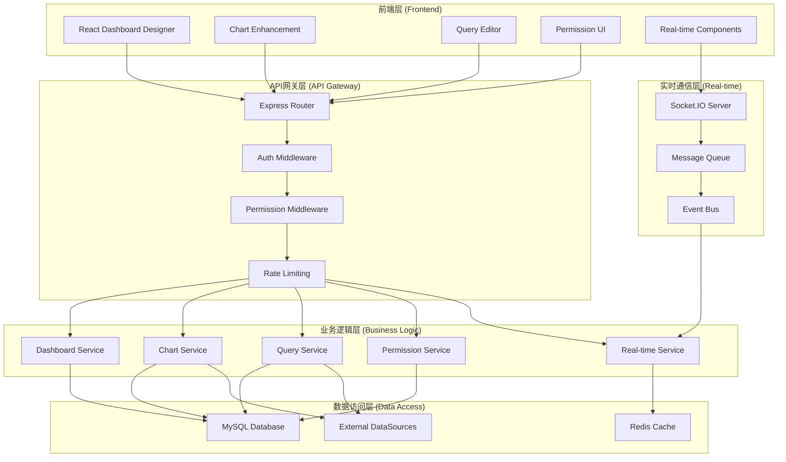
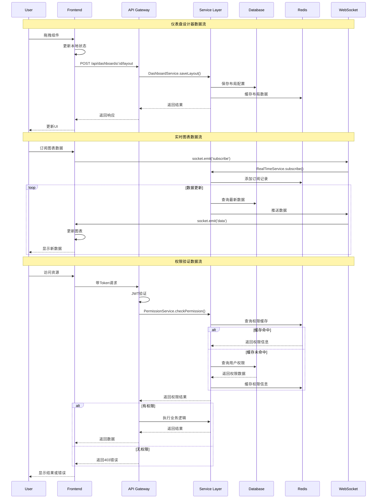

# DESIGN - 功能完善系统设计文档

## 整体架构图



## 分层设计

### 1. 前端展示层 (Presentation Layer)

#### 1.1 仪表盘设计器模块
```typescript
// 组件架构
DashboardDesigner/
├── index.tsx                 # 主入口组件
├── components/
│   ├── LayoutEditor/         # 布局编辑器
│   │   ├── GridLayout.tsx    # 网格布局组件
│   │   ├── DragHandle.tsx    # 拖拽手柄
│   │   └── ResizeHandle.tsx  # 调整大小手柄
│   ├── ComponentLibrary/     # 组件库
│   │   ├── ChartComponents/  # 图表组件
│   │   ├── TextComponents/   # 文本组件
│   │   └── FilterComponents/ # 筛选组件
│   ├── PropertyPanel/        # 属性配置面板
│   │   ├── ChartConfig.tsx   # 图表配置
│   │   ├── StyleConfig.tsx   # 样式配置
│   │   └── DataConfig.tsx    # 数据配置
│   ├── ToolBar/             # 工具栏
│   │   ├── SaveButton.tsx    # 保存按钮
│   │   ├── PreviewButton.tsx # 预览按钮
│   │   └── UndoRedo.tsx     # 撤销重做
│   └── PreviewMode/         # 预览模式
│       ├── ViewMode.tsx      # 查看模式
│       └── FullScreen.tsx    # 全屏模式
├── hooks/
│   ├── useDashboardDesigner.ts # 设计器状态管理
│   ├── useLayoutManager.ts     # 布局管理
│   └── useComponentLibrary.ts  # 组件库管理
├── stores/
│   ├── designerStore.ts        # 设计器状态
│   └── layoutStore.ts          # 布局状态
└── types/
    ├── designer.ts             # 设计器类型
    └── layout.ts               # 布局类型
```

#### 1.2 图表增强模块
```typescript
// 图表增强架构
ChartEnhancement/
├── components/
│   ├── RealTimeChart/        # 实时图表
│   │   ├── LineChart.tsx     # 实时折线图
│   │   ├── BarChart.tsx      # 实时柱状图
│   │   └── PieChart.tsx      # 实时饼图
│   ├── ChartConfig/          # 图表配置
│   │   ├── ThemeSelector.tsx # 主题选择器
│   │   ├── ColorPicker.tsx   # 颜色选择器
│   │   └── StyleEditor.tsx   # 样式编辑器
│   └── ChartInteraction/     # 图表交互
│       ├── DrillDown.tsx     # 钻取功能
│       ├── Linkage.tsx       # 联动功能
│       └── Export.tsx        # 导出功能
├── hooks/
│   ├── useRealTimeChart.ts   # 实时图表Hook
│   ├── useChartTheme.ts      # 图表主题Hook
│   └── useChartInteraction.ts # 图表交互Hook
└── services/
    ├── chartDataService.ts   # 图表数据服务
    └── chartExportService.ts # 图表导出服务
```

#### 1.3 查询编辑器模块
```typescript
// 查询编辑器架构
QueryEditor/
├── components/
│   ├── SQLEditor/            # SQL编辑器
│   │   ├── MonacoEditor.tsx  # Monaco编辑器
│   │   ├── Autocomplete.tsx  # 自动补全
│   │   └── SyntaxHighlight.tsx # 语法高亮
│   ├── QueryResult/          # 查询结果
│   │   ├── ResultTable.tsx   # 结果表格
│   │   ├── ResultChart.tsx   # 结果图表
│   │   └── ResultExport.tsx  # 结果导出
│   ├── QueryHistory/         # 查询历史
│   │   ├── HistoryList.tsx   # 历史列表
│   │   └── SavedQueries.tsx  # 收藏查询
│   └── QueryTools/           # 查询工具
│       ├── Formatter.tsx     # SQL格式化
│       ├── Validator.tsx     # SQL验证
│       └── Performance.tsx   # 性能分析
├── hooks/
│   ├── useQueryEditor.ts     # 查询编辑器Hook
│   ├── useQueryHistory.ts    # 查询历史Hook
│   └── useQueryExecution.ts  # 查询执行Hook
└── utils/
    ├── sqlFormatter.ts       # SQL格式化工具
    └── sqlValidator.ts       # SQL验证工具
```

### 2. 业务逻辑层 (Business Logic Layer)

#### 2.1 仪表盘服务
```typescript
// 仪表盘服务设计
class DashboardService {
  // 仪表盘CRUD操作
  async createDashboard(data: CreateDashboardDto): Promise<Dashboard>
  async updateDashboard(id: string, data: UpdateDashboardDto): Promise<Dashboard>
  async deleteDashboard(id: string): Promise<void>
  async getDashboard(id: string): Promise<Dashboard>
  async getDashboards(query: DashboardQuery): Promise<PaginatedResult<Dashboard>>
  
  // 布局管理
  async saveLayout(dashboardId: string, layout: LayoutConfig): Promise<void>
  async getLayout(dashboardId: string): Promise<LayoutConfig>
  async validateLayout(layout: LayoutConfig): Promise<ValidationResult>
  
  // 模板管理
  async createTemplate(data: CreateTemplateDto): Promise<Template>
  async getTemplates(category?: string): Promise<Template[]>
  async applyTemplate(dashboardId: string, templateId: string): Promise<void>
  
  // 分享和协作
  async shareDashboard(id: string, shareConfig: ShareConfig): Promise<ShareLink>
  async getDashboardPermissions(id: string): Promise<Permission[]>
  async updateDashboardPermissions(id: string, permissions: Permission[]): Promise<void>
}
```

#### 2.2 图表服务增强
```typescript
// 图表服务增强设计
class ChartService {
  // 实时数据管理
  async subscribeToRealTimeData(chartId: string, callback: DataCallback): Promise<Subscription>
  async unsubscribeFromRealTimeData(subscriptionId: string): Promise<void>
  async publishChartData(chartId: string, data: ChartData): Promise<void>
  
  // 图表配置管理
  async saveChartConfig(chartId: string, config: ChartConfig): Promise<void>
  async getChartConfig(chartId: string): Promise<ChartConfig>
  async validateChartConfig(config: ChartConfig): Promise<ValidationResult>
  
  // 图表主题管理
  async createTheme(data: CreateThemeDto): Promise<ChartTheme>
  async getThemes(): Promise<ChartTheme[]>
  async applyTheme(chartId: string, themeId: string): Promise<void>
  
  // 图表交互功能
  async setupChartLinkage(sourceChartId: string, targetChartId: string, config: LinkageConfig): Promise<void>
  async setupDrillDown(chartId: string, config: DrillDownConfig): Promise<void>
  async exportChart(chartId: string, format: ExportFormat): Promise<ExportResult>
}
```

#### 2.3 查询服务
```typescript
// 查询服务设计
class QueryService {
  // 查询执行
  async executeQuery(dataSourceId: string, sql: string, options?: QueryOptions): Promise<QueryResult>
  async validateQuery(dataSourceId: string, sql: string): Promise<ValidationResult>
  async explainQuery(dataSourceId: string, sql: string): Promise<QueryPlan>
  
  // 查询缓存
  async getCachedResult(queryHash: string): Promise<QueryResult | null>
  async setCachedResult(queryHash: string, result: QueryResult, ttl: number): Promise<void>
  async invalidateCache(pattern: string): Promise<void>
  
  // 查询历史
  async saveQueryHistory(userId: string, query: QueryHistoryDto): Promise<QueryHistory>
  async getQueryHistory(userId: string, pagination: Pagination): Promise<PaginatedResult<QueryHistory>>
  async deleteQueryHistory(id: string): Promise<void>
  
  // 收藏查询
  async saveQuery(userId: string, data: SaveQueryDto): Promise<SavedQuery>
  async getSavedQueries(userId: string): Promise<SavedQuery[]>
  async updateSavedQuery(id: string, data: UpdateSavedQueryDto): Promise<SavedQuery>
  async deleteSavedQuery(id: string): Promise<void>
}
```

#### 2.4 权限服务
```typescript
// 权限服务设计
class PermissionService {
  // 角色管理
  async createRole(data: CreateRoleDto): Promise<Role>
  async updateRole(id: string, data: UpdateRoleDto): Promise<Role>
  async deleteRole(id: string): Promise<void>
  async getRoles(): Promise<Role[]>
  
  // 权限管理
  async createPermission(data: CreatePermissionDto): Promise<Permission>
  async getPermissions(): Promise<Permission[]>
  async assignPermissionToRole(roleId: string, permissionId: string): Promise<void>
  async removePermissionFromRole(roleId: string, permissionId: string): Promise<void>
  
  // 用户权限
  async assignRoleToUser(userId: string, roleId: string): Promise<void>
  async removeRoleFromUser(userId: string, roleId: string): Promise<void>
  async getUserPermissions(userId: string): Promise<Permission[]>
  async checkPermission(userId: string, resource: string, action: string): Promise<boolean>
  
  // 资源权限
  async setResourcePermission(resourceType: string, resourceId: string, userId: string, permissions: string[]): Promise<void>
  async getResourcePermissions(resourceType: string, resourceId: string): Promise<ResourcePermission[]>
  async checkResourcePermission(userId: string, resourceType: string, resourceId: string, action: string): Promise<boolean>
}
```

#### 2.5 实时服务
```typescript
// 实时服务设计
class RealTimeService {
  // WebSocket连接管理
  async handleConnection(socket: Socket): Promise<void>
  async handleDisconnection(socketId: string): Promise<void>
  async getActiveConnections(): Promise<Connection[]>
  
  // 数据订阅
  async subscribe(socketId: string, channel: string, filters?: any): Promise<Subscription>
  async unsubscribe(socketId: string, subscriptionId: string): Promise<void>
  async publish(channel: string, data: any, filters?: any): Promise<void>
  
  // 实时告警
  async createAlert(data: CreateAlertDto): Promise<Alert>
  async updateAlert(id: string, data: UpdateAlertDto): Promise<Alert>
  async deleteAlert(id: string): Promise<void>
  async checkAlerts(data: any): Promise<Alert[]>
  async sendAlert(alert: Alert, data: any): Promise<void>
  
  // 系统监控
  async getSystemMetrics(): Promise<SystemMetrics>
  async getPerformanceMetrics(): Promise<PerformanceMetrics>
  async getConnectionMetrics(): Promise<ConnectionMetrics>
}
```

### 3. 数据访问层 (Data Access Layer)

#### 3.1 数据库扩展设计
```sql
-- 仪表盘设计器相关表
CREATE TABLE dashboard_layouts (
  id VARCHAR(36) PRIMARY KEY,
  dashboard_id VARCHAR(36) NOT NULL,
  layout_config JSON NOT NULL,
  version INT DEFAULT 1,
  is_active BOOLEAN DEFAULT TRUE,
  created_at TIMESTAMP DEFAULT CURRENT_TIMESTAMP,
  updated_at TIMESTAMP DEFAULT CURRENT_TIMESTAMP ON UPDATE CURRENT_TIMESTAMP,
  FOREIGN KEY (dashboard_id) REFERENCES dashboards(id) ON DELETE CASCADE,
  INDEX idx_dashboard_id (dashboard_id),
  INDEX idx_version (dashboard_id, version)
);

CREATE TABLE component_templates (
  id VARCHAR(36) PRIMARY KEY,
  name VARCHAR(100) NOT NULL,
  category VARCHAR(50) NOT NULL,
  type VARCHAR(50) NOT NULL,
  config JSON NOT NULL,
  preview_image VARCHAR(255),
  description TEXT,
  is_public BOOLEAN DEFAULT FALSE,
  download_count INT DEFAULT 0,
  rating DECIMAL(3,2) DEFAULT 0.00,
  created_by VARCHAR(36),
  created_at TIMESTAMP DEFAULT CURRENT_TIMESTAMP,
  updated_at TIMESTAMP DEFAULT CURRENT_TIMESTAMP ON UPDATE CURRENT_TIMESTAMP,
  FOREIGN KEY (created_by) REFERENCES users(id) ON DELETE SET NULL,
  INDEX idx_category (category),
  INDEX idx_type (type),
  INDEX idx_public (is_public),
  INDEX idx_rating (rating DESC)
);

-- 图表增强相关表
CREATE TABLE chart_themes (
  id VARCHAR(36) PRIMARY KEY,
  name VARCHAR(100) NOT NULL,
  config JSON NOT NULL,
  preview_image VARCHAR(255),
  is_system BOOLEAN DEFAULT FALSE,
  is_public BOOLEAN DEFAULT FALSE,
  created_by VARCHAR(36),
  created_at TIMESTAMP DEFAULT CURRENT_TIMESTAMP,
  FOREIGN KEY (created_by) REFERENCES users(id) ON DELETE SET NULL,
  INDEX idx_system (is_system),
  INDEX idx_public (is_public)
);

CREATE TABLE chart_interactions (
  id VARCHAR(36) PRIMARY KEY,
  source_chart_id VARCHAR(36) NOT NULL,
  target_chart_id VARCHAR(36),
  interaction_type ENUM('linkage', 'drilldown', 'filter') NOT NULL,
  config JSON NOT NULL,
  is_active BOOLEAN DEFAULT TRUE,
  created_at TIMESTAMP DEFAULT CURRENT_TIMESTAMP,
  FOREIGN KEY (source_chart_id) REFERENCES charts(id) ON DELETE CASCADE,
  FOREIGN KEY (target_chart_id) REFERENCES charts(id) ON DELETE CASCADE,
  INDEX idx_source_chart (source_chart_id),
  INDEX idx_target_chart (target_chart_id),
  INDEX idx_type (interaction_type)
);

-- 查询管理相关表
CREATE TABLE query_history (
  id VARCHAR(36) PRIMARY KEY,
  user_id VARCHAR(36) NOT NULL,
  data_source_id VARCHAR(36) NOT NULL,
  query_text TEXT NOT NULL,
  query_hash VARCHAR(64) NOT NULL,
  execution_time INT,
  result_rows INT,
  result_size INT,
  status ENUM('success', 'error', 'timeout', 'cancelled') NOT NULL,
  error_message TEXT,
  created_at TIMESTAMP DEFAULT CURRENT_TIMESTAMP,
  FOREIGN KEY (user_id) REFERENCES users(id) ON DELETE CASCADE,
  FOREIGN KEY (data_source_id) REFERENCES data_sources(id) ON DELETE CASCADE,
  INDEX idx_user_id (user_id),
  INDEX idx_data_source_id (data_source_id),
  INDEX idx_query_hash (query_hash),
  INDEX idx_created_at (created_at DESC)
);

CREATE TABLE saved_queries (
  id VARCHAR(36) PRIMARY KEY,
  user_id VARCHAR(36) NOT NULL,
  name VARCHAR(200) NOT NULL,
  description TEXT,
  query_text TEXT NOT NULL,
  data_source_id VARCHAR(36) NOT NULL,
  category VARCHAR(50),
  tags JSON,
  is_public BOOLEAN DEFAULT FALSE,
  is_favorite BOOLEAN DEFAULT FALSE,
  usage_count INT DEFAULT 0,
  last_used_at TIMESTAMP,
  created_at TIMESTAMP DEFAULT CURRENT_TIMESTAMP,
  updated_at TIMESTAMP DEFAULT CURRENT_TIMESTAMP ON UPDATE CURRENT_TIMESTAMP,
  FOREIGN KEY (user_id) REFERENCES users(id) ON DELETE CASCADE,
  FOREIGN KEY (data_source_id) REFERENCES data_sources(id) ON DELETE CASCADE,
  INDEX idx_user_id (user_id),
  INDEX idx_category (category),
  INDEX idx_public (is_public),
  INDEX idx_favorite (user_id, is_favorite)
);

-- 权限管理相关表
CREATE TABLE roles (
  id VARCHAR(36) PRIMARY KEY,
  name VARCHAR(100) NOT NULL UNIQUE,
  display_name VARCHAR(100) NOT NULL,
  description TEXT,
  is_system BOOLEAN DEFAULT FALSE,
  is_active BOOLEAN DEFAULT TRUE,
  created_at TIMESTAMP DEFAULT CURRENT_TIMESTAMP,
  updated_at TIMESTAMP DEFAULT CURRENT_TIMESTAMP ON UPDATE CURRENT_TIMESTAMP,
  INDEX idx_name (name),
  INDEX idx_system (is_system),
  INDEX idx_active (is_active)
);

CREATE TABLE permissions (
  id VARCHAR(36) PRIMARY KEY,
  resource VARCHAR(100) NOT NULL,
  action VARCHAR(50) NOT NULL,
  conditions JSON,
  description TEXT,
  created_at TIMESTAMP DEFAULT CURRENT_TIMESTAMP,
  UNIQUE KEY uk_resource_action (resource, action),
  INDEX idx_resource (resource),
  INDEX idx_action (action)
);

CREATE TABLE role_permissions (
  role_id VARCHAR(36),
  permission_id VARCHAR(36),
  granted_at TIMESTAMP DEFAULT CURRENT_TIMESTAMP,
  granted_by VARCHAR(36),
  PRIMARY KEY (role_id, permission_id),
  FOREIGN KEY (role_id) REFERENCES roles(id) ON DELETE CASCADE,
  FOREIGN KEY (permission_id) REFERENCES permissions(id) ON DELETE CASCADE,
  FOREIGN KEY (granted_by) REFERENCES users(id) ON DELETE SET NULL
);

CREATE TABLE user_roles (
  user_id VARCHAR(36),
  role_id VARCHAR(36),
  assigned_by VARCHAR(36),
  assigned_at TIMESTAMP DEFAULT CURRENT_TIMESTAMP,
  expires_at TIMESTAMP NULL,
  is_active BOOLEAN DEFAULT TRUE,
  PRIMARY KEY (user_id, role_id),
  FOREIGN KEY (user_id) REFERENCES users(id) ON DELETE CASCADE,
  FOREIGN KEY (role_id) REFERENCES roles(id) ON DELETE CASCADE,
  FOREIGN KEY (assigned_by) REFERENCES users(id) ON DELETE SET NULL,
  INDEX idx_expires_at (expires_at),
  INDEX idx_active (is_active)
);

CREATE TABLE resource_permissions (
  id VARCHAR(36) PRIMARY KEY,
  resource_type VARCHAR(50) NOT NULL,
  resource_id VARCHAR(36) NOT NULL,
  user_id VARCHAR(36),
  role_id VARCHAR(36),
  permissions JSON NOT NULL,
  granted_by VARCHAR(36),
  granted_at TIMESTAMP DEFAULT CURRENT_TIMESTAMP,
  expires_at TIMESTAMP NULL,
  is_active BOOLEAN DEFAULT TRUE,
  FOREIGN KEY (user_id) REFERENCES users(id) ON DELETE CASCADE,
  FOREIGN KEY (role_id) REFERENCES roles(id) ON DELETE CASCADE,
  FOREIGN KEY (granted_by) REFERENCES users(id) ON DELETE SET NULL,
  INDEX idx_resource (resource_type, resource_id),
  INDEX idx_user_id (user_id),
  INDEX idx_role_id (role_id),
  INDEX idx_active (is_active)
);

-- 实时数据相关表
CREATE TABLE real_time_subscriptions (
  id VARCHAR(36) PRIMARY KEY,
  user_id VARCHAR(36) NOT NULL,
  socket_id VARCHAR(100) NOT NULL,
  channel VARCHAR(100) NOT NULL,
  filters JSON,
  created_at TIMESTAMP DEFAULT CURRENT_TIMESTAMP,
  last_activity TIMESTAMP DEFAULT CURRENT_TIMESTAMP ON UPDATE CURRENT_TIMESTAMP,
  FOREIGN KEY (user_id) REFERENCES users(id) ON DELETE CASCADE,
  INDEX idx_user_id (user_id),
  INDEX idx_socket_id (socket_id),
  INDEX idx_channel (channel),
  INDEX idx_last_activity (last_activity)
);

CREATE TABLE alerts (
  id VARCHAR(36) PRIMARY KEY,
  name VARCHAR(200) NOT NULL,
  description TEXT,
  chart_id VARCHAR(36),
  data_source_id VARCHAR(36),
  condition_config JSON NOT NULL,
  notification_config JSON NOT NULL,
  is_active BOOLEAN DEFAULT TRUE,
  last_triggered TIMESTAMP NULL,
  trigger_count INT DEFAULT 0,
  created_by VARCHAR(36),
  created_at TIMESTAMP DEFAULT CURRENT_TIMESTAMP,
  updated_at TIMESTAMP DEFAULT CURRENT_TIMESTAMP ON UPDATE CURRENT_TIMESTAMP,
  FOREIGN KEY (chart_id) REFERENCES charts(id) ON DELETE CASCADE,
  FOREIGN KEY (data_source_id) REFERENCES data_sources(id) ON DELETE CASCADE,
  FOREIGN KEY (created_by) REFERENCES users(id) ON DELETE SET NULL,
  INDEX idx_chart_id (chart_id),
  INDEX idx_data_source_id (data_source_id),
  INDEX idx_active (is_active),
  INDEX idx_last_triggered (last_triggered)
);

-- 系统监控相关表
CREATE TABLE system_metrics (
  id VARCHAR(36) PRIMARY KEY,
  metric_type VARCHAR(50) NOT NULL,
  metric_name VARCHAR(100) NOT NULL,
  metric_value DECIMAL(15,4) NOT NULL,
  tags JSON,
  recorded_at TIMESTAMP DEFAULT CURRENT_TIMESTAMP,
  INDEX idx_type_name (metric_type, metric_name),
  INDEX idx_recorded_at (recorded_at DESC)
);
```

## 核心组件设计

### 1. 仪表盘设计器核心组件

```typescript
// 设计器主组件
interface DashboardDesignerProps {
  dashboardId?: string;
  mode: 'edit' | 'view';
  onSave?: (layout: LayoutConfig) => void;
  onCancel?: () => void;
}

const DashboardDesigner: React.FC<DashboardDesignerProps> = ({
  dashboardId,
  mode,
  onSave,
  onCancel
}) => {
  const {
    layout,
    selectedComponent,
    isDragging,
    isResizing,
    updateLayout,
    addComponent,
    removeComponent,
    selectComponent
  } = useDashboardDesigner(dashboardId);

  return (
    <div className="dashboard-designer">
      <ToolBar
        mode={mode}
        onSave={() => onSave?.(layout)}
        onCancel={onCancel}
        onUndo={() => {}}
        onRedo={() => {}}
        onPreview={() => {}}
      />
      
      <div className="designer-content">
        <ComponentLibrary
          onAddComponent={addComponent}
          categories={componentCategories}
        />
        
        <LayoutEditor
          layout={layout}
          selectedComponent={selectedComponent}
          onLayoutChange={updateLayout}
          onComponentSelect={selectComponent}
          onComponentRemove={removeComponent}
          isDragging={isDragging}
          isResizing={isResizing}
        />
        
        <PropertyPanel
          component={selectedComponent}
          onConfigChange={(config) => {
            if (selectedComponent) {
              updateComponentConfig(selectedComponent.id, config);
            }
          }}
        />
      </div>
    </div>
  );
};
```

### 2. 实时图表组件

```typescript
// 实时图表组件
interface RealTimeChartProps {
  chartId: string;
  config: ChartConfig;
  refreshInterval?: number;
  onDataUpdate?: (data: ChartData) => void;
}

const RealTimeChart: React.FC<RealTimeChartProps> = ({
  chartId,
  config,
  refreshInterval = 5000,
  onDataUpdate
}) => {
  const {
    data,
    isLoading,
    error,
    isConnected,
    subscribe,
    unsubscribe
  } = useRealTimeChart(chartId, refreshInterval);

  useEffect(() => {
    subscribe();
    return () => unsubscribe();
  }, [chartId]);

  useEffect(() => {
    if (data && onDataUpdate) {
      onDataUpdate(data);
    }
  }, [data, onDataUpdate]);

  if (error) {
    return <ChartError error={error} onRetry={subscribe} />;
  }

  return (
    <div className="real-time-chart">
      <ChartHeader
        title={config.title}
        isConnected={isConnected}
        isLoading={isLoading}
        lastUpdate={data?.timestamp}
      />
      
      <ChartRenderer
        type={config.type}
        data={data}
        config={config}
        theme={config.theme}
      />
      
      <ChartFooter
        showLegend={config.showLegend}
        showDataLabels={config.showDataLabels}
        onExport={() => exportChart(chartId)}
      />
    </div>
  );
};
```

## 接口契约定义

### 1. 仪表盘设计器API

```typescript
// 仪表盘设计器相关接口
interface LayoutConfig {
  version: string;
  grid: {
    cols: number;
    rows: number;
    gap: number;
  };
  components: LayoutComponent[];
  theme: LayoutTheme;
  settings: LayoutSettings;
}

interface LayoutComponent {
  id: string;
  type: ComponentType;
  position: {
    x: number;
    y: number;
    w: number;
    h: number;
  };
  config: ComponentConfig;
  style: ComponentStyle;
  data: ComponentData;
}

// API接口
POST /api/dashboards/:id/layout
PUT /api/dashboards/:id/layout
GET /api/dashboards/:id/layout
DELETE /api/dashboards/:id/layout

GET /api/component-templates
POST /api/component-templates
PUT /api/component-templates/:id
DELETE /api/component-templates/:id
```

### 2. 实时数据API

```typescript
// WebSocket事件定义
interface SocketEvents {
  // 客户端发送
  'subscribe': {
    channel: string;
    filters?: any;
  };
  'unsubscribe': {
    subscriptionId: string;
  };
  
  // 服务端发送
  'data': {
    channel: string;
    data: any;
    timestamp: number;
  };
  'error': {
    message: string;
    code: string;
  };
  'connected': {
    socketId: string;
  };
  'disconnected': {
    reason: string;
  };
}

// REST API
GET /api/real-time/subscriptions
POST /api/real-time/subscriptions
DELETE /api/real-time/subscriptions/:id

GET /api/real-time/metrics
GET /api/real-time/connections
```

### 3. 权限管理API

```typescript
// 权限相关接口
interface Permission {
  id: string;
  resource: string;
  action: string;
  conditions?: any;
  description?: string;
}

interface Role {
  id: string;
  name: string;
  displayName: string;
  description?: string;
  permissions: Permission[];
  isSystem: boolean;
  isActive: boolean;
}

// API接口
GET /api/permissions
POST /api/permissions
PUT /api/permissions/:id
DELETE /api/permissions/:id

GET /api/roles
POST /api/roles
PUT /api/roles/:id
DELETE /api/roles/:id

POST /api/roles/:id/permissions
DELETE /api/roles/:id/permissions/:permissionId

GET /api/users/:id/permissions
POST /api/users/:id/roles
DELETE /api/users/:id/roles/:roleId

POST /api/resources/:type/:id/permissions
GET /api/resources/:type/:id/permissions
PUT /api/resources/:type/:id/permissions
```

## 数据流向图



## 异常处理策略

### 1. 前端异常处理

```typescript
// 全局错误边界
class ErrorBoundary extends React.Component {
  componentDidCatch(error: Error, errorInfo: React.ErrorInfo) {
    // 记录错误日志
    logger.error('React Error Boundary:', error, errorInfo);
    
    // 发送错误报告
    errorReportingService.report(error, {
      component: errorInfo.componentStack,
      user: getCurrentUser(),
      timestamp: new Date().toISOString()
    });
  }
}

// API请求错误处理
class ApiErrorHandler {
  static handle(error: AxiosError) {
    switch (error.response?.status) {
      case 401:
        // 未授权，跳转登录
        authService.logout();
        router.push('/login');
        break;
      case 403:
        // 权限不足
        message.error('权限不足，请联系管理员');
        break;
      case 404:
        // 资源不存在
        message.error('请求的资源不存在');
        break;
      case 500:
        // 服务器错误
        message.error('服务器内部错误，请稍后重试');
        break;
      default:
        message.error(error.message || '请求失败');
    }
  }
}
```

### 2. 后端异常处理

```typescript
// 全局异常处理中间件
class GlobalExceptionHandler {
  static handle(error: Error, req: Request, res: Response, next: NextFunction) {
    logger.error('Global Exception:', error, {
      url: req.url,
      method: req.method,
      user: req.user?.id,
      timestamp: new Date().toISOString()
    });

    if (error instanceof ValidationError) {
      return res.status(400).json({
        success: false,
        error: 'VALIDATION_ERROR',
        message: error.message,
        details: error.details
      });
    }

    if (error instanceof PermissionError) {
      return res.status(403).json({
        success: false,
        error: 'PERMISSION_DENIED',
        message: '权限不足'
      });
    }

    if (error instanceof DatabaseError) {
      return res.status(500).json({
        success: false,
        error: 'DATABASE_ERROR',
        message: '数据库操作失败'
      });
    }

    // 未知错误
    return res.status(500).json({
      success: false,
      error: 'INTERNAL_ERROR',
      message: '服务器内部错误'
    });
  }
}
```

### 3. 实时连接异常处理

```typescript
// WebSocket连接异常处理
class WebSocketErrorHandler {
  static handleConnectionError(socket: Socket, error: Error) {
    logger.error('WebSocket Connection Error:', error, {
      socketId: socket.id,
      userId: socket.data.userId,
      timestamp: new Date().toISOString()
    });

    socket.emit('error', {
      code: 'CONNECTION_ERROR',
      message: '连接异常，请刷新页面重试'
    });
  }

  static handleSubscriptionError(socket: Socket, error: Error, channel: string) {
    logger.error('WebSocket Subscription Error:', error, {
      socketId: socket.id,
      channel,
      timestamp: new Date().toISOString()
    });

    socket.emit('subscription_error', {
      channel,
      code: 'SUBSCRIPTION_ERROR',
      message: '订阅失败，请重试'
    });
  }
}
```

---

**文档版本**: v1.0  
**创建时间**: 2024-01-15  
**最后更新**: 2024-01-15  
**状态**: 设计完成  
**负责人**: AI Assistant