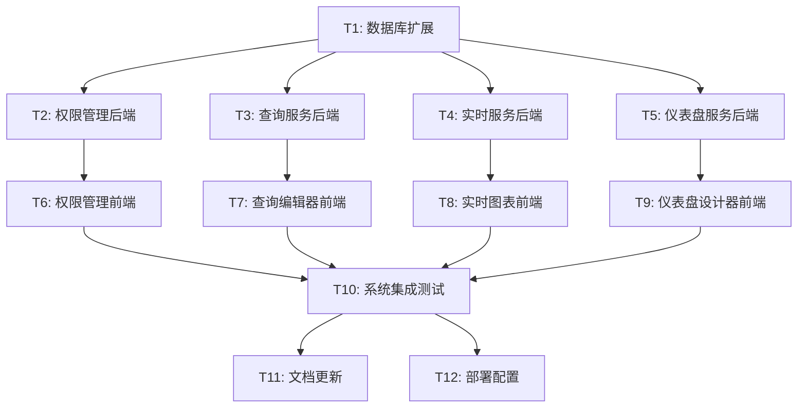

# TASK - 功能完善任务拆分文档

## 任务依赖图

## 原子任务详细定义

### T1: 数据库扩展

**任务描述**: 扩展现有数据库结构，添加支持新功能的表和索引

**输入契约**:
- 前置依赖: 现有数据库结构
- 输入数据: DESIGN文档中的数据库设计
- 环境依赖: MySQL 8.0+, 数据库管理权限

**输出契约**:
- 输出数据: 完整的数据库迁移脚本
- 交付物: 
  - `migrations/001_add_dashboard_features.sql`
  - `migrations/002_add_permission_system.sql`
  - `migrations/003_add_query_management.sql`
  - `migrations/004_add_realtime_features.sql`
- 验收标准:
  - 所有新表创建成功
  - 索引创建正确
  - 外键约束正确
  - 数据库迁移可回滚
  - 现有数据不受影响

**实现约束**:
- 技术栈: MySQL DDL
- 接口规范: 遵循现有数据库命名规范
- 质量要求: 迁移脚本必须可逆，包含回滚语句

**依赖关系**:
- 后置任务: T2, T3, T4, T5
- 并行任务: 无

---

### T2: 权限管理后端

**任务描述**: 实现完整的RBAC权限管理系统后端服务

**输入契约**:
- 前置依赖: T1完成，数据库表可用
- 输入数据: 权限管理API设计规范
- 环境依赖: Node.js, Express, TypeScript, 数据库连接

**输出契约**:
- 输出数据: 权限管理API服务
- 交付物:
  - `src/controllers/permissionController.ts`
  - `src/controllers/roleController.ts`
  - `src/services/permissionService.ts`
  - `src/middleware/permissionMiddleware.ts`
  - `src/routes/permission.ts`
  - `src/routes/role.ts`
  - `src/types/permission.ts`
  - `tests/permission.test.ts`
- 验收标准:
  - 所有权限API接口正常工作
  - 角色CRUD操作完整
  - 权限验证中间件正确
  - 资源级权限控制有效
  - 单元测试覆盖率>90%
  - API文档完整

**实现约束**:
- 技术栈: TypeScript, Express, MySQL
- 接口规范: RESTful API, 统一响应格式
- 质量要求: 代码覆盖率>90%, 性能测试通过

**依赖关系**:
- 前置任务: T1
- 后置任务: T6
- 并行任务: T3, T4, T5

---

### T3: 查询服务后端

**任务描述**: 实现高级查询引擎，包括查询历史、收藏查询、缓存优化

**输入契约**:
- 前置依赖: T1完成，数据库表可用
- 输入数据: 查询服务API设计规范
- 环境依赖: Node.js, Redis, 多数据源连接

**输出契约**:
- 输出数据: 查询管理API服务
- 交付物:
  - `src/controllers/queryController.ts`
  - `src/services/queryService.ts`
  - `src/services/queryCache.ts`
  - `src/services/queryOptimizer.ts`
  - `src/routes/query.ts`
  - `src/types/query.ts`
  - `tests/query.test.ts`
- 验收标准:
  - 查询执行性能优化
  - 查询历史记录完整
  - 收藏查询功能正常
  - 查询缓存机制有效
  - 查询验证和优化建议
  - 单元测试覆盖率>85%

**实现约束**:
- 技术栈: TypeScript, Express, Redis, SQL解析器
- 接口规范: RESTful API, 异步查询支持
- 质量要求: 查询性能提升30%以上

**依赖关系**:
- 前置任务: T1
- 后置任务: T7
- 并行任务: T2, T4, T5

---

### T4: 实时服务后端

**任务描述**: 实现WebSocket实时数据推送和告警系统

**输入契约**:
- 前置依赖: T1完成，数据库表可用
- 输入数据: 实时服务设计规范
- 环境依赖: Node.js, Socket.IO, Redis, 消息队列

**输出契约**:
- 输出数据: 实时数据推送服务
- 交付物:
  - `src/services/realTimeService.ts`
  - `src/services/alertService.ts`
  - `src/websocket/socketHandler.ts`
  - `src/websocket/subscriptionManager.ts`
  - `src/types/realtime.ts`
  - `tests/realtime.test.ts`
- 验收标准:
  - WebSocket连接稳定
  - 实时数据推送延迟<100ms
  - 告警系统正常工作
  - 连接数支持1000+并发
  - 消息可靠性保证
  - 性能测试通过

**实现约束**:
- 技术栈: TypeScript, Socket.IO, Redis
- 接口规范: WebSocket事件规范
- 质量要求: 高并发支持，低延迟

**依赖关系**:
- 前置任务: T1
- 后置任务: T8
- 并行任务: T2, T3, T5

---

### T5: 仪表盘服务后端

**任务描述**: 实现仪表盘设计器后端服务，支持布局管理和模板系统

**输入契约**:
- 前置依赖: T1完成，数据库表可用
- 输入数据: 仪表盘服务设计规范
- 环境依赖: Node.js, Express, 文件存储

**输出契约**:
- 输出数据: 仪表盘管理API服务
- 交付物:
  - `src/controllers/dashboardController.ts` (扩展)
  - `src/services/dashboardService.ts` (扩展)
  - `src/services/layoutService.ts`
  - `src/services/templateService.ts`
  - `src/routes/dashboard.ts` (扩展)
  - `src/types/dashboard.ts` (扩展)
  - `tests/dashboard.test.ts`
- 验收标准:
  - 布局保存和加载正常
  - 模板系统完整
  - 版本控制功能
  - 分享和协作功能
  - 布局验证机制
  - 单元测试覆盖率>85%

**实现约束**:
- 技术栈: TypeScript, Express, JSON Schema验证
- 接口规范: RESTful API, 版本化支持
- 质量要求: 布局数据完整性保证

**依赖关系**:
- 前置任务: T1
- 后置任务: T9
- 并行任务: T2, T3, T4

---

### T6: 权限管理前端

**任务描述**: 实现权限管理界面，包括角色管理、权限分配、用户权限查看

**输入契约**:
- 前置依赖: T2完成，权限API可用
- 输入数据: 权限管理UI设计
- 环境依赖: React, Ant Design, TypeScript

**输出契约**:
- 输出数据: 权限管理前端页面
- 交付物:
  - `src/pages/Permission/index.tsx`
  - `src/pages/Permission/RoleManagement.tsx`
  - `src/pages/Permission/PermissionMatrix.tsx`
  - `src/pages/Permission/UserPermissions.tsx`
  - `src/components/Permission/RoleSelector.tsx`
  - `src/components/Permission/PermissionTree.tsx`
  - `src/hooks/usePermissions.ts`
  - `src/hooks/useRoles.ts`
  - `src/types/permission.ts`
- 验收标准:
  - 角色CRUD界面完整
  - 权限分配界面直观
  - 用户权限查看清晰
  - 权限矩阵展示正确
  - 响应式设计适配
  - 用户体验良好

**实现约束**:
- 技术栈: React, TypeScript, Ant Design
- 接口规范: 与后端API对接
- 质量要求: UI/UX设计规范，无障碍访问

**依赖关系**:
- 前置任务: T2
- 后置任务: T10
- 并行任务: T7, T8, T9

---

### T7: 查询编辑器前端

**任务描述**: 实现高级SQL查询编辑器，包括语法高亮、自动补全、查询历史

**输入契约**:
- 前置依赖: T3完成，查询API可用
- 输入数据: 查询编辑器UI设计
- 环境依赖: React, Monaco Editor, TypeScript

**输出契约**:
- 输出数据: 查询编辑器前端组件
- 交付物:
  - `src/pages/Query/index.tsx`
  - `src/pages/Query/SQLEditor.tsx`
  - `src/pages/Query/QueryHistory.tsx`
  - `src/pages/Query/SavedQueries.tsx`
  - `src/components/Query/MonacoEditor.tsx`
  - `src/components/Query/QueryResult.tsx`
  - `src/components/Query/QueryTools.tsx`
  - `src/hooks/useQueryEditor.ts`
  - `src/hooks/useQueryHistory.ts`
  - `src/utils/sqlFormatter.ts`
  - `src/utils/sqlValidator.ts`
- 验收标准:
  - SQL语法高亮正确
  - 自动补全功能完整
  - 查询历史管理
  - 收藏查询功能
  - 查询结果展示
  - 性能分析显示
  - 导出功能正常

**实现约束**:
- 技术栈: React, Monaco Editor, Ant Design
- 接口规范: 与查询API对接
- 质量要求: 编辑器性能优化，大文件支持

**依赖关系**:
- 前置任务: T3
- 后置任务: T10
- 并行任务: T6, T8, T9

---

### T8: 实时图表前端

**任务描述**: 实现实时图表组件，支持WebSocket数据更新和图表交互

**输入契约**:
- 前置依赖: T4完成，实时API可用
- 输入数据: 实时图表UI设计
- 环境依赖: React, Socket.IO Client, 图表库

**输出契约**:
- 输出数据: 实时图表前端组件
- 交付物:
  - `src/components/Chart/RealTimeChart.tsx`
  - `src/components/Chart/ChartTheme.tsx`
  - `src/components/Chart/ChartInteraction.tsx`
  - `src/components/Chart/ChartAlert.tsx`
  - `src/hooks/useRealTimeChart.ts`
  - `src/hooks/useChartTheme.ts`
  - `src/hooks/useWebSocket.ts`
  - `src/services/chartDataService.ts`
  - `src/types/realtime.ts`
- 验收标准:
  - 实时数据更新流畅
  - 图表主题切换正常
  - 图表交互功能完整
  - 告警功能正常
  - WebSocket连接稳定
  - 性能优化良好

**实现约束**:
- 技术栈: React, Socket.IO Client, Ant Design Charts
- 接口规范: WebSocket事件处理
- 质量要求: 实时性能优化，内存管理

**依赖关系**:
- 前置任务: T4
- 后置任务: T10
- 并行任务: T6, T7, T9

---

### T9: 仪表盘设计器前端

**任务描述**: 实现拖拽式仪表盘设计器，支持组件库、布局编辑、属性配置

**输入契约**:
- 前置依赖: T5完成，仪表盘API可用
- 输入数据: 仪表盘设计器UI设计
- 环境依赖: React, react-grid-layout, react-dnd

**输出契约**:
- 输出数据: 仪表盘设计器前端组件
- 交付物:
  - `src/pages/Dashboard/Designer/index.tsx`
  - `src/pages/Dashboard/Designer/LayoutEditor.tsx`
  - `src/pages/Dashboard/Designer/ComponentLibrary.tsx`
  - `src/pages/Dashboard/Designer/PropertyPanel.tsx`
  - `src/pages/Dashboard/Designer/ToolBar.tsx`
  - `src/components/Designer/GridLayout.tsx`
  - `src/components/Designer/DragHandle.tsx`
  - `src/components/Designer/ComponentTemplate.tsx`
  - `src/hooks/useDashboardDesigner.ts`
  - `src/hooks/useLayoutManager.ts`
  - `src/stores/designerStore.ts`
  - `src/types/designer.ts`
- 验收标准:
  - 拖拽功能流畅
  - 组件库完整
  - 属性配置正确
  - 布局保存加载
  - 预览模式正常
  - 撤销重做功能
  - 响应式设计

**实现约束**:
- 技术栈: React, react-grid-layout, react-dnd, Zustand
- 接口规范: 与仪表盘API对接
- 质量要求: 拖拽性能优化，用户体验优先

**依赖关系**:
- 前置任务: T5
- 后置任务: T10
- 并行任务: T6, T7, T8

---

### T10: 系统集成测试

**任务描述**: 进行端到端集成测试，确保所有功能模块协同工作

**输入契约**:
- 前置依赖: T6, T7, T8, T9完成
- 输入数据: 集成测试用例
- 环境依赖: 完整的开发环境，测试数据

**输出契约**:
- 输出数据: 集成测试报告
- 交付物:
  - `tests/integration/permission.test.ts`
  - `tests/integration/query.test.ts`
  - `tests/integration/realtime.test.ts`
  - `tests/integration/dashboard.test.ts`
  - `tests/e2e/user-workflow.test.ts`
  - `docs/测试报告.md`
- 验收标准:
  - 所有集成测试通过
  - 端到端测试覆盖主要用户流程
  - 性能测试达标
  - 安全测试通过
  - 兼容性测试完成
  - 测试报告详细

**实现约束**:
- 技术栈: Jest, Cypress, Supertest
- 接口规范: 测试用例标准化
- 质量要求: 测试覆盖率>80%

**依赖关系**:
- 前置任务: T6, T7, T8, T9
- 后置任务: T11, T12
- 并行任务: 无

---

### T11: 文档更新

**任务描述**: 更新项目文档，包括API文档、用户手册、开发指南

**输入契约**:
- 前置依赖: T10完成，功能验证通过
- 输入数据: 新功能规范和测试结果
- 环境依赖: 文档编写工具

**输出契约**:
- 输出数据: 完整的项目文档
- 交付物:
  - `README.md` (更新)
  - `docs/API.md` (更新)
  - `docs/用户手册.md`
  - `docs/开发指南.md` (更新)
  - `docs/部署指南.md` (更新)
  - `docs/功能说明.md`
- 验收标准:
  - API文档完整准确
  - 用户手册易于理解
  - 开发指南详细
  - 部署指南可操作
  - 功能说明清晰
  - 文档格式统一

**实现约束**:
- 技术栈: Markdown, 文档生成工具
- 接口规范: 文档标准化格式
- 质量要求: 文档准确性和可读性

**依赖关系**:
- 前置任务: T10
- 后置任务: 无
- 并行任务: T12

---

### T12: 部署配置

**任务描述**: 更新部署配置，支持新功能的生产环境部署

**输入契约**:
- 前置依赖: T10完成，功能验证通过
- 输入数据: 新功能的部署需求
- 环境依赖: Docker, 部署环境

**输出契约**:
- 输出数据: 完整的部署配置
- 交付物:
  - `docker-compose.yml` (更新)
  - `Dockerfile` (更新)
  - `.env.example` (更新)
  - `nginx.conf` (更新)
  - `deploy/production.yml`
  - `scripts/deploy.sh` (更新)
- 验收标准:
  - Docker构建成功
  - 生产环境部署正常
  - 环境变量配置完整
  - 负载均衡配置正确
  - 监控配置有效
  - 备份策略完善

**实现约束**:
- 技术栈: Docker, Nginx, 部署脚本
- 接口规范: 部署标准化流程
- 质量要求: 部署可靠性和可维护性

**依赖关系**:
- 前置任务: T10
- 后置任务: 无
- 并行任务: T11

---

## 任务复杂度评估

| 任务ID | 任务名称 | 复杂度 | 预估工时 | 风险等级 | 关键路径 |
|--------|----------|--------|----------|----------|----------|
| T1 | 数据库扩展 | 中 | 8小时 | 低 | 是 |
| T2 | 权限管理后端 | 高 | 16小时 | 中 | 是 |
| T3 | 查询服务后端 | 高 | 20小时 | 中 | 否 |
| T4 | 实时服务后端 | 高 | 18小时 | 高 | 否 |
| T5 | 仪表盘服务后端 | 中 | 12小时 | 低 | 否 |
| T6 | 权限管理前端 | 中 | 14小时 | 低 | 是 |
| T7 | 查询编辑器前端 | 高 | 16小时 | 中 | 否 |
| T8 | 实时图表前端 | 高 | 18小时 | 中 | 否 |
| T9 | 仪表盘设计器前端 | 高 | 24小时 | 高 | 是 |
| T10 | 系统集成测试 | 中 | 12小时 | 中 | 是 |
| T11 | 文档更新 | 低 | 6小时 | 低 | 否 |
| T12 | 部署配置 | 低 | 4小时 | 低 | 否 |

**总预估工时**: 148小时  
**关键路径**: T1 → T2 → T6 → T9 → T10  
**关键路径工时**: 74小时

## 风险控制措施

### 高风险任务

1. **T4: 实时服务后端**
   - 风险: WebSocket连接稳定性
   - 缓解措施: 分阶段实现，先实现基础功能
   - 备选方案: 使用成熟的实时服务框架

2. **T9: 仪表盘设计器前端**
   - 风险: 拖拽性能和用户体验
   - 缓解措施: 原型验证，性能测试
   - 备选方案: 简化设计器功能

### 中风险任务

1. **T2: 权限管理后端**
   - 风险: 权限逻辑复杂性
   - 缓解措施: 详细设计评审

2. **T3: 查询服务后端**
   - 风险: 查询性能优化
   - 缓解措施: 性能基准测试

3. **T7: 查询编辑器前端**
   - 风险: Monaco Editor集成复杂
   - 缓解措施: 技术预研

4. **T8: 实时图表前端**
   - 风险: 实时数据渲染性能
   - 缓解措施: 数据虚拟化技术

---

**文档版本**: v1.0  
**创建时间**: 2024-01-15  
**最后更新**: 2024-01-15  
**状态**: 任务拆分完成  
**负责人**: AI Assistant